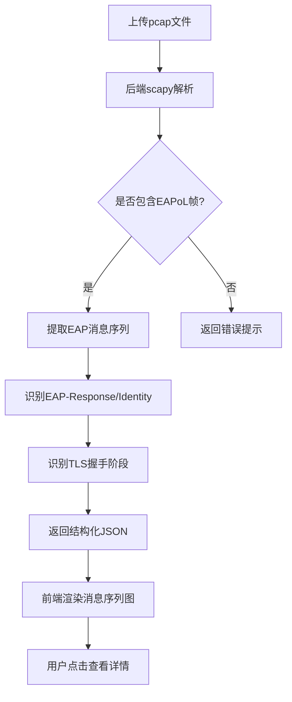

## 1. 产品概述

EAPoL报文分析器是一个面向网络工程师和安全研究人员的可视化工具，用于解析EAPoL-over-LAN报文（EAP-Request/Response），提取用户身份信息与TLS隧道建立过程，并以消息序列图的形式直观展示认证交互流程。

- 解决802.1X认证过程中EAPoL报文难以直观分析的痛点
- 帮助用户快速定位认证失败原因、理解TLS隧道协商过程

## 2. 核心功能

### 2.1 用户角色

| 角色 | 说明 | 核心权限 |
|------|------|----------|
| 网络工程师 | 上传pcap文件进行分析 | 上传、解析、查看分析结果 |
| 安全研究员 | 分析EAP-TLS握手安全性 | 上传、解析、查看、导出分析报告 |

### 2.2 功能模块

1. **报文上传页**: 文件上传区域、示例数据快速加载、解析状态进度
2. **分析结果页**: 消息序列图、EAP报文详情面板、用户身份提取、TLS隧道阶段标注

### 2.3 页面详情

| 页面名称 | 模块名称 | 功能描述 |
|----------|----------|----------|
| 报文上传页 | 文件上传区 | 支持拖拽/点击上传pcap/pcapng文件，显示文件名和大小 |
| 报文上传页 | 示例数据 | 提供内置示例pcap数据，一键加载分析 |
| 报文上传页 | 解析状态 | 实时显示解析进度、已识别的EAPoL帧数量 |
| 分析结果页 | 消息序列图 | 以时序图形式展示Supplicant-Authenticator-Server之间的EAP交互流程，标注每条消息类型和方向 |
| 分析结果页 | EAP报文详情 | 点击序列图中的消息，展示EAP Code/Type/Data等详细字段 |
| 分析结果页 | 用户身份卡片 | 提取并展示EAP-Response/Identity中的用户名、域等信息 |
| 分析结果页 | TLS隧道阶段 | 标注TLS ClientHello至Finished各阶段，区分明文阶段和加密隧道阶段 |

## 3. 核心流程

用户上传pcap文件 → 后端scapy解析EAPoL帧 → 提取EAP-Request/Response → 识别用户身份和TLS阶段 → 返回结构化数据 → 前端渲染消息序列图

## 4. 用户界面设计

### 4.1 设计风格

- 主色调: 深蓝(#0A1628) + 青色(#00E5CC)作为科技感强调色
- 次要色: 暗灰(#1A2332)用于卡片背景，琥珀色(#F59E0B)用于TLS隧道标注
- 按钮: 圆角8px，主按钮使用青色渐变，hover带发光效果
- 字体: 代码区域使用JetBrains Mono，正文使用Noto Sans SC
- 布局: 左右分栏布局，左侧消息序列图，右侧详情面板
- 图标: 网络协议相关线性图标风格（使用lucide-react）

### 4.2 页面设计概览

| 页面名称 | 模块名称 | UI元素 |
|----------|----------|--------|
| 报文上传页 | 文件上传区 | 虚线边框拖拽区域，拖入时高亮动画，中心上传图标 |
| 报文上传页 | 示例数据 | 卡片式按钮，网络图标+简短描述 |
| 分析结果页 | 消息序列图 | 三列垂直生命线（Supplicant/Authenticator/Server），水平箭头连接，TLS阶段背景色区分 |
| 分析结果页 | 报文详情 | 右侧抽屉式面板，字段以键值对表格展示，hex数据高亮 |
| 分析结果页 | 身份卡片 | 顶部固定卡片，显示用户头像图标+身份信息 |

### 4.3 响应式

- 桌面优先设计，消息序列图需充裕水平空间
- 平板端序列图可水平滚动
- 移动端详情面板改为底部抽屉

### 4.4 3D场景指引

不适用
