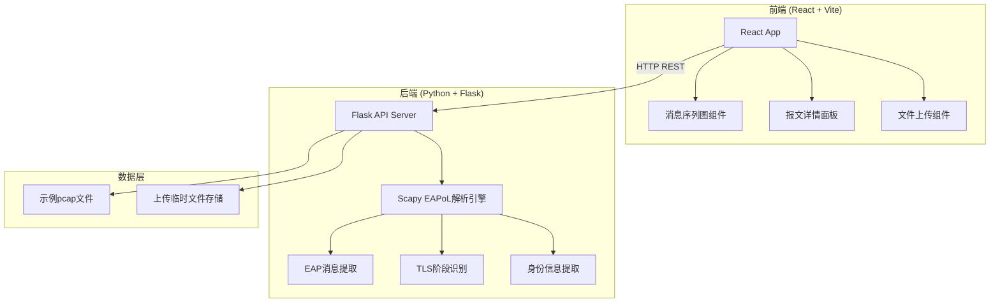
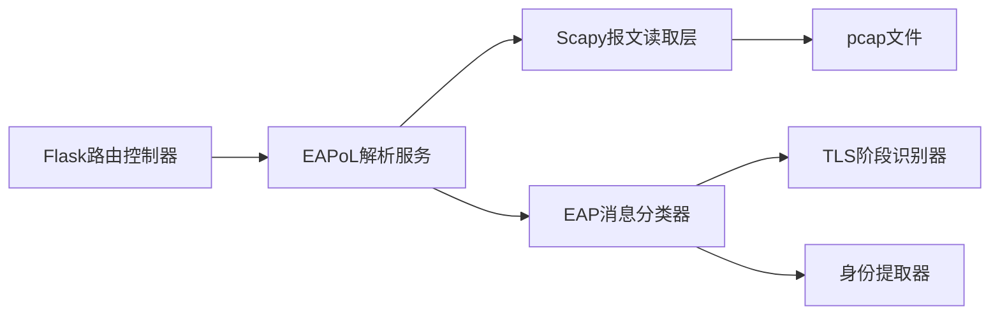

## 1. 架构设计



## 2. 技术说明

- 前端: React@18 + TypeScript + Tailwind CSS@3 + Vite
- 初始化工具: vite-init
- 后端: Python 3.10+ + Flask + scapy
- 数据库: 无（基于文件解析，结果实时返回）
- 状态管理: zustand

## 3. 路由定义

| 路由 | 用途 |
|------|------|
| / | 报文上传页面，含文件上传区域和示例数据 |
| /analysis/:id | 分析结果页面，展示消息序列图和详情 |

## 4. API定义

### 4.1 上传并解析pcap文件

**POST /api/analyze/upload**

Request:
- Content-Type: multipart/form-data
- Body: file (pcap/pcapng文件)

Response:
```typescript
interface AnalyzeResponse {
  id: string;
  summary: {
    totalFrames: number;
    eapolFrames: number;
    duration: number;
    identity: string | null;
    authMethod: string;
  };
  messages: EapMessage[];
  tlsPhases: TlsPhase[];
}

interface EapMessage {
  id: number;
  frameNumber: number;
  timestamp: number;
  direction: "supplicant_to_auth" | "auth_to_supplicant" | "auth_to_server" | "server_to_auth";
  eapCode: "Request" | "Response" | "Success" | "Failure";
  eapType: string;
  eapTypeData: string;
  rawData: string;
  tlsPhase?: "ClientHello" | "ServerHello" | "Certificate" | "KeyExchange" | "Finished" | "ApplicationData";
  identity?: string;
}

interface TlsPhase {
  name: string;
  startMessageId: number;
  endMessageId: number;
  description: string;
}
```

### 4.2 加载示例数据

**GET /api/analyze/sample**

Response: 同 AnalyzeResponse

### 4.3 获取单条EAP消息详情

**GET /api/analyze/:id/message/:messageId**

Response:
```typescript
interface EapMessageDetail extends EapMessage {
  ethernetHeader: {
    srcMac: string;
    dstMac: string;
    etherType: string;
  };
  eapolHeader: {
    version: number;
    type: string;
    length: number;
  };
  eapHeader: {
    code: number;
    identifier: number;
    length: number;
  };
  decodedFields: Record<string, string>;
}
```

## 5. 服务器架构图



## 6. 数据模型

不适用（本项目基于文件实时解析，无持久化数据库）
