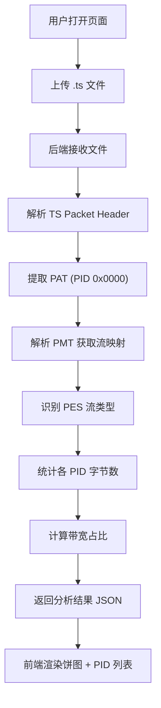

## 1. 产品概述

MPEG-TS 码流分析器——上传 MPEG-TS 文件，解析 PAT/PMT/PES 等 PID 结构，统计各 PID 带宽占比，以饼图和列表形式直观呈现码流组成。面向流媒体工程师、广播技术人员和音视频开发者，解决快速排查码流结构与带宽分配的痛点。

## 2. 核心功能

### 2.1 功能模块

1. **上传与分析页**：文件上传区域、实时分析进度、饼图可视化、PID 详情列表

### 2.2 页面详情

| 页面名称 | 模块名称 | 功能描述 |
|----------|----------|----------|
| 上传与分析页 | 文件上传区 | 拖拽或点击上传 MPEG-TS 文件，支持 .ts 后缀，显示文件名与大小 |
| 上传与分析页 | 分析进度 | 上传后显示解析进度条，解析完成后自动切换到结果视图 |
| 上传与分析页 | 带宽饼图 | 以环形饼图展示各 PID 带宽占比，hover 显示详细百分比和字节数 |
| 上传与分析页 | PID 列表 | 表格展示 PID 编号、类型（PAT/PMT/PES/其他）、描述、字节数、带宽占比，支持按占比排序 |
| 上传与分析页 | 流结构树 | 展示 PAT→PMT→PES 的层级关系，方便理解码流组织结构 |

## 3. 核心流程

用户打开页面 → 上传 MPEG-TS 文件 → 后端接收并解析 → 前端展示饼图与 PID 列表

## 4. 用户界面设计

### 4.1 设计风格

- 主色调：深蓝灰（#1a1f2e）搭配科技青（#00d4aa）作为强调色，营造专业流媒体分析工具氛围
- 辅助色：暗面板（#232839）、卡片背景（#2a2f42）、数据高亮（#ff6b6b 用于告警、#4ecdc4 用于视频流、#ffe66d 用于音频流）
- 按钮风格：圆角矩形，hover 时发光效果
- 字体：JetBrains Mono（数据展示）+ DM Sans（UI 文本）
- 布局：顶部导航栏 + 左侧上传区/右侧结果区，桌面端双栏布局
- 图标风格：线条图标（lucide-react）

### 4.2 页面设计概览

| 页面名称 | 模块名称 | UI 元素 |
|----------|----------|----------|
| 上传与分析页 | 文件上传区 | 虚线边框拖拽区，拖入时边框高亮，上传按钮，文件信息显示 |
| 上传与分析页 | 分析进度 | 渐变进度条，百分比文字，解析阶段提示 |
| 上传与分析页 | 带宽饼图 | Recharts 环形饼图，中心显示总码率，图例在右侧 |
| 上传与分析页 | PID 列表 | 深色表格，PID 类型彩色标签，带宽占比进度条，可排序表头 |
| 上传与分析页 | 流结构树 | 树形缩进展示 PAT→PMT→PES 关系，连线动画 |

### 4.3 响应式

桌面端优先，大屏双栏布局（左上传/右结果），平板及以下切换为单栏垂直布局。
