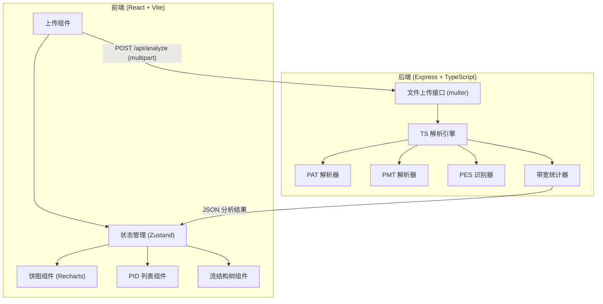
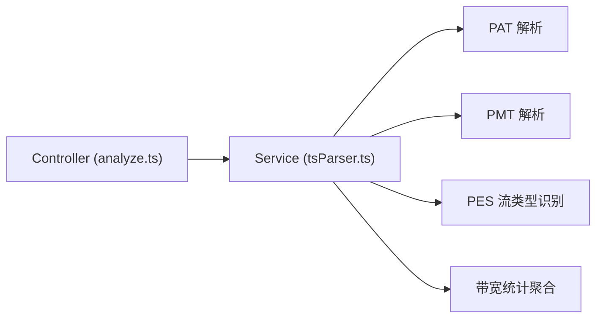

## 1. 架构设计



## 2. 技术说明

- 前端：React@18 + Tailwind CSS@3 + Vite
- 初始化工具：vite-init（react-express-ts 模板）
- 后端：Express@4 + TypeScript（ESM 格式）
- 数据库：无需数据库（实时分析，结果不持久化）
- 图表库：Recharts（饼图/环形图）
- 文件上传：multer（处理 multipart/form-data）
- 状态管理：Zustand

## 3. 路由定义

| 路由 | 用途 |
|------|------|
| / | 主页，上传与分析 |

## 4. API 定义

### 4.1 TypeScript 类型定义

```typescript
interface TSPacketHeader {
  syncByte: number;
  transportErrorIndicator: boolean;
  payloadUnitStartIndicator: boolean;
  pid: number;
  adaptationFieldControl: number;
  continuityCounter: number;
}

interface PIDInfo {
  pid: number;
  type: "PAT" | "PMT" | "PES-Video" | "PES-Audio" | "PES-Data" | "Null" | "Other";
  description: string;
  streamType?: number;
  streamTypeDesc?: string;
  byteCount: number;
  packetCount: number;
  bandwidthPercent: number;
}

interface PMTEntry {
  streamType: number;
  elementaryPID: number;
  esInfoLength: number;
  streamTypeDesc: string;
}

interface AnalysisResult {
  fileName: string;
  fileSize: number;
  totalPackets: number;
  totalBytes: number;
  pids: PIDInfo[];
  pat: {
    transportStreamId: number;
    versionNumber: number;
    pmtEntries: { programNumber: number; pmtPID: number }[];
  };
  pmts: {
    pmtPID: number;
    programNumber: number;
    entries: PMTEntry[];
  }[];
}
```

### 4.2 接口定义

**POST /api/analyze**

- 请求：multipart/form-data，字段名 `file`，文件为 .ts 格式
- 响应：`{ success: true, data: AnalysisResult }` 或 `{ success: false, error: string }`

## 5. 服务器架构



## 6. 数据模型

无需数据库，所有数据为实时解析结果。
