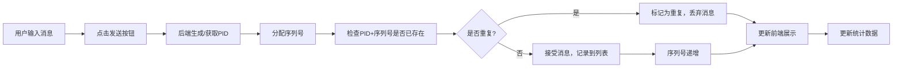

## 1. 产品概述

Kafka生产者幂等性模拟器，用于演示和学习Kafka生产者的幂等性机制。通过可视化界面展示生产者ID（PID）、序列号以及消息去重效果，帮助开发者理解Kafka如何通过PID+序列号机制实现生产端消息不重复。

## 2. 核心功能

### 2.1 功能模块

1. **控制面板**：配置生产者参数、发送消息、重置状态
2. **状态展示区**：展示生产者ID（PID）、当前序列号、幂等性开关状态
3. **消息列表区**：展示已发送的消息详情，包括被接受和被丢弃的重复消息
4. **去重效果演示区**：通过颜色和状态标识清晰展示哪些消息被成功处理，哪些因重复被丢弃

### 2.2 页面详情

| 页面名称 | 模块名称 | 功能描述 |
|-----------|-------------|---------------------|
| 主页 | 控制面板 | 配置消息内容、发送正常消息、发送重复消息、重置生产者状态 |
| 主页 | 状态展示 | 实时显示PID、当前序列号、幂等性配置状态 |
| 主页 | 消息列表 | 展示所有消息记录，包含消息内容、PID、序列号、状态（成功/丢弃）、时间戳 |
| 主页 | 统计信息 | 展示总发送数、成功数、丢弃数、去重率等统计数据 |

## 3. 核心流程

用户在控制面板输入消息内容，点击"发送消息"按钮，后端模拟Kafka生产者生成PID和序列号，检查消息是否重复（相同PID+序列号），如果是新消息则接受并递增序列号，如果是重复消息则丢弃。前端实时更新状态展示和消息列表，用不同颜色区分成功和丢弃的消息。

## 4. 用户界面设计

### 4.1 设计风格
- **主色调**：深蓝色（代表Kafka技术属性）搭配暖橙色（强调状态变化）
- **辅助色**：绿色表示成功，红色表示丢弃/重复，灰色表示中性信息
- **字体**：使用JetBrains Mono作为等宽字体展示PID和序列号，搭配现代无衬线字体作为正文
- **布局风格**：卡片式布局，清晰的功能分区，左侧控制面板，右侧状态和消息展示
- **视觉效果**：微交互动画，消息发送时的过渡效果，重复消息的抖动提示

### 4.2 页面设计概述

| 页面名称 | 模块名称 | UI元素 |
|-----------|-------------|-------------|
| 主页 | 控制面板 | 输入框、发送按钮、发送重复消息按钮、重置按钮、配置开关 |
| 主页 | 状态展示 | PID卡片、序列号卡片、幂等性状态徽章 |
| 主页 | 消息列表 | 表格视图，每行包含状态徽章、消息内容、PID、序列号、时间戳 |
| 主页 | 统计信息 | 数字卡片，带有动画效果的计数器 |

### 4.3 响应性
- 桌面端为主，采用两栏布局：左侧30%控制面板，右侧70%内容展示
- 移动端自适应为单栏布局，控制面板在上，内容展示在下
- 表格在小屏幕上转为卡片式展示

### 4.4 交互设计
- 发送消息时有加载状态动画
- 重复消息被丢弃时有红色高亮和轻微抖动效果
- 新消息成功时数字计数器有滚动动画
- 序列号每次递增时有数字变化动画
- 悬停在消息行上显示详细信息
