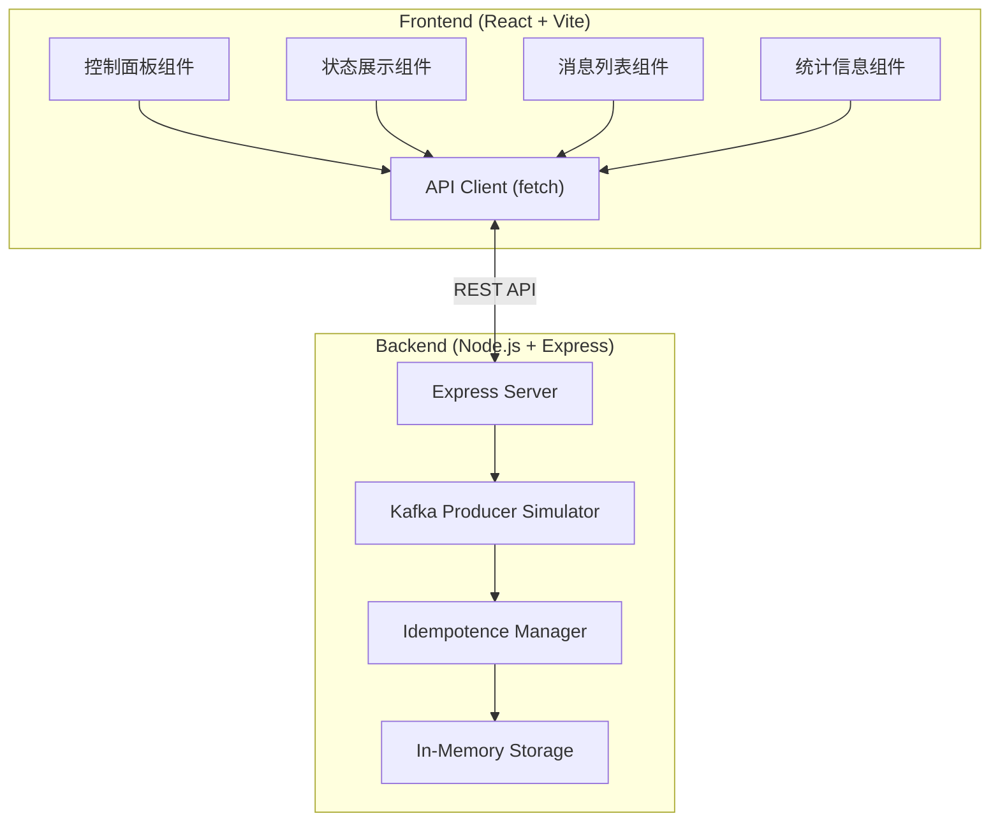
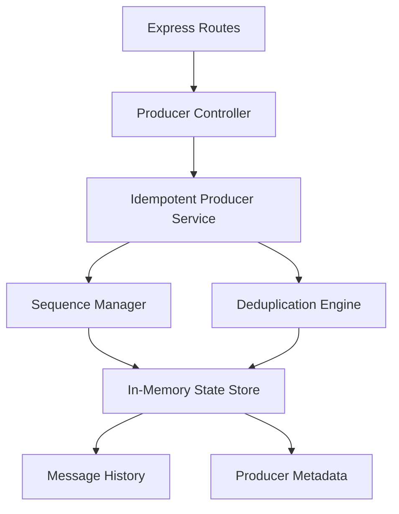
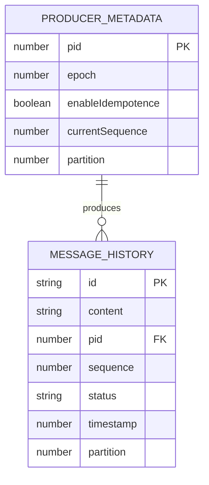

## 1. 架构设计



## 2. 技术描述

- **前端**：React@18 + TypeScript + TailwindCSS@3 + Vite
- **初始化工具**：Vite
- **后端**：Express@4 + Node.js
- **数据存储**：内存存储（模拟Kafka Broker状态）
- **HTTP客户端**：原生fetch API

## 3. 路由定义

| 路由 | 方法 | 用途 |
|-------|------|---------|
| / | GET | 前端静态页面 |
| /api/producer/status | GET | 获取生产者状态（PID、序列号、幂等性状态） |
| /api/producer/send | POST | 发送消息 |
| /api/producer/send-duplicate | POST | 发送重复消息（使用相同PID+序列号） |
| /api/producer/messages | GET | 获取所有消息记录 |
| /api/producer/reset | POST | 重置生产者状态 |
| /api/producer/toggle-idempotence | POST | 切换幂等性开关 |

## 4. API 定义

### 4.1 类型定义

```typescript
interface MessageRecord {
  id: string;
  content: string;
  pid: number;
  sequence: number;
  status: 'ACCEPTED' | 'DUPLICATE_DISCARDED';
  timestamp: number;
  partition: number;
}

interface ProducerStatus {
  pid: number;
  currentSequence: number;
  enableIdempotence: boolean;
  epoch: number;
}

interface ProducerStats {
  totalSent: number;
  accepted: number;
  discarded: number;
  deduplicationRate: number;
}

interface SendMessageRequest {
  content: string;
  partition?: number;
}

interface SendMessageResponse {
  success: boolean;
  message: MessageRecord;
  isDuplicate: boolean;
}
```

### 4.2 接口详情

#### GET /api/producer/status
**响应**：
```typescript
{
  pid: number;
  currentSequence: number;
  enableIdempotence: boolean;
  epoch: number;
}
```

#### POST /api/producer/send
**请求体**：
```typescript
{
  content: string;
  partition?: number;
}
```

**响应**：
```typescript
{
  success: boolean;
  message: MessageRecord;
  isDuplicate: boolean;
}
```

#### POST /api/producer/send-duplicate
**请求体**：
```typescript
{
  content: string;
  pid: number;
  sequence: number;
  partition?: number;
}
```

**响应**：
```typescript
{
  success: boolean;
  message: MessageRecord;
  isDuplicate: boolean;
}
```

#### GET /api/producer/messages
**响应**：
```typescript
{
  messages: MessageRecord[];
  stats: ProducerStats;
}
```

#### POST /api/producer/reset
**响应**：
```typescript
{
  success: boolean;
  status: ProducerStatus;
}
```

#### POST /api/producer/toggle-idempotence
**请求体**：
```typescript
{
  enable: boolean;
}
```

**响应**：
```typescript
{
  success: boolean;
  enableIdempotence: boolean;
}
```

## 5. 服务端架构图



## 6. 数据模型

### 6.1 数据模型定义



### 6.2 核心数据结构说明

**ProducerMetadata（生产者元数据）**：
- `pid`: 生产者ID，Kafka分配的唯一标识，模拟范围 1000-9999
- `epoch`: 生产者纪元，用于标识生产者会话
- `enableIdempotence`: 幂等性开关
- `currentSequence`: 当前序列号，从0开始递增
- `partition`: 目标分区，默认0

**MessageRecord（消息记录）**：
- `id`: 唯一标识，UUID生成
- `content`: 消息内容
- `pid`: 生产者ID
- `sequence`: 序列号，相同PID+Sequence构成唯一键
- `status`: 消息状态，ACCEPTED（已接受）或 DUPLICATE_DISCARDED（重复丢弃）
- `timestamp`: 时间戳
- `partition`: 分区号

**去重逻辑**：
- 幂等性开启时，使用 `pid + sequence` 作为唯一键检查重复
- 如果该组合已存在，则标记为 DUPLICATE_DISCARDED
- 如果不存在，则标记为 ACCEPTED 并递增序列号
- 幂等性关闭时，所有消息都标记为 ACCEPTED，不进行去重检查
