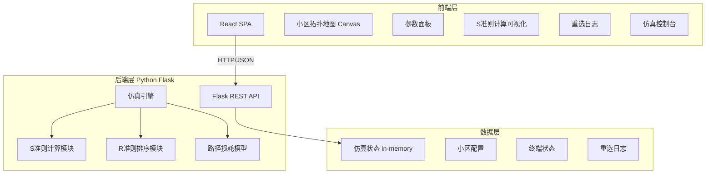
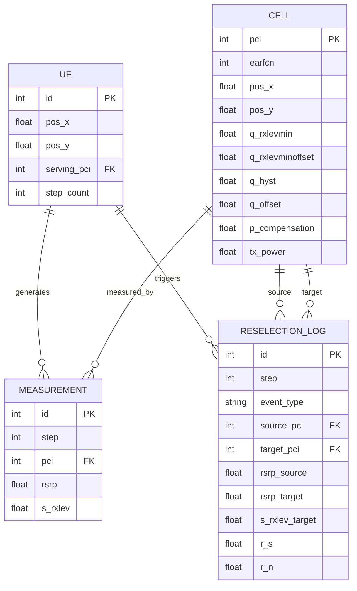

## 1. 架构设计



## 2. 技术说明

- 前端：React@18 + TailwindCSS@3 + Vite
- 初始化工具：Vite
- 后端：Python Flask + Flask-CORS
- 数据库：无，使用内存存储仿真状态
- 通信协议：REST API + JSON

## 3. 路由定义

| 路由 | 用途 |
|------|------|
| `/` | 主仿真页面 |
| `/api/cells` | 获取所有小区配置与当前测量值 |
| `/api/simulation/start` | 启动仿真 |
| `/api/simulation/pause` | 暂停仿真 |
| `/api/simulation/reset` | 重置仿真 |
| `/api/simulation/step` | 单步执行仿真 |
| `/api/simulation/status` | 获取当前仿真状态 |
| `/api/simulation/config` | 更新仿真配置参数 |
| `/api/logs` | 获取重选决策日志 |

## 4. API定义

### 4.1 获取小区信息 GET /api/cells

```typescript
interface CellInfo {
  pci: number;
  earfcn: number;
  position: { x: number; y: number };
  rsrp: number;            // dBm 当前测量值
  q_rxlevmin: number;      // dBm 最小接收电平
  q_rxlevminoffset: number; // dB 偏移
  q_hyst: number;          // dB 迟滞值
  p_compensation: number;  // dB 功率补偿
  s_rxlev: number;         // 计算得到的S值
  is_serving: boolean;
}

interface CellsResponse {
  cells: CellInfo[];
  serving_pci: number;
}
```

### 4.2 仿真控制 POST /api/simulation/start|pause|reset|step

```typescript
interface SimulationStatus {
  running: boolean;
  step_count: number;
  ue_position: { x: number; y: number };
  serving_pci: number;
  reselection_count: number;
}
```

### 4.3 重选日志 GET /api/logs

```typescript
interface ReselectionLog {
  timestamp: number;
  step: number;
  event_type: "measurement" | "s_criterion" | "reselection";
  source_pci: number | null;
  target_pci: number | null;
  details: {
    rsrp_source: number;
    rsrp_target: number;
    s_rxlev_target: number;
    r_s: number;
    r_n: number;
  };
}

interface LogsResponse {
  logs: ReselectionLog[];
}
```

### 4.4 更新配置 POST /api/simulation/config

```typescript
interface SimulationConfig {
  speed: number;           // 仿真步进间隔 ms
  q_rxlevmin: number;      // 全局默认最小接收电平
  q_hyst: number;          // 全局默认迟滞值
  treselection: number;    // 重选持续时间 步数
  path_loss_exponent: number; // 路径损耗指数
}
```

## 5. 服务端架构图

```mermaid
graph LR
    "Flask Router" --> "SimulationService"
    "SimulationService" --> "PathLossModel"
    "SimulationService" --> "SCriterion"
    "SimulationService" --> "RCriterion"
    "SimulationService" --> "CellRepository"
    "SimulationService" --> "LogRepository"
```

## 6. 数据模型

### 6.1 数据模型定义



## 7. 核心算法

### 7.1 S准则

```
S_rxlev = Q_rxlevmeas - (Q_rxlevmin + Q_rxlevminoffset) - P_compensation
```
- S_rxlev > 0 → 小区满足驻留条件

### 7.2 R准则排序

```
R_s = Q_meas,s + Q_hyst         （服务小区）
R_n = Q_meas,n - Q_offset        （邻区）
```
- 若 R_n > R_s 持续 Treselection 时间 → 执行重选

### 7.3 路径损耗模型

```
RSRP = Tx_Power - PathLoss
PathLoss = 128.1 + 37.6 * log10(d) + N(0, σ)
```
- d 为终端到基站距离（km）
- σ 为对数正态阴影衰落标准差（典型8dB）
