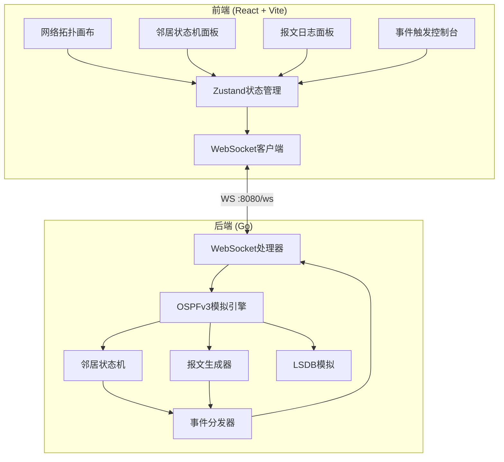
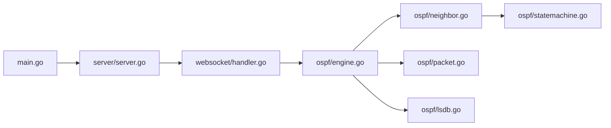
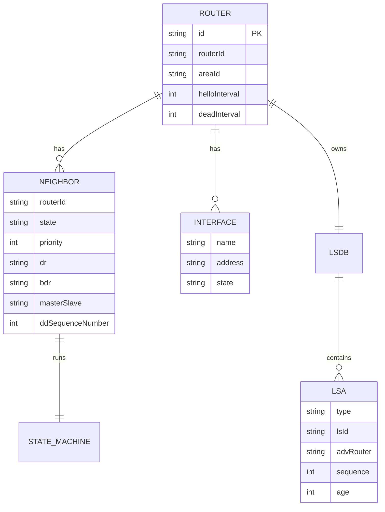

## 1. 架构设计



## 2. 技术说明

- 前端：React@18 + TypeScript + Tailwind CSS + Vite
- 初始化工具：vite-init (react-ts 模板)
- 后端：Go 1.21+ + gorilla/websocket
- 数据库：无（纯内存模拟）
- 通信协议：WebSocket（实时状态推送）

## 3. 路由定义

| 路由 | 用途 |
|------|------|
| / | 模拟器主页（拓扑+状态机+日志+控制台） |

## 4. API定义

### 4.1 WebSocket通信协议

WebSocket端点：`ws://localhost:8080/ws`

#### 客户端→服务器消息

```typescript
type ClientMessage =
  | { type: "trigger_event"; event: OspfEvent; routerId: string; targetId?: string }
  | { type: "select_router"; routerId: string }
  | { type: "reset_all" }
  | { type: "auto_demo" }

type OspfEvent =
  | "send_hello"
  | "send_dbd"
  | "send_lsr"
  | "send_lsu"
  | "reset_neighbor"
  | "start_auto"
```

#### 服务器→客户端消息

```typescript
type ServerMessage =
  | { type: "state_change"; routerId: string; neighborId: string; oldState: OspfState; newState: OspfState }
  | { type: "packet_sent"; from: string; to: string; packetType: OspfPacketType; details: PacketDetails }
  | { type: "packet_received"; from: string; to: string; packetType: OspfPacketType; details: PacketDetails }
  | { type: "topology_update"; routers: RouterInfo[]; links: LinkInfo[] }
  | { type: "router_detail"; router: RouterDetail }
  | { type: "log"; message: string; level: "info" | "warn" | "error"; timestamp: number }

type OspfState = "Down" | "Init" | "2-Way" | "ExStart" | "Exchange" | "Loading" | "Full"

type OspfPacketType = "Hello" | "DBD" | "LSR" | "LSU" | "LSAck"

interface PacketDetails {
  messageType: OspfPacketType
  sourceRouter: string
  destRouter: string
  fields: Record<string, string | number>
}

interface RouterInfo {
  id: string
  name: string
  routerId: string
  areaId: string
  x: number
  y: number
}

interface LinkInfo {
  from: string
  to: string
  state: OspfState
  interfaceIp: string
}

interface RouterDetail {
  id: string
  routerId: string
  areaId: string
  helloInterval: number
  deadInterval: number
  interfaces: InterfaceInfo[]
  lsdb: LsaSummary[]
  neighbors: NeighborInfo[]
}

interface InterfaceInfo {
  name: string
  address: string
  state: string
}

interface LsaSummary {
  type: string
  lsId: string
  advRouter: string
  sequence: number
}

interface NeighborInfo {
  routerId: string
  state: OspfState
  priority: number
  dr: string
  bdr: string
}
```

## 5. Go后端架构



### 模块说明

| 模块 | 文件 | 职责 |
|------|------|------|
| main | main.go | 入口，启动HTTP服务器 |
| server | server/server.go | HTTP服务器配置、路由注册、静态文件服务 |
| websocket | websocket/handler.go | WebSocket连接管理、消息解析分发 |
| engine | ospf/engine.go | 模拟引擎主逻辑，协调各模块 |
| neighbor | ospf/neighbor.go | 邻居数据结构与管理 |
| statemachine | ospf/statemachine.go | OSPFv3邻居状态机实现 |
| packet | ospf/packet.go | 报文结构定义与生成 |
| lsdb | ospf/lsdb.go | 链路状态数据库模拟 |

## 6. 数据模型

### 6.1 核心数据结构



### 6.2 默认拓扑

- R1 (Router-ID: 1.1.1.1) ←→ R2 (Router-ID: 2.2.2.2): 直连链路
- R2 (Router-ID: 2.2.2.2) ←→ R3 (Router-ID: 3.3.3.3): 直连链路
- R1 (Router-ID: 1.1.1.1) ←→ R3 (Router-ID: 3.3.3.3): 直连链路（三角拓扑）
