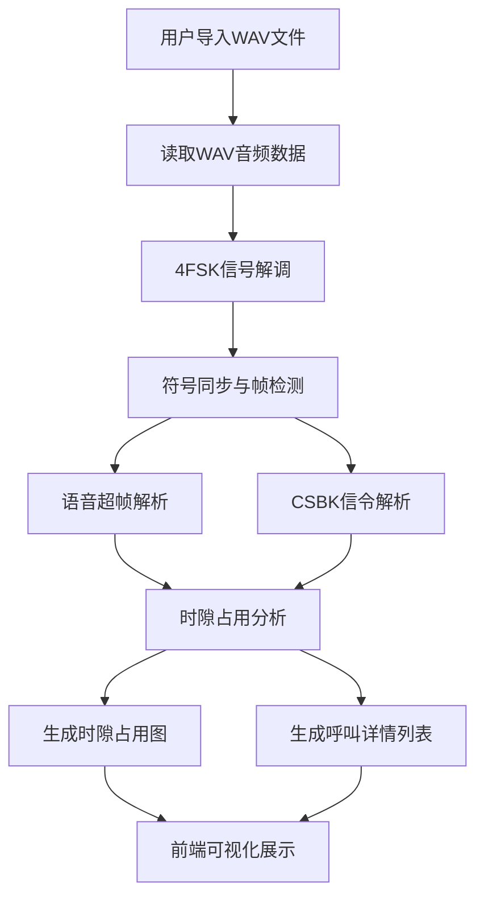

## 1. 产品概述

DMR基带分析工具是一款专业的数字移动通信信号分析软件，用于读取DMR基带录音文件（WAV格式），解调4FSK调制信号，解析语音超帧和控制信令（CSBK），并通过可视化界面展示时隙占用情况和呼叫类型。

- 主要用途：无线电监测、通信协议分析、DMR网络优化、应急通信保障
- 目标用户：无线电工程师、通信协议分析人员、应急通信保障人员
- 产品价值：提供直观的DMR信号可视化分析能力，帮助技术人员快速识别呼叫模式和网络行为

## 2. 核心功能

### 2.1 功能模块

1. **主界面**：文件导入区、信号处理控制面板、时隙占用图、呼叫详情列表
2. **信号分析模块**：WAV文件读取、4FSK解调、符号同步、DMR帧解析
3. **可视化展示**：时隙占用时间轴、呼叫类型统计、信号质量指标

### 2.2 页面详情

| 页面名称 | 模块名称 | 功能描述 |
|----------|----------|----------|
| 主界面 | 文件导入区 | 支持拖拽或点击选择WAV文件，显示文件基本信息（采样率、时长、大小） |
| 主界面 | 信号处理控制 | 解调参数配置、开始/停止分析按钮、处理进度显示 |
| 主界面 | 时隙占用图 | 时间轴展示两个时隙的占用情况，不同颜色区分呼叫类型 |
| 主界面 | 呼叫详情列表 | 列出所有解析到的呼叫，包括时隙、类型、源ID、目标ID、时长 |
| 主界面 | 信号质量面板 | 显示解调信噪比、频率偏移、符号错误率等指标 |

## 3. 核心流程

## 4. 用户界面设计

### 4.1 设计风格

- **设计方向**：科技感/工业监控风格，专业无线电监测工具的视觉语言
- **主色调**：深空灰背景 (#0a0e17)，搭配赛博蓝 (#00d4ff) 作为主强调色，警示橙 (#ff6b35) 用于告警状态，数据绿 (#00ff88) 用于正常状态
- **字体**：JetBrains Mono 作为等宽数据展示字体，Inter 作为界面文本字体
- **布局**：左右分栏布局，左侧控制面板，右侧可视化展示区，底部状态栏
- **视觉元素**：网格背景、扫描线效果、数据块高亮、实时更新动画

### 4.2 页面设计概述

| 页面名称 | 模块名称 | UI元素 |
|----------|----------|--------|
| 主界面 | 文件导入区 | 拖拽区域带边框动画、文件图标、文件名和参数显示卡片 |
| 主界面 | 时隙占用图 | 时间轴刻度、时隙1/2双行显示、色块表示呼叫、悬停显示详情 |
| 主界面 | 呼叫列表 | 表格样式、行高亮、呼叫类型图标、可排序列 |
| 主界面 | 信号质量面板 | 仪表盘样式指标、进度条、实时数值更新动画 |
| 主界面 | 控制面板 | 玻璃拟态卡片、发光按钮、参数滑块、状态指示灯 |

### 4.3 响应式

- 桌面端优先设计，最低支持1280x800分辨率
- 自适应窗口大小，可视化区域可伸缩
- 列表区域支持独立滚动

## 5. 非功能需求

- **性能要求**：支持处理最长30分钟的录音文件，处理速度不低于实时速度的2倍
- **精度要求**：符号解调准确率>95%（信噪比>10dB时）
- **兼容性**：支持Windows/macOS/Linux三平台
- **采样率支持**：48kHz、44.1kHz、22.05kHz WAV文件
