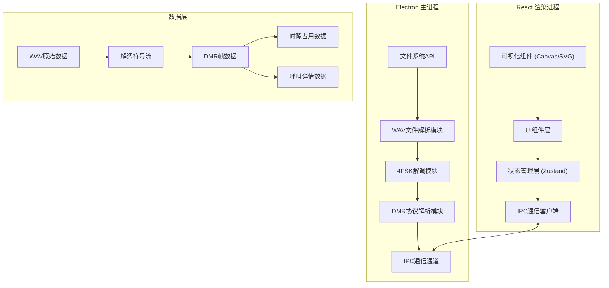

## 1. 架构设计



## 2. 技术选型

| 层级 | 技术 | 版本 | 说明 |
|------|------|------|------|
| 桌面框架 | Electron | ^30.0 | 跨平台桌面应用框架 |
| 前端框架 | React | ^18.2 | 用户界面框架 |
| 语言 | TypeScript | ^5.4 | 类型安全 |
| 构建工具 | Vite | ^5.2 | 快速构建 |
| 样式 | TailwindCSS | ^3.4 | 原子化CSS |
| 状态管理 | Zustand | ^4.5 | 轻量状态管理 |
| 图标 | Lucide React | ^0.37 | 图标库 |
| 数字信号处理 | dsp.js | 自定义 | 4FSK解调算法 |
| 音频处理 | Web Audio API + wavefile | ^11.0 | WAV文件解析 |

## 3. 目录结构

```
p269/
├── electron/                    # Electron主进程
│   ├── main.ts                 # 主进程入口
│   ├── preload.ts              # 预加载脚本
│   └── dsp/                    # 数字信号处理模块
│       ├── wav-reader.ts       # WAV文件读取
│       ├── fsk4-demodulator.ts # 4FSK解调器
│       ├── dmr-parser.ts       # DMR协议解析
│       └── types.ts            # 类型定义
├── src/                        # React渲染进程
│   ├── components/             # UI组件
│   │   ├── FileImporter.tsx    # 文件导入组件
│   │   ├── TimeSlotChart.tsx   # 时隙占用图
│   │   ├── CallList.tsx        # 呼叫列表
│   │   ├── SignalMeter.tsx     # 信号质量仪表
│   │   └── ControlPanel.tsx    # 控制面板
│   ├── store/                  # 状态管理
│   │   └── useDmrStore.ts      # DMR分析状态
│   ├── hooks/                  # 自定义Hooks
│   │   └── useDmrAnalysis.ts   # DMR分析Hook
│   ├── types/                  # 类型定义
│   │   └── index.ts
│   ├── utils/                  # 工具函数
│   │   └── format.ts
│   ├── App.tsx                 # 主应用组件
│   ├── main.tsx                # 入口文件
│   └── index.css               # 全局样式
├── shared/                     # 共享类型
│   └── types.ts
├── package.json
├── vite.config.ts
├── tailwind.config.js
└── tsconfig.json
```

## 4. 核心数据类型定义

```typescript
// 共享类型定义
export interface WavFileInfo {
  path: string;
  name: string;
  sampleRate: number;
  channels: number;
  bitsPerSample: number;
  duration: number;
  size: number;
}

export interface DemodulationConfig {
  symbolRate: number;          // 符号率，默认4800
  frequencyDeviation: number;  // 频偏，默认2400Hz
  centerFrequency: number;     // 中心频率偏移
}

export interface DemodulationResult {
  symbols: number[];           // 解调后的符号流 (-3, -1, 1, 3)
  snr: number;                 // 信噪比
  frequencyOffset: number;     // 频率偏移估计
  symbolErrorRate: number;     // 符号错误率估计
  qualityScore: number;        // 信号质量评分 0-100
}

export type DmrSlot = 1 | 2;

export type CallType = 
  | 'group_voice'      // 组呼
  | 'private_voice'    // 单呼
  | 'group_data'       // 组数据
  | 'private_data'     // 单数据
  | 'csbk'             // 控制信令
  | 'unknown';

export interface DmrFrame {
  slot: DmrSlot;
  timestamp: number;       // 时间戳（毫秒）
  frameType: 'voice' | 'data' | 'csbk' | 'sync';
  callType: CallType;
  sourceId?: number;
  destinationId?: number;
  colorCode?: number;
  rawData?: Uint8Array;
}

export interface TimeSlotOccupancy {
  slot: DmrSlot;
  startTime: number;
  endTime: number;
  callType: CallType;
  sourceId?: number;
  destinationId?: number;
  duration: number;
}

export interface AnalysisResult {
  fileInfo: WavFileInfo;
  demodulation: DemodulationResult;
  frames: DmrFrame[];
  timeSlots: TimeSlotOccupancy[];
  callStatistics: {
    totalCalls: number;
    byType: Record<CallType, number>;
    bySlot: Record<DmrSlot, number>;
    totalDuration: number;
  };
}

export interface AnalysisProgress {
  phase: 'reading' | 'demodulating' | 'parsing' | 'complete';
  progress: number;  // 0-100
}
```

## 5. IPC通信定义

### 5.1 主进程 → 渲染进程

| 通道名 | 数据类型 | 说明 |
|--------|----------|------|
| `dmr:analysis-progress` | `AnalysisProgress` | 分析进度更新 |
| `dmr:analysis-complete` | `AnalysisResult` | 分析完成 |
| `dmr:analysis-error` | `{ message: string }` | 分析错误 |

### 5.2 渲染进程 → 主进程

| 通道名 | 参数类型 | 返回类型 | 说明 |
|--------|----------|----------|------|
| `dmr:select-file` | `void` | `WavFileInfo \| null` | 打开文件选择对话框 |
| `dmr:start-analysis` | `{ filePath: string; config: DemodulationConfig }` | `void` | 开始分析 |
| `dmr:cancel-analysis` | `void` | `void` | 取消分析 |

## 6. 核心算法说明

### 6.1 4FSK解调算法

1. **载波恢复**：使用锁相环（PLL）估计和校正频率偏移
2. **匹配滤波**：根升余弦（RRC）滤波器进行脉冲整形
3. **符号同步**：使用Gardner算法进行定时恢复
4. **判决**：根据信号星座点进行软判决，输出符号值 (-3, -1, 1, 3)

### 6.2 DMR帧解析

1. **同步检测**：检测DMR同步字（0x755FD7DF755FD7DF）
2. **时隙识别**：根据同步字类型区分时隙1和时隙2
3. **色彩码提取**：从帧头中提取色彩码（Color Code）
4. **载荷解码**：根据帧类型（语音/数据/CSBK）进行相应解码
5. **呼叫关联**：将连续帧关联为完整呼叫记录

### 6.3 CSBK信令解析

支持解析的CSBK类型：
- UU_Voice_Request：单呼语音请求
- UU_Answer_Response：呼叫应答
- BS_Dwn_Act：基站下行活动通知
- Group_Voice_Channel_User：组呼信道用户
