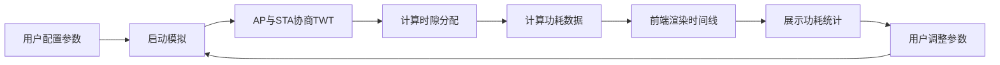

## 1. 产品概述

TWT（Target Wake Time）模拟器是一个用于模拟Wi-Fi 6/802.11ah网络中AP与多个STA协商TWT参数、计算睡眠/唤醒时隙并展示功耗节省效果的可视化工具。本产品帮助网络工程师和研究人员直观理解TWT机制的工作原理和节能效果。

- 主要目的：模拟TWT协商过程，可视化展示时隙分配，量化功耗节省比例
- 目标用户：网络研究人员、Wi-Fi系统工程师、高校师生
- 产品价值：提供直观的TWT机制演示和性能分析工具

## 2. 核心功能

### 2.1 用户角色
| 角色 | 注册方式 | 核心权限 |
|------|----------|----------|
| 普通用户 | 无需注册 | 使用模拟功能、调整参数、查看结果 |

### 2.2 功能模块
1. **主页面**：参数配置面板、TWT时间线可视化、功耗统计展示
2. **模拟控制区**：开始/暂停/重置模拟、调整模拟速度
3. **STA管理区**：添加/删除STA、配置每个STA的TWT参数

### 2.3 页面详情
| 页面名称 | 模块名称 | 功能描述 |
|-----------|-------------|---------------------|
| 主页面 | 参数配置面板 | 配置AP参数、TWT周期、唤醒时长、STA数量等 |
| 主页面 | TWT时间线 | 可视化展示各STA的睡眠/唤醒时隙，时间轴可缩放 |
| 主页面 | 功耗统计面板 | 实时显示功耗节省比例、各STA功耗对比图表 |
| 主页面 | STA列表 | 显示各STA的TWT参数、状态和能耗数据 |
| 主页面 | 模拟控制 | 开始/暂停/重置模拟，调整模拟速度 |

## 3. 核心流程

用户配置TWT参数 → 启动模拟 → 后端计算协商结果和时隙分配 → 前端实时渲染时间线和功耗数据 → 用户可调整参数重新模拟

## 4. 用户界面设计

### 4.1 设计风格
- 主色调：深蓝色（#1e3a5f）代表技术专业感，搭配青色（#06b6d4）作为数据高亮
- 辅助色：绿色表示唤醒状态，灰色表示睡眠状态
- 按钮风格：圆角矩形，带悬停阴影效果
- 字体：使用Space Mono作为数据展示字体，搭配现代无衬线字体
- 布局：卡片式布局，顶部导航+左侧参数面板+右侧可视化区域
- 图标风格：使用线性图标，简洁科技感

### 4.2 页面设计概述
| 页面名称 | 模块名称 | UI元素 |
|-----------|-------------|-------------|
| 主页面 | 参数配置面板 | 表单输入框、滑块、下拉选择器、卡片容器 |
| 主页面 | TWT时间线 | SVG时间轴、颜色编码的时隙块、悬停提示、缩放控制 |
| 主页面 | 功耗统计面板 | 进度条、环形图、数据卡片、柱状图 |
| 主页面 | STA列表 | 表格、状态指示器、操作按钮 |
| 主页面 | 模拟控制 | 播放/暂停按钮、速度滑块、重置按钮 |

### 4.3 响应性
- 桌面端（默认）：三栏布局，参数面板+时间线+统计面板
- 平板端：两栏布局，参数面板折叠为抽屉
- 移动端：单栏垂直布局，所有模块垂直排列

### 4.4 动画效果
- 页面加载：元素依次淡入，时间线从左到右展开
- 时隙变化：平滑过渡动画
- 数据更新：数字滚动效果
- 悬停交互：卡片微上浮、按钮阴影加深
