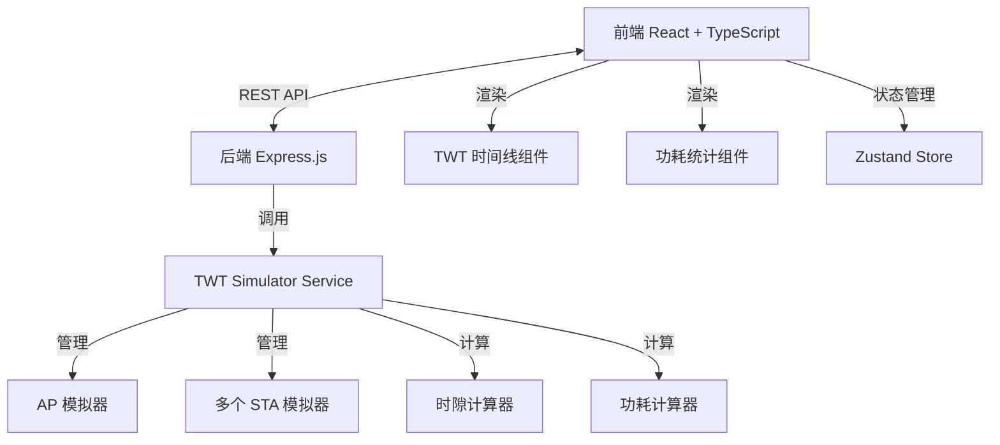
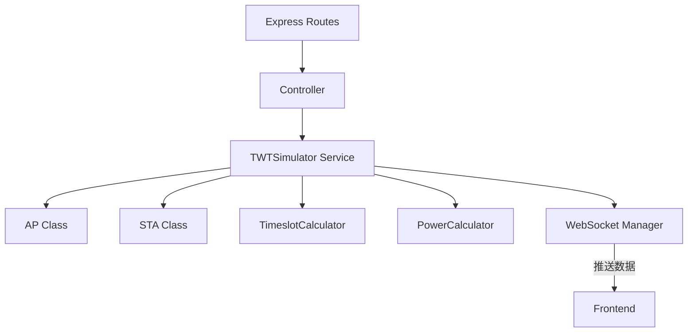

## 1. 架构设计



## 2. 技术描述

- **前端**：React@18 + TypeScript + Vite + TailwindCSS@3 + Zustand + lucide-react
- **后端**：Express.js@4 + TypeScript + Node.js
- **数据格式**：JSON，无需数据库，所有数据在内存中处理
- **初始化工具**：vite-init，使用 react-express-ts 模板

## 3. 目录结构

```
p277/
├── src/
│   ├── components/
│   │   ├── ControlPanel.tsx      # 控制面板组件
│   │   ├── TWTTimeline.tsx       # TWT时间线组件
│   │   ├── PowerStats.tsx        # 功耗统计组件
│   │   ├── STAList.tsx           # STA列表组件
│   │   └── ConfigPanel.tsx       # 参数配置面板
│   ├── hooks/
│   │   └── useTWTWebSocket.ts    # WebSocket连接Hook
│   ├── store/
│   │   └── useSimulationStore.ts # Zustand状态管理
│   ├── pages/
│   │   └── Index.tsx             # 主页面
│   ├── utils/
│   │   └── format.ts             # 格式化工具函数
│   ├── App.tsx
│   ├── main.tsx
│   └── index.css
├── api/
│   ├── server.ts                 # Express服务器入口
│   ├── services/
│   │   ├── TWTSimulator.ts       # TWT模拟器核心服务
│   │   ├── AP.ts                 # AP模拟器类
│   │   ├── STA.ts                # STA模拟器类
│   │   ├── TimeslotCalculator.ts # 时隙计算器
│   │   └── PowerCalculator.ts    # 功耗计算器
│   ├── types/
│   │   └── index.ts              # 类型定义
│   └── routes/
│       └── api.ts                # API路由
├── shared/
│   └── types.ts                  # 前后端共享类型
├── vite.config.ts
├── tsconfig.json
├── tailwind.config.js
└── package.json
```

## 4. 路由定义

| 路由 | 方法 | 用途 |
|-------|------|---------|
| / | GET | 主页面 |
| /api/simulation/start | POST | 启动模拟 |
| /api/simulation/pause | POST | 暂停模拟 |
| /api/simulation/reset | POST | 重置模拟 |
| /api/simulation/config | POST | 配置模拟参数 |
| /api/simulation/state | GET | 获取当前模拟状态 |
| /api/stas | GET | 获取所有STA列表 |
| /api/stas | POST | 添加新的STA |
| /api/stas/:id | PUT | 更新STA配置 |
| /api/stas/:id | DELETE | 删除STA |
| /ws | WebSocket | 实时推送模拟数据 |

## 5. API 类型定义

```typescript
// 前后端共享类型

// TWT参数类型
export interface TWTParams {
  wakeInterval: number;      // 唤醒间隔 (ms)
  wakeDuration: number;      // 唤醒持续时间 (ms)
  wakeOffset: number;        // 唤醒偏移量 (ms)
}

// STA类型
export interface STA {
  id: string;
  name: string;
  macAddress: string;
  twtParams: TWTParams;
  powerProfile: PowerProfile;
  status: 'sleeping' | 'awake' | 'negotiating' | 'disconnected';
  negotiated: boolean;
  negotiatedTWT?: TWTParams;
}

// 功耗配置
export interface PowerProfile {
  awakePower: number;        // 唤醒功耗 (mW)
  sleepPower: number;        // 睡眠功耗 (mW)
  transitionPower: number;   // 状态转换功耗 (mW)
}

// AP类型
export interface AccessPoint {
  id: string;
  name: string;
  maxSupportedSTAs: number;
  twtCapability: {
    supportBroadcast: boolean;
    supportIndividual: boolean;
    minWakeInterval: number;
    maxWakeInterval: number;
  };
}

// 时隙
export interface Timeslot {
  staId: string;
  startTime: number;         // 开始时间 (ms)
  duration: number;          // 持续时间 (ms)
  type: 'wake' | 'sleep' | 'transition';
}

// 功耗数据
export interface PowerData {
  staId: string;
  timestamp: number;
  currentPower: number;      // 当前功耗 (mW)
  totalEnergy: number;       // 总能耗 (mWh)
  savedEnergy: number;       // 节省能耗 (mWh)
  savingRatio: number;       // 节省比例 (0-1)
}

// 模拟状态
export interface SimulationState {
  isRunning: boolean;
  currentTime: number;       // 当前模拟时间 (ms)
  speed: number;             // 模拟速度倍率
  ap: AccessPoint;
  stas: STA[];
  timeslots: Timeslot[];
  powerStats: PowerData[];
  overallSavingRatio: number;
}

// 模拟配置
export interface SimulationConfig {
  duration: number;          // 模拟总时长 (ms)
  speed: number;             // 模拟速度
  apConfig: Partial<AccessPoint>;
  staCount: number;
  defaultTWTParams: TWTParams;
}

// API响应
export interface ApiResponse<T> {
  success: boolean;
  data?: T;
  error?: string;
  message?: string;
}
```

## 6. 后端服务架构



### 6.1 核心类说明

**AP.ts** - 接入点模拟器
```typescript
class AccessPointSimulator {
  negotiateTWT(sta: STA, requestedParams: TWTParams): TWTParams;
  allocateTimeslot(sta: STA, params: TWTParams): boolean;
  getAvailableTimeslots(): Timeslot[];
}
```

**STA.ts** - 站点模拟器
```typescript
class STASimulator {
  requestTWT(params: TWTParams): Promise<TWTParams>;
  updateStatus(time: number): 'sleeping' | 'awake' | 'transition';
  calculatePowerConsumption(duration: number): number;
}
```

**TimeslotCalculator.ts** - 时隙计算器
```typescript
class TimeslotCalculator {
  generateSTAislot(sta: STA, startTime: number, endTime: number): Timeslot[];
  checkCollision(slot1: Timeslot, slot2: Timeslot): boolean;
  optimizeSlots(slots: Timeslot[]): Timeslot[];
}
```

**PowerCalculator.ts** - 功耗计算器
```typescript
class PowerCalculator {
  calculatePowerForSTA(sta: STA, timeslots: Timeslot[]): PowerData;
  calculateSavingRatio(sta: STA, timeslots: Timeslot[]): number;
  calculateOverallStats(stas: STA[], allSlots: Timeslot[]): PowerData[];
}
```

## 7. 前端状态管理

**Zustand Store** 管理以下状态：
- 模拟状态（运行/暂停/停止）
- 当前模拟时间
- STA列表及状态
- 时隙数据
- 功耗统计数据
- 配置参数

## 8. 功耗计算公式

- **无TWT时的能耗**：`E_no_twt = awakePower × total_time`
- **有TWT时的能耗**：`E_twt = Σ(awakePower × wake_duration + sleepPower × sleep_duration + transitionPower × transition_count)`
- **节省比例**：`saving_ratio = (E_no_twt - E_twt) / E_no_twt × 100%`
