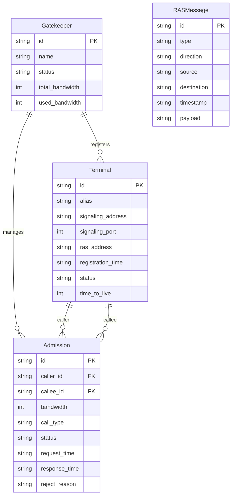

## 1. 架构设计

```mermaid
flowchart TB
    subgraph "前端 (React + Vite)"
        "控制台页面"
        "终端管理页面"
        "呼叫许可页面"
        "Zustand 状态管理"
        "WebSocket 客户端"
    end
    subgraph "后端 (Python FastAPI)"
        "REST API"
        "WebSocket 推送"
        "RAS 消息模拟器"
        "终端注册表"
        "呼叫许可管理"
    end
    "前端 (React + Vite)" <-->|"HTTP + WebSocket"| "后端 (Python FastAPI)"
```

## 2. 技术说明

- **前端**：React@18 + TypeScript + Vite + TailwindCSS@3
- **初始化工具**：vite-init (react-ts 模板)
- **后端**：Python 3 + FastAPI + uvicorn
- **实时通信**：WebSocket（RAS 消息实时推送）
- **数据库**：内存数据结构（模拟场景无需持久化）

## 3. 路由定义

| 路由 | 用途 |
|------|------|
| `/` | 控制台 - 网守状态总览和 RAS 消息日志 |
| `/terminals` | 终端管理 - 注册终端列表和管理 |
| `/admissions` | 呼叫许可 - 呼叫请求和带宽管理 |

## 4. API 定义

### 4.1 REST API

```typescript
interface Terminal {
  id: string
  alias: string
  signaling_address: string
  signaling_port: number
  ras_address: string
  registration_time: string
  status: "online" | "offline"
  time_to_live: number
}

interface AdmissionRequest {
  id: string
  caller_alias: string
  callee_alias: string
  bandwidth: number
  call_type: "point_to_point" | "multipoint"
  status: "pending" | "confirmed" | "rejected"
  request_time: string
  response_time?: string
  reject_reason?: string
}

interface RASMessage {
  id: string
  type: "GRQ" | "GCF" | "GRJ" | "RRQ" | "RCF" | "RRJ" | "ARQ" | "ACF" | "ARJ"
  direction: "inbound" | "outbound"
  source: string
  destination: string
  timestamp: string
  payload: Record<string, unknown>
}

interface GatekeeperInfo {
  id: string
  name: string
  status: "running" | "stopped"
  total_bandwidth: number
  used_bandwidth: number
  registered_count: number
  active_calls: number
}

// API Endpoints
// GET    /api/gatekeeper           - 获取网守信息
// GET    /api/terminals            - 获取所有已注册终端
// POST   /api/terminals/register   - 模拟 RRQ 注册终端
// DELETE /api/terminals/{id}        - 注销终端
// GET    /api/admissions           - 获取所有呼叫许可
// POST   /api/admissions/request   - 模拟 ARQ 呼叫请求
// POST   /api/ras/grq              - 模拟 GRQ 发现请求
// GET    /api/ras/messages         - 获取 RAS 消息历史
// WS     /ws/ras                   - RAS 消息实时推送
```

### 4.2 WebSocket 消息格式

```typescript
interface WSMessage {
  event: "ras_message" | "terminal_registered" | "terminal_unregistered" | "admission_update" | "gatekeeper_status"
  data: RASMessage | Terminal | AdmissionRequest | GatekeeperInfo
}
```

## 5. 后端架构图

```mermaid
flowchart TB
    "FastAPI Router" --> "RAS Service"
    "RAS Service" --> "Gatekeeper Engine"
    "Gatekeeper Engine" --> "Terminal Registry"
    "Gatekeeper Engine" --> "Admission Manager"
    "Gatekeeper Engine" --> "Bandwidth Manager"
    "Gatekeeper Engine" --> "Message Logger"
    "WebSocket Manager" --> "RAS Service"
```

## 6. 数据模型

### 6.1 数据模型定义



### 6.2 数据定义

本项目使用内存数据结构，无需 DDL。所有数据在 Python 后端中以字典列表形式维护，通过 FastAPI 暴露为 REST API。
