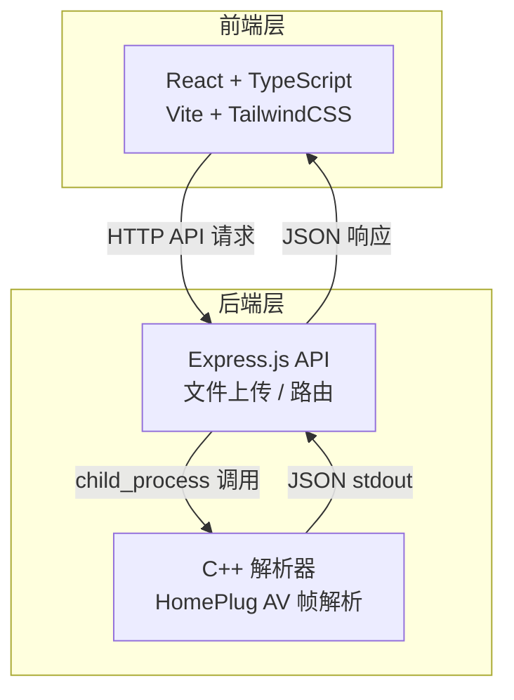

## 1. 架构设计



## 2. 技术说明

- 前端：React@18 + TypeScript + TailwindCSS@3 + Vite
- 初始化工具：vite-init（react-express-ts 模板）
- 后端 API 层：Express@4 + TypeScript + multer（文件上传）
- C++ 解析器：C++17 标准，CMake 构建系统，无外部依赖
- 数据库：无（解析结果为实时计算，不持久化）

## 3. 路由定义

| 路由 | 用途 |
|------|------|
| / | 主页面 - 数据上传与解析结果展示 |

## 4. API 定义

### 4.1 上传并解析文件

```
POST /api/parse
Content-Type: multipart/form-data

Request:
  file: Binary (HomePlug AV 捕获文件)

Response:
{
  "success": boolean,
  "frames": [
    {
      "frameIndex": number,
      "frameType": "MAC" | "BEACON" | "SACK" | "UNKNOWN",
      "macHeader": {
        "destinationTEI": number,
        "sourceTEI": number,
        "frameControl": number,
        "segmentInfo": number,
        "delimiterType": string
      },
      "sof": {
        preambleQuality": number,
        modulationScheme": string,
        toneMapIndex": number,
        payloadLength": number,
        frameControlBits": string
      },
      "signaling": {
        "sack": {
          "present": boolean,
          "ackBitmap": string,
          "acknowledgedSegments": number[]
        },
        "ccoInfo": {
          "present": boolean,
          "ccoTEI": number,
          "networkId": string,
          "stationRole": string,
          "beaconPeriod": number
        }
      },
      "rawHex": string
    }
  ],
  "error": string | null
}
```

### 4.2 健康检查

```
GET /api/health

Response:
{
  "status": "ok",
  "parserAvailable": boolean
}
```

## 5. 服务器架构

```mermaid
flowchart LR
    "Controller<br/>/api/parse<br/>/api/health" --> "Service<br/>FileService<br/>ParserService"
    "ParserService" --> "C++ Executable<br/>hpav-parser"
    "FileService" --> "Temp Storage<br/>/tmp/hpav-uploads/"
```

## 6. C++ 解析器设计

### 6.1 HomePlug AV 帧格式

HomePlug AV MAC 帧结构（基于 IEEE 1901/HomePlug AV 标准）：

```
| 前导码 (Preamble) | 帧控制 (FC) | MAC 报头 | 有效载荷 | FCS |
|     56 bits       |   128 bits  | 变长     | 变长     | 32b |
```

**MAC 报头字段**：
- Frame Control (2 bytes): 帧类型、方向等
- Destination TEI (1 byte): 目标终端标识 (0-254, 0xFF=广播)
- Source TEI (1 byte): 源终端标识
- 其他字段取决于帧类型

**SOF 信号字段**：
- Tone Map Index (TMI)
- 调制方案
- 有效载荷长度
- 前导码质量指示

**SACK 信令**：
- 选择性确认位图，标识哪些段已成功接收

**CCo 信息**：
- CCo TEI、网络标识、站点角色、信标周期

### 6.2 C++ 解析器模块

| 模块 | 功能 |
|------|------|
| main.cpp | 入口，读取文件，调用解析器，输出 JSON |
| FrameParser | 主解析器，按帧边界切分数据 |
| MacHeaderParser | 解析 MAC 报头，提取 TEI |
| SofParser | 解析 SOF 信号字段 |
| SignalingParser | 解析 SACK、CCo 信令 |
| JsonBuilder | 构建结构化 JSON 输出 |

### 6.3 编译与调用

```bash
# 编译
cd cpp-parser && mkdir build && cd build && cmake .. && make

# 调用
./hpav-parser <input_file>
# 输出 JSON 到 stdout
```
