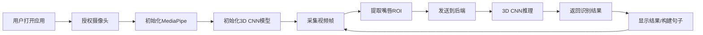

## 1. 产品概述

实时唇语识别Web应用，通过摄像头采集视频流，利用MediaPipe提取嘴唇区域，结合3D CNN模型识别辅音（b/p/m等），实时返回识别文本，支持句子模式和训练数据存储。

## 2. 核心功能

### 2.1 用户角色
| 角色 | 注册方式 | 核心权限 |
|------|----------|----------|
| 普通用户 | 无需注册 | 使用唇语识别功能，查看识别结果 |
| 管理员 | 本地登录 | 管理训练数据，查看模型状态 |

### 2.2 功能模块
1. **实时识别页面**：摄像头预览，嘴唇ROI可视化，实时识别结果显示
2. **句子模式**：连续识别，自动拼接成句子，支持编辑和复制
3. **训练数据管理**：录制视频片段，标注辅音标签，存储到数据库
4. **设置面板**：摄像头选择，识别灵敏度调节，模型选择

### 2.3 页面详情
| 页面名称 | 模块名称 | 功能描述 |
|----------|----------|----------|
| 实时识别页面 | 摄像头预览区 | 显示实时摄像头画面，叠加嘴唇关键点 |
| 实时识别页面 | 嘴唇ROI区域 | 放大显示提取的嘴唇区域，供用户确认 |
| 实时识别页面 | 识别结果区 | 实时显示识别的辅音和置信度 |
| 实时识别页面 | 句子构建区 | 连续识别结果拼接成完整句子 |
| 训练数据管理 | 录制面板 | 录制指定辅音的视频片段 |
| 训练数据管理 | 数据列表 | 查看已存储的训练视频片段 |

## 3. 核心流程

用户打开应用 → 授权摄像头权限 → 系统初始化MediaPipe和模型 → 实时采集视频帧 → 提取嘴唇关键点 → 裁剪嘴唇ROI → 发送到后端识别 → 3D CNN模型推理 → 返回识别结果 → 前端显示并构建句子

## 4. 用户界面设计

### 4.1 设计风格
- 主色调：深蓝科技风（#1a365d），辅助色：青色（#319795）
- 按钮风格：圆角矩形，轻微阴影，悬停效果
- 字体：现代无衬线字体，标题使用粗体
- 布局：卡片式布局，左右分栏（左侧视频，右侧结果）
- 图标风格：线性简约图标

### 4.2 页面设计概述
| 页面名称 | 模块名称 | UI元素 |
|----------|----------|--------|
| 实时识别页面 | 视频预览区 | 圆角边框，关键点叠加动画，状态指示器 |
| 实时识别页面 | 识别结果区 | 大字显示当前识别辅音，置信度进度条 |
| 实时识别页面 | 句子构建区 | 文本框，复制按钮，清空按钮，历史记录 |
| 训练数据管理 | 录制面板 | 录制按钮，时长显示，辅音选择下拉框 |

### 4.3 响应式
- 桌面端：左右分栏布局，视频区占60%宽度
- 平板端：上下布局，视频在上，结果在下
- 移动端：单列布局，优化触控交互

### 4.4 视觉效果
- 摄像头激活时显示呼吸灯效果
- 识别结果出现时使用淡入动画
- 嘴唇关键点使用动态连线效果
- 置信度条使用平滑过渡动画
