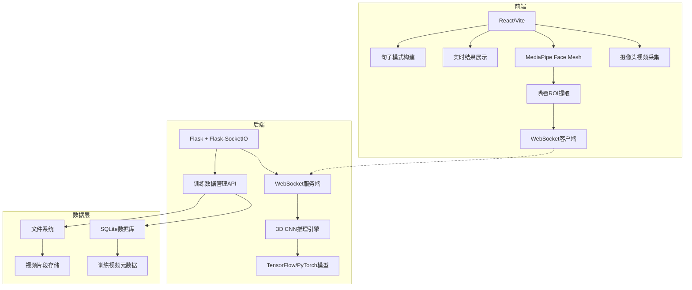
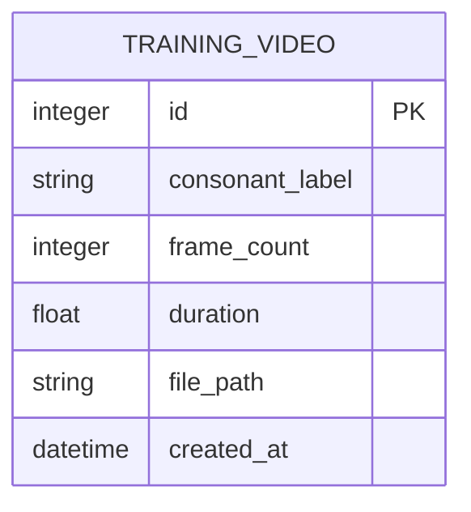

## 1. 架构设计



## 2. 技术描述

- **前端**：React@18 + Vite + TypeScript
  - MediaPipe Face Mesh：面部关键点检测
  - Socket.IO-client：实时WebSocket通信
  - TailwindCSS 3：样式框架
- **后端**：Python + Flask + Flask-SocketIO
  - TensorFlow/PyTorch：3D CNN模型推理
  - OpenCV：视频帧处理
- **数据库**：SQLite（训练数据元数据）
- **文件存储**：本地文件系统（视频片段）

## 3. 目录结构

```
p29/
├── frontend/
│   ├── src/
│   │   ├── components/
│   │   │   ├── CameraPreview.tsx
│   │   │   ├── LipROI.tsx
│   │   │   ├── RecognitionResult.tsx
│   │   │   ├── SentenceBuilder.tsx
│   │   │   └── TrainingPanel.tsx
│   │   ├── hooks/
│   │   │   ├── useCamera.ts
│   │   │   ├── useMediaPipe.ts
│   │   │   └── useWebSocket.ts
│   │   ├── utils/
│   │   │   └── lipExtraction.ts
│   │   │   └── frameProcessor.ts
│   │   └── App.tsx
│   └── package.json
├── backend/
│   ├── app.py
│   ├── model/
│   │   ├── cnn3d.py
│   │   └── inference.py
│   ├── database/
│   │   ├── models.py
│   │   └── database.py
│   ├── utils/
│   │   └── video_processor.py
│   └── requirements.txt
└── data/
    └── training_videos/
```

## 4. 前端核心类型定义

```typescript
// 识别结果
interface RecognitionResult {
  consonant: string;
  confidence: number;
  timestamp: number;
}

// 嘴唇关键点
interface LipLandmarks {
  upperLip: Point[];
  lowerLip: Point[];
  boundingBox: { x: number; y: number; width: number; height: number };
}

// WebSocket消息
interface WSMessage {
  type: 'frame' | 'result' | 'status';
  data: string;
}
```

## 5. 后端API定义

### WebSocket事件

| 事件名 | 方向 | 数据格式 | 说明 |
|--------|------|----------|------|
| frame | 前端→后端 | `{ frames: base64[], timestamp: number }` | 发送视频帧序列 |
| result | 后端→前端 | `{ consonant: string, confidence: number }` | 返回识别结果 |
| status | 后端→前端 | `{ status: 'ready' | 'processing' | 'error' }` | 状态更新 |

### REST API

| 方法 | 路径 | 说明 |
|------|------|------|
| GET | /api/training-data | 获取训练数据列表 |
| POST | /api/training-data | 上传训练视频 |
| DELETE | /api/training-data/:id | 删除训练数据 |
| GET | /api/model/status | 获取模型状态 |
| POST | /api/model/train | 触发模型训练 |

## 6. 数据模型

### 6.1 ER图



### 6.2 DDL

```sql
CREATE TABLE training_videos (
    id INTEGER PRIMARY KEY AUTOINCREMENT,
    consonant_label VARCHAR(10) NOT NULL,
    frame_count INTEGER NOT NULL,
    duration FLOAT NOT NULL,
    file_path VARCHAR(255) NOT NULL,
    created_at DATETIME DEFAULT CURRENT_TIMESTAMP
);

CREATE INDEX idx_consonant_label ON training_videos(consonant_label);
```

## 7. 3D CNN模型架构

- 输入：16帧 x 64x64 灰度嘴唇ROI序列
- 卷积层：3D Conv + BatchNorm + MaxPool3D
- 全连接层：Dropout + Dense
- 输出：辅音分类（b, p, m, f, d, t, n, l, ...）
