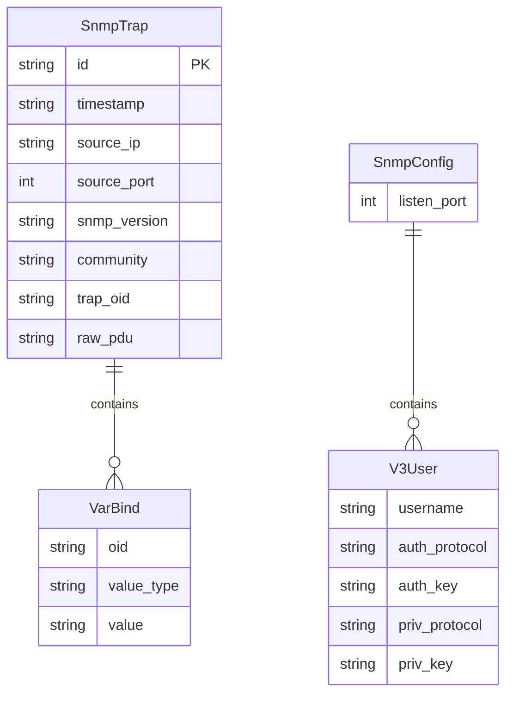

## 1. 架构设计

```mermaid
graph TB
    subgraph "网络设备层"
        "D1[交换机/路由器 v2c Trap]"
        "D2[防火墙/服务器 v3 Trap]"
    end
    subgraph "后端服务层 (Python)"
        "B1[FastAPI HTTP Server]"
        "B2[pysnmp Trap Receiver]"
        "B3[WebSocket Manager]"
    end
    subgraph "前端展示层 (React)"
        "F1[Trap 监控页面]"
        "F2[配置管理页面]"
    end
    "D1" --> "B2"
    "D2" --> "B2"
    "B2" --> "B3"
    "B3" -->|"WebSocket"| "F1"
    "B1" -->|"REST API"| "F2"
    "F2" -->|"REST API"| "B1"
    "B1" --> "B2"
```

## 2. 技术说明

- **前端**：React@18 + TailwindCSS@3 + Vite
- **初始化工具**：Vite (create-vite)
- **后端**：Python 3.10+ / FastAPI + pysnmp-lextudio + uvicorn + websockets
- **数据库**：内存存储（Trap 列表保存在进程内存中，最多保留 1000 条）
- **通信协议**：前端 ↔ 后端：REST API + WebSocket；后端 ↔ 网络设备：SNMP UDP Trap

### 后端关键依赖

| 库 | 版本 | 用途 |
|----|------|------|
| fastapi | >=0.100 | HTTP 框架 |
| uvicorn | >=0.23 | ASGI 服务器 |
| pysnmp-lextudio | >=5.0 | SNMP Trap 接收（v2c/v3） |
| websockets | >=11.0 | WebSocket 实时推送 |

## 3. 路由定义

| 路由 | 用途 |
|------|------|
| `/` | 前端主页面（Trap 监控） |
| `/config` | 前端配置管理页面 |
| `/api/traps` | GET - 获取 Trap 列表 |
| `/api/traps/:id` | GET - 获取单条 Trap 详情（含原始报文） |
| `/api/traps` | DELETE - 清空 Trap 列表 |
| `/api/traps/export` | GET - 导出 Trap 列表为 JSON |
| `/api/config` | GET - 获取当前 SNMP 配置 |
| `/api/config` | PUT - 更新 SNMP 配置（重启监听） |
| `/api/status` | GET - 获取服务状态 |
| `/ws/traps` | WebSocket - 实时推送新 Trap |

## 4. API 定义

### Trap 数据结构

```typescript
interface SnmpTrap {
  id: string
  timestamp: string
  source_ip: string
  source_port: number
  snmp_version: "v2c" | "v3"
  community?: string
  trap_oid: string
  variable_bindings: VarBind[]
  raw_pdu: string
}

interface VarBind {
  oid: string
  value_type: string
  value: string
}

interface SnmpConfig {
  listen_port: number
  v2c_communities: string[]
  v3_users: V3User[]
}

interface V3User {
  username: string
  auth_protocol: "MD5" | "SHA" | "NONE"
  auth_key: string
  priv_protocol: "DES" | "AES" | "NONE"
  priv_key: string
}

interface ServiceStatus {
  listening: boolean
  listen_port: number
  trap_count: number
  uptime: number
}
```

### 请求/响应

```
GET /api/traps?version=v2c&limit=50&offset=0
Response: { traps: SnmpTrap[], total: number }

GET /api/traps/:id
Response: SnmpTrap

DELETE /api/traps
Response: { message: string }

GET /api/traps/export
Response: SnmpTrap[] (JSON 下载)

GET /api/config
Response: SnmpConfig

PUT /api/config
Body: SnmpConfig
Response: { message: string, status: ServiceStatus }

GET /api/status
Response: ServiceStatus

WebSocket /ws/traps
Message: SnmpTrap (实时推送)
```

## 5. 服务端架构图

```mermaid
graph LR
    subgraph "FastAPI Application"
        "C1[Trap Controller]" --> "S1[Trap Service]"
        "C2[Config Controller]" --> "S2[Config Service]"
        "S1" --> "R1[内存存储 TrapStore]"
        "S2" --> "R2[pysnmp TrapListener]"
        "R2" --> "S1"
        "S1" --> "WS[WebSocket Manager]"
    end
```

## 6. 数据模型

### 6.1 数据模型定义



### 6.2 数据定义

本项目使用内存存储，无需 DDL。TrapStore 在 Python 进程中以列表形式维护，最大容量 1000 条，FIFO 淘汰。
