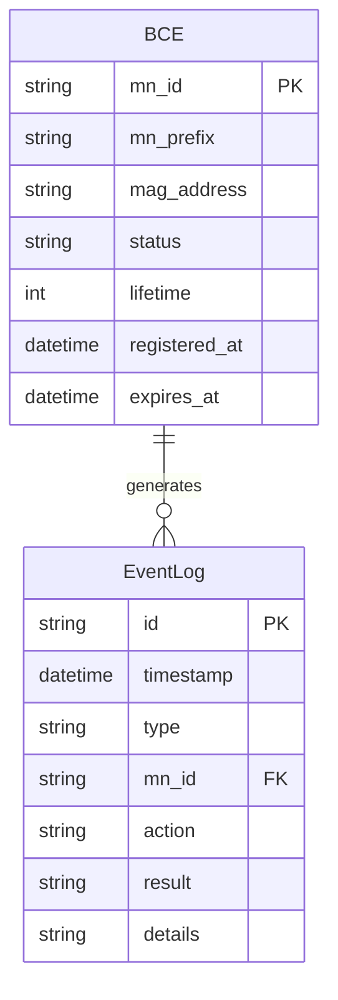

## 1. 架构设计

```mermaid
graph TB
    subgraph "前端层"
        "React + Vite + Tailwind"
    end
    subgraph "后端层 - Go"
        "HTTP Router" --> "PBU 处理器"
        "HTTP Router" --> "BCE 查询处理器"
        "PBU 处理器" --> "绑定缓存管理器"
        "BCE 查询处理器" --> "绑定缓存管理器"
    end
    subgraph "数据层"
        "内存绑定缓存 Map"
    end
    "React + Vite + Tailwind" -->|"REST API"| "HTTP Router"
    "绑定缓存管理器" --> "内存绑定缓存 Map"
```

## 2. 技术说明

- 前端：React@18 + TypeScript + Tailwind CSS@3 + Vite
- 初始化工具：vite-init（react-ts 模板）
- 后端：Go 1.21+（标准库 net/http + gorilla/mux 路由）
- 数据库：无，使用内存 Map 存储绑定缓存（模拟场景足够）
- 状态管理：Zustand

## 3. 路由定义

| 路由 | 用途 |
|------|------|
| `/` | 绑定缓存展示主页 |

## 4. API 定义

### 4.1 发送代理绑定更新

**POST /api/pbu**

请求体：
```typescript
interface PBURequest {
  mn_id: string         // MN 标识符（如 MN1）
  mn_prefix: string     // MN 的 IPv6 前缀（如 2001:db8:1::/64）
  mag_address: string   // MAG 的 IPv6 地址（如 2001:db8:0:1::1）
  lifetime: number      // 绑定生存时间（秒），0 表示注销
}
```

响应体：
```typescript
interface PBAResponse {
  status: number        // 0=成功, 1=参数错误, 2=未找到(注销时)
  message: string       // 状态描述
  mn_id: string         // MN 标识符
  mn_prefix: string     // 分配的前缀
  mag_address: string   // MAG 地址
  lifetime: number      // 授权生存时间
  timestamp: string     // PBA 时间戳（ISO 8601）
}
```

### 4.2 查询绑定缓存

**GET /api/bce**

响应体：
```typescript
interface BCEEntry {
  mn_id: string         // MN 标识符
  mn_prefix: string     // MN 的 IPv6 前缀
  mag_address: string   // 当前服务的 MAG 地址
  status: "Active" | "Expired" | "Pending"
  lifetime: number      // 剩余生存时间（秒）
  registered_at: string // 注册时间（ISO 8601）
  expires_at: string    // 过期时间（ISO 8601）
}

interface BCEResponse {
  entries: BCEEntry[]
  total: number
}
```

### 4.3 查询事件日志

**GET /api/events**

响应体：
```typescript
interface EventLog {
  id: string
  timestamp: string     // ISO 8601
  type: "PBU" | "PBA"
  mn_id: string
  action: "Register" | "Update" | "DeRegister"
  result: "Success" | "Failure"
  details: string
}

interface EventsResponse {
  events: EventLog[]
  total: number
}
```

## 5. 服务器架构图

```mermaid
graph LR
    "Main" --> "Router"
    "Router" --> "PBU Handler"
    "Router" --> "BCE Handler"
    "Router" --> "Events Handler"
    "PBU Handler" --> "BindingCache"
    "BCE Handler" --> "BindingCache"
    "Events Handler" --> "EventLogger"
    "PBU Handler" --> "EventLogger"
    "BindingCache" --> "sync.Map"
    "EventLogger" --> "[]EventLog"
```

## 6. 数据模型

### 6.1 数据模型定义



### 6.2 Go 结构体定义

```go
type BCEEntry struct {
    MNID        string    `json:"mn_id"`
    MNPrefix    string    `json:"mn_prefix"`
    MAGAddress  string    `json:"mag_address"`
    Status      string    `json:"status"`
    Lifetime    int       `json:"lifetime"`
    RegisteredAt time.Time `json:"registered_at"`
    ExpiresAt   time.Time `json:"expires_at"`
}

type EventLog struct {
    ID        string    `json:"id"`
    Timestamp time.Time `json:"timestamp"`
    Type      string    `json:"type"`
    MNID      string    `json:"mn_id"`
    Action    string    `json:"action"`
    Result    string    `json:"result"`
    Details   string    `json:"details"`
}
```
