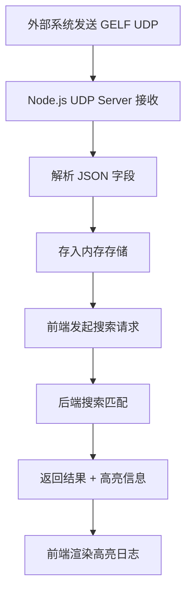

## 1. 产品概述

GELF 日志管理平台是一个轻量级的日志收集与检索系统，通过 UDP 协议接收 GELF（Graylog Extended Log Format）格式的日志消息，解析核心字段后存储并提供全文搜索与关键词高亮功能。面向开发者和运维人员，解决分布式系统日志集中查看与快速定位问题。

- 核心价值：将散落各处的日志统一收集、存储，并提供高效的搜索与可视化能力
- 目标用户：后端开发者、运维工程师、SRE 团队

## 2. 核心功能

### 2.1 功能模块

1. **日志搜索页**：实时日志流展示、关键词搜索、搜索高亮、日志详情展开

### 2.2 页面详情

| 页面名称 | 模块名称 | 功能描述 |
|----------|----------|----------|
| 日志搜索页 | 搜索栏 | 支持关键词输入，实时过滤日志列表 |
| 日志搜索页 | 日志列表 | 以时间线形式展示日志，每条显示 host、short_message、时间戳 |
| 日志搜索页 | 日志详情 | 点击日志条目展开查看 full_message 和完整字段 |
| 日志搜索页 | 高亮显示 | 搜索关键词在日志内容中高亮标记 |
| 日志搜索页 | 统计面板 | 显示日志总数、最近接收时间、各 host 日志数量分布 |

## 3. 核心流程

1. 外部系统通过 UDP 发送 GELF 格式日志到后端 12201 端口
2. 后端解析 JSON 字段（host、short_message、full_message），写入内存存储
3. 前端通过搜索栏输入关键词，调用后端搜索 API
4. 后端在存储中全文匹配，返回结果
5. 前端渲染日志列表，对匹配关键词高亮显示

## 4. 用户界面设计

### 4.1 设计风格

- **主题**：深色工业风，模拟终端/控制台氛围
- **主色**：深灰黑（#0d1117）背景，亮青色（#00d4ff）作为强调色
- **辅色**：琥珀色（#f0a500）用于警告/高亮，翠绿色（#00ff88）用于状态指示
- **字体**：JetBrains Mono 用于日志内容，Source Sans 3 用于界面文案
- **布局**：顶部搜索栏 + 侧边统计面板 + 主区域日志流
- **按钮风格**：扁平化，圆角 6px，hover 时发光边框效果
- **动效**：新日志条目滑入动画，搜索结果淡入，展开详情平滑过渡

### 4.2 页面设计概览

| 页面名称 | 模块名称 | UI 元素 |
|----------|----------|---------|
| 日志搜索页 | 搜索栏 | 深色输入框，青色光标，搜索图标，快捷键提示 |
| 日志搜索页 | 日志列表 | 单行日志卡片，左侧 host 标签（彩色编码），时间戳，short_message 预览 |
| 日志搜索页 | 日志详情 | 展开面板，full_message 带等宽字体显示，字段键值对网格布局 |
| 日志搜索页 | 高亮显示 | 匹配文本用青色背景 + 深色文字高亮标记 |
| 日志搜索页 | 统计面板 | 数字大屏风格，发光数字，迷你柱状图 |

### 4.3 响应式设计

- 桌面优先设计，侧边统计面板在移动端折叠为顶部卡片
- 日志列表自适应宽度，详情展开区域全宽
