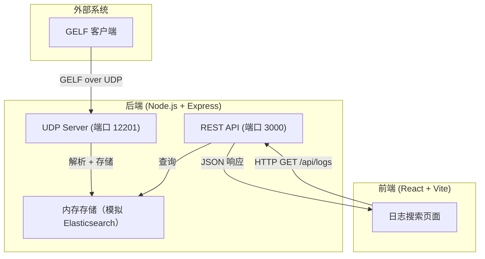
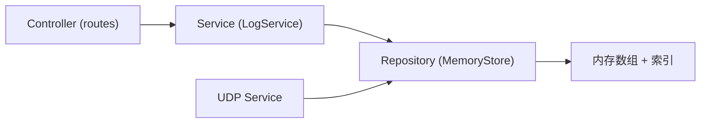
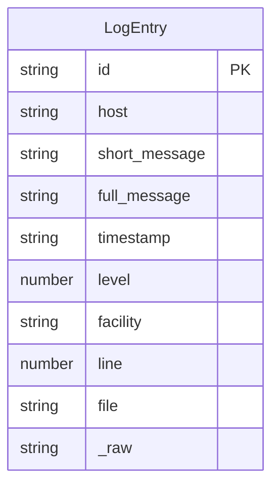

## 1. 架构设计



## 2. 技术说明

- **前端**：React@18 + Tailwind CSS@3 + Vite + Zustand
- **初始化工具**：vite-init（react-express-ts 模板）
- **后端**：Express@4 + Node.js dgram（UDP 模块）
- **数据库**：内存模拟 Elasticsearch（数组 + 全文索引）

## 3. 路由定义

| 路由 | 用途 |
|------|------|
| `/` | 日志搜索主页 |

## 4. API 定义

### 4.1 搜索日志

```
GET /api/logs
Query 参数：
  - q: 搜索关键词（可选，默认空字符串返回全部）
  - page: 页码（默认 1）
  - limit: 每页条数（默认 50）

响应类型：
interface LogEntry {
  id: string;
  host: string;
  short_message: string;
  full_message: string | null;
  timestamp: string;
  level: number;
  facility: string | null;
  line: number | null;
  file: string | null;
  _raw: string;
}

interface SearchResponse {
  total: number;
  page: number;
  limit: number;
  data: LogEntry[];
}
```

### 4.2 获取统计信息

```
GET /api/logs/stats

响应类型：
interface StatsResponse {
  totalLogs: number;
  lastReceived: string | null;
  hostCounts: Record<string, number>;
  levelCounts: Record<number, number>;
}
```

### 4.3 发送测试日志（开发辅助）

```
POST /api/logs/test
Body: { host: string; short_message: string; full_message?: string }

响应：{ success: boolean }
```

## 5. 服务器架构图



## 6. 数据模型

### 6.1 数据模型定义



### 6.2 GELF 协议说明

GELF（Graylog Extended Log Format）通过 UDP 发送 JSON 消息，核心字段：

| 字段 | 类型 | 必填 | 说明 |
|------|------|------|------|
| version | string | 是 | GELF 版本，通常为 "1.1" |
| host | string | 是 | 发送主机名 |
| short_message | string | 是 | 短消息（第一行） |
| full_message | string | 否 | 完整消息 |
| timestamp | number | 否 | Unix 时间戳 |
| level | number | 否 | 日志级别（0=Emergency, 1=Alert, ..., 6=Info, 7=Debug） |
| _facility | string | 否 | 自定义字段 |
| _line | number | 否 | 代码行号 |
| _file | string | 否 | 文件名 |

UDP 消息格式：JSON 字符串以空字节（\0）结尾。消息可能被 chunked（分片），需处理 chunk 头部。
