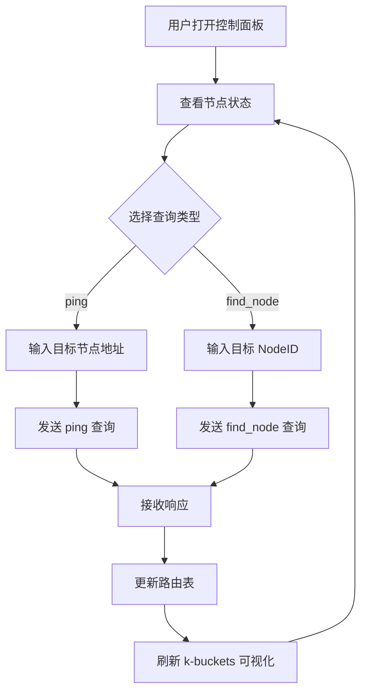

## 1. 产品概述

DHT KRPC 模拟器是一个可视化工具，用于模拟 BitTorrent DHT 网络中节点的 KRPC 协议交互。用户可通过 Web 界面向模拟的 DHT 节点发送 ping 和 find_node 查询，实时观察路由表（k-buckets）的变化和返回的节点列表，帮助理解分布式哈希表的核心工作原理。

- 目标用户：网络协议学习者、P2P 开发者、分布式系统研究者
- 核心价值：将抽象的 DHT/KRPC 协议以直观、可交互的方式呈现

## 2. 核心功能

### 2.1 功能模块

1. **控制面板页**：节点配置、查询发送、日志输出
2. **路由表页**：k-buckets 可视化、节点详情

### 2.2 页面详情

| 页面名称 | 模块名称 | 功能描述 |
|----------|----------|----------|
| 控制面板 | 节点状态 | 显示当前节点 ID、运行状态、已知的节点总数 |
| 控制面板 | 查询发送 | 发送 ping 查询（目标节点地址）、发送 find_node 查询（目标 ID） |
| 控制面板 | 查询日志 | 按时间倒序展示所有查询请求和响应，含事务ID、查询类型、耗时 |
| 路由表 | k-buckets 可视化 | 以树状/表格形式展示 160 个 bucket 及其中的节点 |
| 路由表 | 节点详情 | 点击节点展示 NodeID、IP、端口、最后活动时间 |

## 3. 核心流程

用户启动 DHT 模拟节点后，可通过控制面板向目标发送 ping 或 find_node 查询。ping 查询验证目标节点存活；find_node 查询根据目标 ID 返回距离最近的节点列表。所有响应的节点会被自动加入路由表，前端实时刷新 k-buckets 可视化。

## 4. 用户界面设计

### 4.1 设计风格

- 主色调：深色科技风（#0A0E17 背景 + #00FF88 赛博绿高亮）
- 辅助色：#1E293B 卡片背景，#334155 边框
- 按钮风格：圆角药丸按钮，悬停时发光效果
- 字体：JetBrains Mono（数据展示）+ Noto Sans SC（中文）
- 布局：左侧控制面板 + 右侧路由表，顶部状态栏

### 4.2 页面设计概览

| 页面名称 | 模块名称 | UI 元素 |
|----------|----------|---------|
| 控制面板 | 节点状态 | 顶部状态栏，显示节点ID（十六进制）、运行时长、已知节点数 |
| 控制面板 | 查询发送 | 两个 Tab（ping/find_node），输入框 + 发送按钮 |
| 控制面板 | 查询日志 | 时间线列表，每条含时间戳、类型标签、事务ID、状态、耗时 |
| 路由表 | k-buckets | 左侧 bucket 索引列表（0-159），右侧展示选中 bucket 的节点卡片 |
| 路由表 | 节点详情 | 弹窗展示 NodeID、IP:Port、距离、最后活跃时间 |

### 4.3 响应式

桌面优先设计，侧边栏在小屏幕下收起为抽屉式菜单。

### 4.4 动效

- 查询发送时按钮波纹动画
- 新节点加入路由表时闪烁高亮
- 日志条目入场淡入动画
