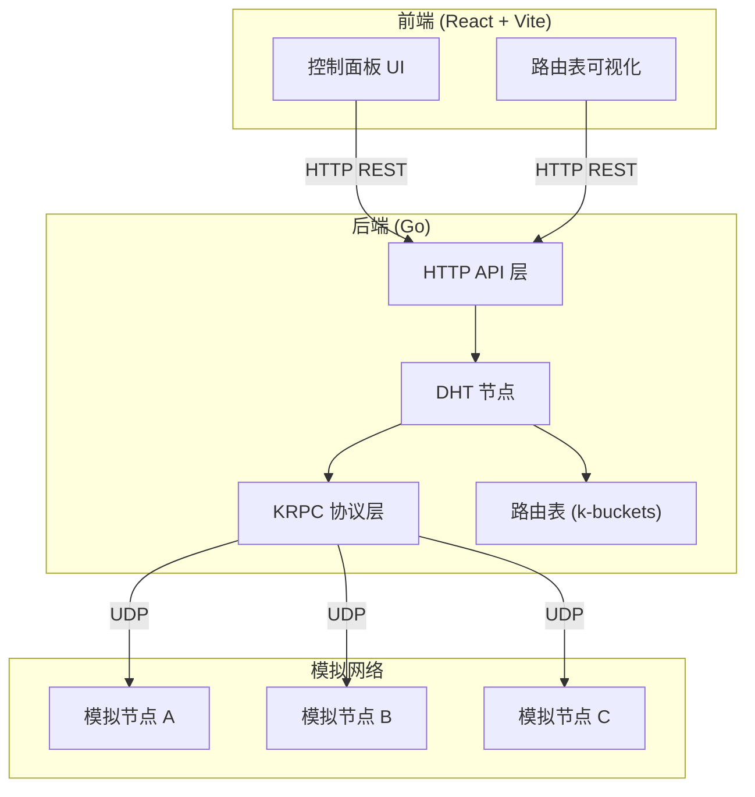
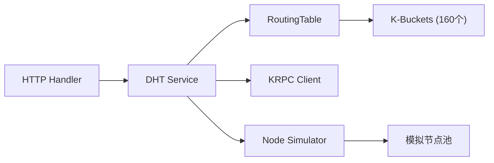
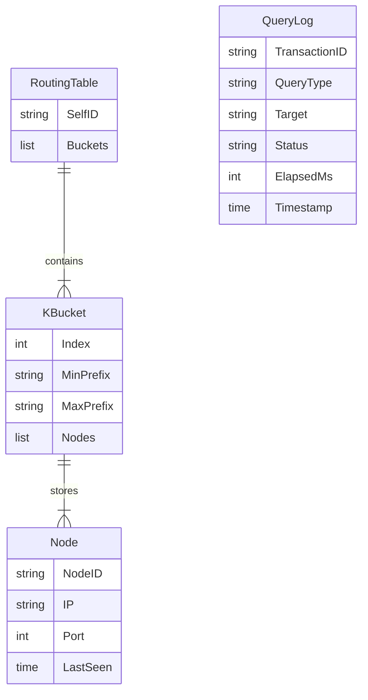

## 1. 架构设计



## 2. 技术说明

- **前端**：React 18 + TypeScript + TailwindCSS + Vite
- **初始化工具**：vite-init (react-ts 模板)
- **后端**：Go 1.21+ (标准库 net/http + 仅有 gorilla/mux 路由)
- **数据库**：无，路由表数据全部在内存维护
- **通信协议**：KRPC over UDP（bencode 编码），前后端通过 HTTP REST API 交互

## 3. 路由定义

| 路由 | 用途 |
|------|------|
| `/` | 控制面板主页 |
| `/routing-table` | 路由表可视化页 |

## 4. API 定义

### 4.1 获取节点状态

```
GET /api/node/status
Response: {
  node_id: string       // 本节点 ID（十六进制）
  address: string       // 本节点监听地址
  known_nodes: number   // 路由表中已知节点总数
  uptime_seconds: number
}
```

### 4.2 发送 ping 查询

```
POST /api/query/ping
Body: {
  target_addr: string   // 目标节点地址 ip:port
}
Response: {
  transaction_id: string
  node_id: string       // 响应节点的 ID
  elapsed_ms: number    // 耗时毫秒
  error: string|null
}
```

### 4.3 发送 find_node 查询

```
POST /api/query/find_node
Body: {
  target_id: string     // 目标 NodeID（十六进制）
  ask_addr: string      // 向哪个节点发起查询 ip:port
}
Response: {
  transaction_id: string
  nodes: Array<{
    node_id: string
    ip: string
    port: number
  }>
  elapsed_ms: number
  error: string|null
}
```

### 4.4 获取路由表

```
GET /api/routing-table
Response: {
  buckets: Array<{
    bucket_index: number
    min_distance: string
    max_distance: string
    nodes: Array<{
      node_id: string
      ip: string
      port: number
      last_seen: string   // ISO 8601
    }>
  }>
}
```

### 4.5 获取查询日志

```
GET /api/query/logs
Response: {
  logs: Array<{
    timestamp: string
    transaction_id: string
    query_type: "ping" | "find_node"
    target: string
    status: "success" | "timeout" | "error"
    elapsed_ms: number
    result_summary: string
  }>
}
```

### 4.6 启动/停止模拟节点

```
POST /api/node/start
POST /api/node/stop
Response: { status: "running" | "stopped" }
```

### 4.7 添加模拟引导节点

```
POST /api/bootstrap
Body: {
  count: number         // 生成模拟节点数量
}
Response: {
  added: Array<{
    node_id: string
    address: string
  }>
}
```

## 5. 后端架构图



## 6. 数据模型

### 6.1 核心数据结构



### 6.2 关键设计

- **NodeID**：160-bit（20字节），以十六进制字符串表示
- **k-bucket 容量**：每个 bucket 最多 k=8 个节点
- **距离计算**：XOR 距离，`dist(A, B) = A XOR B`
- **Bucket 索引**：距离的前导零位数确定 bucket 索引（0-159）
- **KRPC 消息**：bencode 编码的字典，包含 t/y/q/a/r 等键
- **模拟节点**：Go 协程模拟的虚拟 DHT 节点，响应 ping 和 find_node
