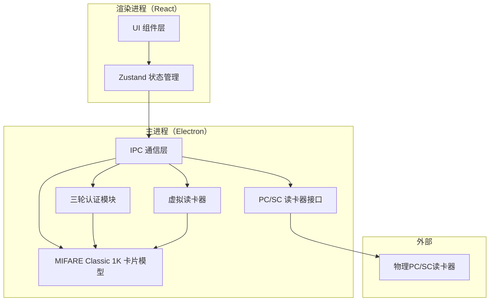

## 1. 架构设计



## 2. 技术说明

- **前端框架**：React 18 + TypeScript + Tailwind CSS
- **桌面框架**：Electron 28+
- **构建工具**：electron-vite
- **状态管理**：Zustand
- **PC/SC 通信**：pcsclite（Node.js 原生绑定），含虚拟读卡器降级方案
- **认证算法**：Crypto1 简化实现（3轮认证协议模拟）
- **图标**：lucide-react

## 3. 路由定义

| 路由 | 用途 |
|------|------|
| / | 主界面：扇区/块数据展示与操作 |

## 4. IPC 通道定义

### 4.1 读卡器通道

| 通道名 | 方向 | 参数 | 返回 |
|--------|------|------|------|
| reader:list | 渲染→主 | 无 | readerInfo[] |
| reader:connect | 渲染→主 | {readerId} | connectionResult |
| reader:disconnect | 渲染→主 | 无 | void |
| reader:status | 主→渲染 | status | 无 |

### 4.2 认证通道

| 通道名 | 方向 | 参数 | 返回 |
|--------|------|------|------|
| auth:authenticate | 渲染→主 | {sector, keyType, key} | authResult |
| auth:status | 主→渲染 | status | 无 |

### 4.3 数据通道

| 通道名 | 方向 | 参数 | 返回 |
|--------|------|------|------|
| card:read | 渲染→主 | {block} | blockData |
| card:write | 渲染→主 | {block, data} | writeResult |
| card:getAll | 渲染→主 | 无 | sectorData[] |
| card:reset | 渲染→主 | 无 | void |

## 5. 数据模型

### 5.1 MIFARE Classic 1K 内存结构

```mermaid
erDiagram
    CARD ||--|{ SECTOR : contains
    SECTOR ||--|{ BLOCK : contains
    SECTOR {
        int sectorNumber 0to15
        bytes keyA 6bytes
        bytes accessBits 4bytes
        bytes keyB 6bytes
    }
    BLOCK {
        int blockNumber 0to63
        bytes data 16bytes
        boolean isReadOnly
        boolean isTrailer
    }
```

### 5.2 类型定义

```typescript
interface SectorData {
  sectorNumber: number
  blocks: BlockData[]
  keyA: Uint8Array  // 6 bytes
  keyB: Uint8Array  // 6 bytes
  accessBits: Uint8Array  // 4 bytes
  authenticated: boolean
  authenticatedWith: 'A' | 'B' | null
}

interface BlockData {
  blockNumber: number
  data: Uint8Array  // 16 bytes
  isReadOnly: boolean
  isTrailer: boolean
}

interface AuthResult {
  success: boolean
  sector: number
  keyType: 'A' | 'B'
  error?: string
}

interface ReaderInfo {
  id: string
  name: string
  isVirtual: boolean
  connected: boolean
}
```

## 6. 项目结构

```
p308/
├── electron/
│   ├── main.ts           # Electron 主入口
│   ├── preload.ts        # 预加载脚本
│   └── modules/
│       ├── card.ts       # MIFARE Classic 1K 卡片模型
│       ├── auth.ts       # 三轮认证模块
│       ├── reader.ts     # PC/SC 读卡器接口
│       └── virtual.ts    # 虚拟读卡器
├── src/
│   ├── App.tsx
│   ├── main.tsx
│   ├── components/
│   │   ├── SectorGrid.tsx
│   │   ├── BlockEditor.tsx
│   │   ├── AuthPanel.tsx
│   │   ├── ReadWritePanel.tsx
│   │   ├── ReaderStatus.tsx
│   │   └── OperationLog.tsx
│   ├── hooks/
│   │   └── useCard.ts
│   ├── store/
│   │   └── cardStore.ts
│   ├── types/
│   │   └── index.ts
│   └── utils/
│       └── hex.ts
├── index.html
├── package.json
├── electron.vite.config.ts
├── tsconfig.json
├── tsconfig.node.json
├── tsconfig.web.json
├── tailwind.config.js
└── postcss.config.js
```
