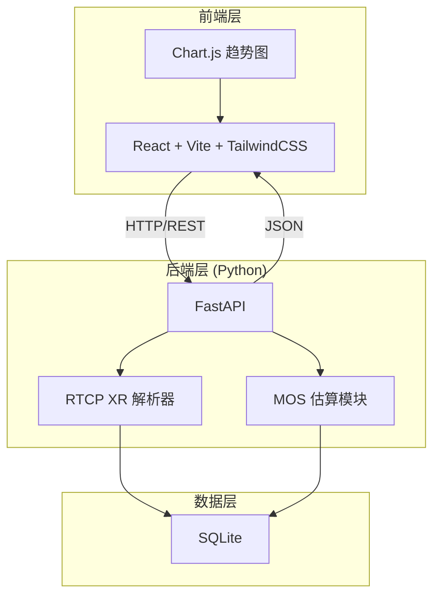
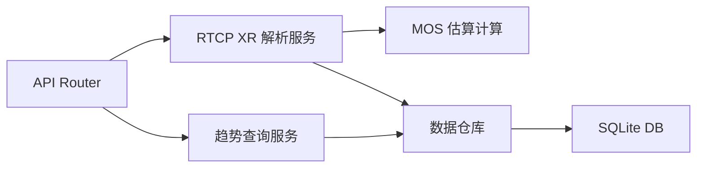
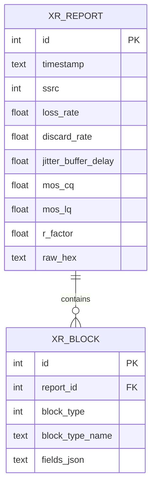

## 1. 架构设计



## 2. 技术说明
- 前端：React@18 + TypeScript + Vite + TailwindCSS@3 + Chart.js
- 前端初始化工具：vite-init
- 后端：Python 3 + FastAPI + uvicorn
- 数据库：SQLite（通过 Python 内置 sqlite3 模块访问）
- 数据可视化：Chart.js（react-chartjs-2 封装）

## 3. 路由定义
| 路由 | 用途 |
|------|------|
| / | 仪表盘：质量概览 + 趋势图 + 上传 + 历史记录 |
| /detail/:id | 报文详情：单条报文的完整解析结果 |

## 4. API 定义

### 4.1 上传报文
- **POST** `/api/xr/parse`
- Request: `multipart/form-data`，字段 `file`（二进制文件）或 `hex`（十六进制文本）
- Response:
```typescript
interface ParseResult {
  id: number
  timestamp: string
  ssrc: number
  loss_rate: number       // 丢包率 0-100%
  discard_rate: number    // 丢弃率 0-100%
  jitter_buffer_delay: number  // 抖动缓冲延迟 ms
  mos_cq: number          // MOS-CQ 1.0-4.5
  mos_lq: number          // MOS-LQ 1.0-4.5
  r_factor: number        // R因子 0-100
  report_blocks: ReportBlock[]
}

interface ReportBlock {
  block_type: number
  block_type_name: string
  fields: Record<string, number | string>
}
```

### 4.2 获取趋势数据
- **GET** `/api/xr/trend?hours=24`
- Response:
```typescript
interface TrendData {
  timestamps: string[]
  loss_rates: number[]
  jitter_delays: number[]
  mos_scores: number[]
}
```

### 4.3 获取历史记录
- **GET** `/api/xr/history?page=1&page_size=20`
- Response:
```typescript
interface HistoryResponse {
  total: number
  page: number
  page_size: number
  records: ParseResult[]
}
```

### 4.4 获取报文详情
- **GET** `/api/xr/detail/:id`
- Response: `ParseResult`（含完整 report_blocks）

## 5. 服务端架构图



## 6. 数据模型

### 6.1 数据模型定义



### 6.2 数据定义语言

```sql
CREATE TABLE xr_report (
    id INTEGER PRIMARY KEY AUTOINCREMENT,
    timestamp TEXT NOT NULL DEFAULT (datetime('now')),
    ssrc INTEGER NOT NULL,
    loss_rate REAL NOT NULL DEFAULT 0,
    discard_rate REAL NOT NULL DEFAULT 0,
    jitter_buffer_delay REAL NOT NULL DEFAULT 0,
    mos_cq REAL NOT NULL DEFAULT 0,
    mos_lq REAL NOT NULL DEFAULT 0,
    r_factor REAL NOT NULL DEFAULT 0,
    raw_hex TEXT
);

CREATE TABLE xr_block (
    id INTEGER PRIMARY KEY AUTOINCREMENT,
    report_id INTEGER NOT NULL,
    block_type INTEGER NOT NULL,
    block_type_name TEXT NOT NULL,
    fields_json TEXT NOT NULL,
    FOREIGN KEY (report_id) REFERENCES xr_report(id)
);

CREATE INDEX idx_xr_report_timestamp ON xr_report(timestamp);
CREATE INDEX idx_xr_report_ssrc ON xr_report(ssrc);
```
