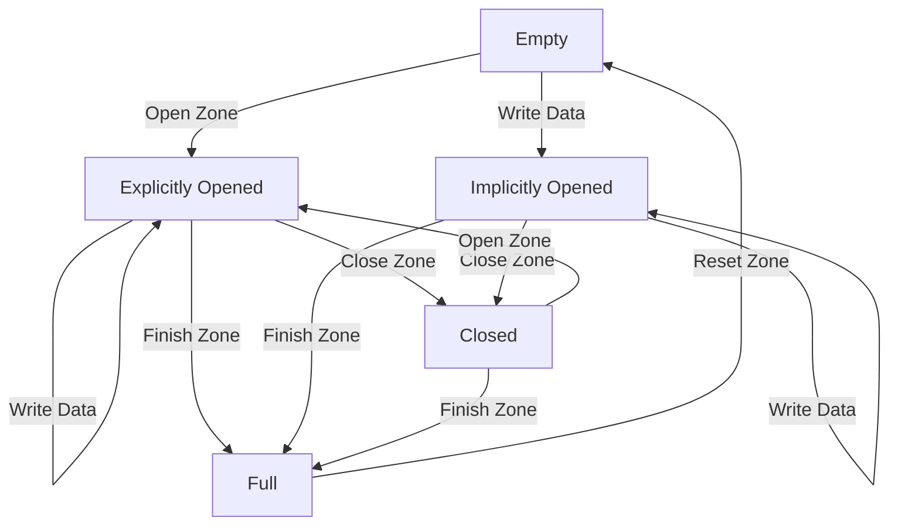

## 1. 产品概述

NVMe ZNS（Zoned Namespace）模拟器是一个交互式Web应用，用于模拟NVMe ZNS协议的分区命名空间行为。每个Zone仅支持顺序写入，用户可通过Zone管理命令（Open/Close/Finish/Reset）控制Zone状态转换，前端实时展示Zone状态表及可视化信息。

- 目标用户：存储系统开发者、NVMe协议学习者、ZNS技术研究人员
- 核心价值：提供直观的ZNS协议行为模拟，帮助理解Zone状态机和顺序写入约束

## 2. 核心功能

### 2.1 功能模块

1. **Zone状态表页面**：Zone列表展示、状态可视化、管理命令操作、数据写入
2. **Namespace配置面板**：创建/配置Namespace参数（Zone数量、Zone容量）

### 2.2 页面详情

| 页面名称 | 模块名称 | 功能描述 |
|----------|----------|----------|
| Zone状态表页面 | Namespace配置面板 | 设置Zone数量、每个Zone容量（LBAs），初始化Namespace |
| Zone状态表页面 | Zone状态总览 | 显示Namespace整体信息：总Zone数、各状态Zone计数、总容量 |
| Zone状态表页面 | Zone状态表 | 表格展示每个Zone的ID、状态、写指针位置、已用容量、容量占比进度条 |
| Zone状态表页面 | Zone操作面板 | 对选中Zone执行管理命令：Open/Close/Finish/Reset |
| Zone状态表页面 | 数据写入面板 | 向指定Zone顺序写入指定大小的数据，强制顺序写入约束 |
| Zone状态表页面 | 状态转换图 | 可视化Zone状态机转换关系图 |
| Zone状态表页面 | 操作日志 | 实时记录所有Zone操作和状态变化的日志流 |

## 3. 核心流程

用户初始化Namespace后，Zone默认处于Empty状态。用户可对Zone执行Open命令使其进入Explicitly Opened状态，然后顺序写入数据（写入时Empty状态的Zone会自动转为Implicitly Opened）。写入完成后可执行Close关闭Zone，或执行Finish将Zone标记为Full（只读）。Reset命令可将Full或Closed状态的Zone重置为Empty，清空写指针。

## 4. 用户界面设计

### 4.1 设计风格

- **主题**：深色工业科技风，模拟存储设备管理终端的专业感
- **主色调**：深灰/近黑背景（#0a0e17），搭配青绿色（#00f0b5）作为主要强调色，橙红色（#ff4d4d）作为警告/错误色
- **按钮风格**：圆角矩形，带有微妙发光效果的操作按钮，不同命令使用不同颜色（Open=青绿，Close=琥珀，Finish=蓝色，Reset=红色）
- **字体**：等宽字体用于数据展示（JetBrains Mono），现代无衬线字体用于标题和说明（Space Grotesk）
- **布局**：顶部状态总览栏 + 左侧Zone状态表 + 右侧操作/详情面板
- **图标**：使用Lucide图标库

### 4.2 页面设计概述

| 页面名称 | 模块名称 | UI元素 |
|----------|----------|--------|
| Zone状态表页面 | Namespace配置面板 | 输入框（Zone数量、容量），初始化按钮，带发光边框的深色卡片 |
| Zone状态表页面 | Zone状态总览 | 统计卡片组：总Zone数、Empty/Open/Closed/Full计数，渐变背景数字 |
| Zone状态表页面 | Zone状态表 | 表格行带状态色标识条，容量进度条，行点击高亮，选中行发光边框 |
| Zone状态表页面 | Zone操作面板 | 4个命令按钮（Open/Close/Finish/Reset），操作前校验，执行结果Toast提示 |
| Zone状态表页面 | 数据写入面板 | 目标Zone选择器、写入大小输入、写入按钮，写入动画效果 |
| Zone状态表页面 | 状态转换图 | 简化版状态机SVG图，当前Zone状态高亮，转换路径动画 |
| Zone状态表页面 | 操作日志 | 终端风格日志流，带时间戳和颜色编码，自动滚动到底部 |

### 4.3 响应式设计

- 桌面优先设计，1920×1080为最佳体验
- 中等屏幕（1024px+）切换为上下布局
- 小屏幕隐藏状态转换图，日志面板折叠
