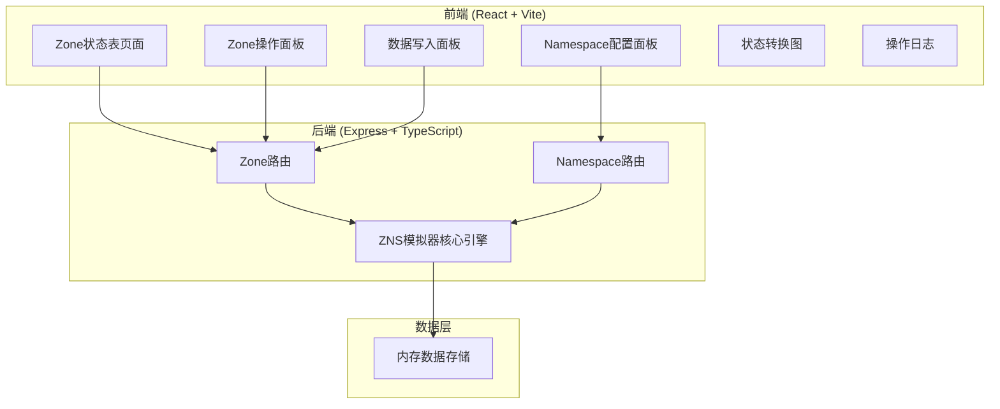

## 1. 架构设计



## 2. 技术说明

- 前端：React@18 + Tailwind CSS@3 + Vite + Zustand（状态管理）
- 初始化工具：vite-init（react-express-ts模板）
- 后端：Express@4 + TypeScript（ESM格式）
- 数据库：无，使用内存数据存储（模拟器场景适用）
- 图标：lucide-react

## 3. 路由定义

| 路由 | 用途 |
|------|------|
| `/` | Zone状态表主页面，展示所有Zone状态和操作界面 |

## 4. API定义

### 4.1 Namespace API

| 方法 | 路径 | 描述 |
|------|------|------|
| POST | `/api/namespace/init` | 初始化Namespace（参数：zoneCount, zoneCapacity） |
| GET | `/api/namespace/status` | 获取Namespace整体状态 |

### 4.2 Zone API

| 方法 | 路径 | 描述 |
|------|------|------|
| GET | `/api/zones` | 获取所有Zone列表及状态 |
| GET | `/api/zones/:id` | 获取单个Zone详情 |
| POST | `/api/zones/:id/open` | 打开Zone（Open Zone命令） |
| POST | `/api/zones/:id/close` | 关闭Zone（Close Zone命令） |
| POST | `/api/zones/:id/finish` | 完成Zone（Finish Zone命令） |
| POST | `/api/zones/:id/reset` | 重置Zone（Reset Zone命令） |
| POST | `/api/zones/:id/write` | 向Zone写入数据（参数：size） |

### 4.3 数据类型定义

```typescript
type ZoneState = 'empty' | 'implicitly_opened' | 'explicitly_opened' | 'closed' | 'full'

interface Zone {
  id: number
  state: ZoneState
  writePointer: number
  capacity: number
  createdAt: string
  updatedAt: string
}

interface Namespace {
  id: string
  zoneCount: number
  zoneCapacity: number
  zones: Zone[]
  createdAt: string
}

interface NamespaceStatus {
  totalZones: number
  zoneCapacity: number
  emptyCount: number
  implicitlyOpenedCount: number
  explicitlyOpenedCount: number
  closedCount: number
  fullCount: number
}

interface WriteRequest {
  size: number
}

interface OperationLog {
  timestamp: string
  zoneId: number
  operation: string
  fromState: ZoneState
  toState: ZoneState
  detail: string
}
```

## 5. ZNS模拟器核心引擎

### 5.1 Zone状态机

```
Empty ──Open──> Explicitly Opened
Empty ──Write──> Implicitly Opened
Explicitly Opened ──Write──> Explicitly Opened (写指针前进)
Explicitly Opened ──Close──> Closed
Explicitly Opened ──Finish──> Full
Implicitly Opened ──Write──> Implicitly Opened (写指针前进)
Implicitly Opened ──Close──> Closed
Implicitly Opened ──Finish──> Full
Closed ──Open──> Explicitly Opened
Closed ──Finish──> Full
Full ──Reset──> Empty
```

### 5.2 顺序写入约束

- 写入必须从当前写指针位置开始
- 如果写指针 == Zone容量，Zone自动转为Full状态
- 不允许随机写入（写入偏移必须等于写指针）
- 写入大小不能超过Zone剩余容量

### 5.3 状态转换验证

每次操作前验证当前状态是否允许该操作：
- Open：仅Empty、Closed状态可执行
- Close：仅Implicitly Opened、Explicitly Opened状态可执行
- Finish：仅Implicitly Opened、Explicitly Opened、Closed状态可执行
- Reset：仅Full、Closed状态可执行
- Write：仅Empty、Implicitly Opened、Explicitly Opened状态可执行
