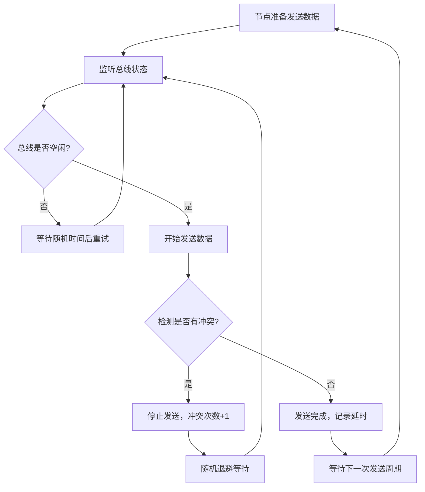

## 1. 产品概述

本产品是一个基于Electron的RS-485总线通信模拟器，用于模拟多个串口节点在共享总线上的通信行为，实现"先听后说+冲突检测"的总线仲裁机制，避免节点同时发送数据导致的冲突。产品面向嵌入式开发人员、通信协议学习者和测试工程师，用于理解和验证RS-485总线仲裁算法。

## 2. 核心功能

### 2.1 用户角色

| 角色 | 注册方式 | 核心权限 |
|------|----------|----------|
| 开发人员 | 本地运行 | 配置节点参数、运行模拟、查看通信数据 |

### 2.2 功能模块

1. **主控面板**：节点配置、总线参数设置、模拟控制
2. **节点状态监控**：实时显示每个节点的发送状态、延时统计、冲突重试次数
3. **总线数据可视化**：总线占用状态、数据传输时序图
4. **日志记录**：通信事件日志、冲突检测日志

### 2.3 页面详情

| 页面名称 | 模块名称 | 功能描述 |
|---------|----------|----------|
| 主界面 | 节点配置区 | 可动态添加/删除RS-485节点，设置节点ID、发送间隔、数据长度 |
| 主界面 | 总线参数区 | 配置波特率、仲裁等待时间、最大重试次数 |
| 主界面 | 状态监控区 | 实时显示各节点的发送延时、冲突次数、发送成功/失败统计 |
| 主界面 | 总线时序区 | 可视化展示总线占用状态、各节点发送时间轴 |
| 主界面 | 控制面板 | 开始/暂停/重置模拟，切换自动/手动发送模式 |
| 主界面 | 日志区 | 记录所有通信事件，包括发送、监听、冲突、重试等 |

## 3. 核心流程

用户启动应用后，配置节点数量和总线参数，点击开始模拟。每个节点按照设定的间隔尝试发送数据，在发送前先监听总线状态（先听后说），如果总线空闲则开始发送；如果两个节点同时检测到总线空闲并开始发送，总线仲裁机制会检测到冲突，触发随机退避重试机制。

## 4. 用户界面设计

### 4.1 设计风格
- **主色调**：工业深蓝 (#165DFF) 作为主色，配合深灰 (#1D2129) 背景，营造专业工控软件氛围
- **强调色**：绿色 (#00B42A) 表示成功/空闲，红色 (#F53F3F) 表示冲突/错误，橙色 (#FF7D00) 表示等待/重试
- **字体**：使用 JetBrains Mono 作为等宽字体显示数据和日志，搭配 Inter 作为界面字体
- **布局**：网格化卡片布局，左侧节点状态列表，右侧总线时序和控制面板
- **视觉风格**：工业仪表风格，带有细微的网格背景和发光效果的状态指示灯

### 4.2 页面设计概述

| 页面名称 | 模块名称 | UI Elements |
|---------|----------|-------------|
| 主界面 | 节点状态卡片 | 每个节点一个卡片，包含状态指示灯、节点ID、发送延时、冲突次数柱状图 |
| 主界面 | 总线时序图 | 时间轴横向滚动，不同颜色条表示不同节点的发送时间段，红色闪烁标记冲突点 |
| 主界面 | 控制面板 | 大型工业风格按钮，旋钮式参数调节，开关式模式切换 |
| 主界面 | 日志面板 | 深色背景，彩色语法高亮的日志输出，支持自动滚动和过滤 |

### 4.3 响应性
- 桌面端优先设计，最小窗口尺寸 1280x800
- 支持窗口缩放，各区域按比例自适应
- 节点列表支持垂直滚动，时序图支持水平滚动和缩放

### 4.4 交互细节
- 状态指示灯带有呼吸动画效果
- 数据更新时带有平滑过渡动画
- 冲突发生时界面有视觉警示效果
- 节点发送时卡片有高亮脉冲动画
