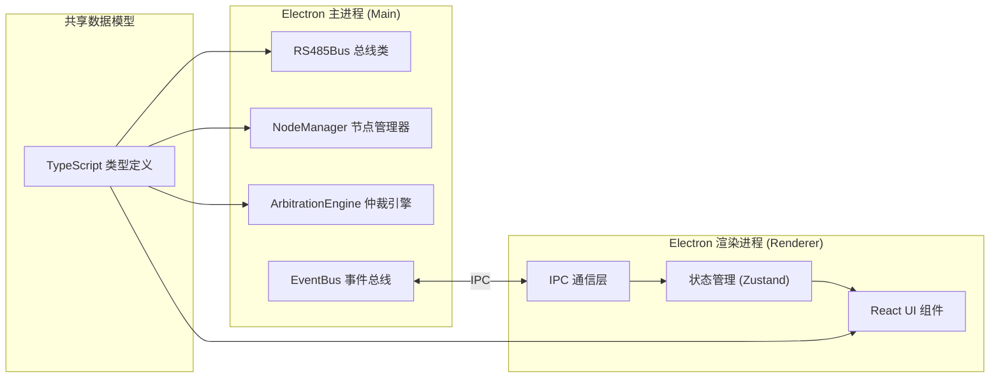

## 1. 架构设计



## 2. 技术描述

- **Electron**: v28.x - 跨平台桌面应用框架
- **前端框架**: React 18 + TypeScript 5.x
- **构建工具**: Vite 5.x + vite-plugin-electron
- **样式方案**: TailwindCSS 3.x
- **状态管理**: Zustand
- **图表库**: Recharts - 用于绘制时序图和统计图表
- **字体**: JetBrains Mono + Inter (Google Fonts)

## 3. 目录结构

```
.
├── src/
│   ├── main/                    # Electron 主进程
│   │   ├── index.ts             # 主进程入口
│   │   ├── bus/
│   │   │   ├── RS485Bus.ts      # 总线模拟类
│   │   │   ├── RS485Node.ts     # 节点类
│   │   │   └── Arbitration.ts   # 仲裁引擎
│   │   ├── managers/
│   │   │   └── NodeManager.ts   # 节点管理器
│   │   └── ipc/
│   │       └── handlers.ts      # IPC 处理器
│   ├── renderer/                # 渲染进程
│   │   ├── index.html
│   │   ├── main.tsx             # React 入口
│   │   ├── App.tsx
│   │   ├── store/
│   │   │   └── useSimStore.ts   # Zustand store
│   │   ├── components/
│   │   │   ├── NodeCard.tsx     # 节点状态卡片
│   │   │   ├── ControlPanel.tsx # 控制面板
│   │   │   ├── BusTimeline.tsx  # 总线时序图
│   │   │   ├── LogPanel.tsx     # 日志面板
│   │   │   └── ConfigPanel.tsx  # 配置面板
│   │   ├── ipc/
│   │   │   └── renderer.ts      # 渲染端 IPC
│   │   └── styles/
│   │       └── index.css        # 全局样式
│   └── shared/                  # 共享类型
│       └── types.ts             # TypeScript 类型定义
├── electron.vite.config.ts
├── package.json
└── tsconfig.json
```

## 4. 核心数据模型

### 4.1 类型定义

```typescript
// 节点状态
type NodeStatus = 'idle' | 'listening' | 'sending' | 'conflict' | 'waiting' | 'success';

// 节点配置
interface NodeConfig {
  id: string;
  name: string;
  sendInterval: number;      // 发送间隔 (ms)
  dataLength: number;        // 数据长度 (字节)
  color: string;             // 显示颜色
}

// 节点运行时状态
interface NodeState {
  id: string;
  status: NodeStatus;
  sendCount: number;         // 发送成功次数
  conflictCount: number;     // 冲突次数
  retryCount: number;        // 当前重试次数
  lastSendDelay: number;     // 上次发送延时 (ms)
  avgSendDelay: number;      // 平均发送延时 (ms)
  maxSendDelay: number;      // 最大发送延时 (ms)
  currentSendStart: number | null;
}

// 总线配置
interface BusConfig {
  baudRate: number;          // 波特率
  arbitrateWaitTime: number; // 仲裁等待时间 (ms)
  maxRetries: number;        // 最大重试次数
  collisionDetectTime: number; // 冲突检测时间 (ms)
}

// 总线状态
interface BusState {
  isBusy: boolean;
  currentSender: string | null;
  conflictDetected: boolean;
  timeline: TimelineEvent[];
}

// 时序事件
interface TimelineEvent {
  id: string;
  nodeId: string;
  type: 'send_start' | 'send_end' | 'conflict' | 'retry';
  timestamp: number;
  duration?: number;
}

// 日志条目
interface LogEntry {
  id: string;
  timestamp: number;
  level: 'info' | 'success' | 'warning' | 'error';
  nodeId?: string;
  message: string;
}
```

### 4.2 核心算法

**总线仲裁算法 - 先听后说 (Listen Before Talk):**
1. 节点在发送前监听总线状态，持续 `arbitrateWaitTime` 毫秒
2. 如果监听期间总线被占用，则等待随机时间后重新监听
3. 如果监听期间总线保持空闲，则开始发送数据
4. 发送期间持续检测是否有冲突（其他节点同时发送）
5. 检测到冲突后立即停止发送，记录冲突次数，执行指数退避重试

**冲突检测机制:**
- 总线维护当前发送者列表
- 当多个节点同时进入发送状态时触发冲突
- 所有冲突节点停止发送，生成随机退避时间
- 退避时间 = `random(0, 2^retryCount) * collisionDetectTime`
- 达到最大重试次数后发送失败

## 5. IPC 通信协议

| 通道名 | 方向 | 数据类型 | 描述 |
|--------|------|----------|------|
| `sim:start` | Renderer → Main | `BusConfig` | 开始模拟 |
| `sim:pause` | Renderer → Main | - | 暂停模拟 |
| `sim:reset` | Renderer → Main | - | 重置模拟 |
| `node:add` | Renderer → Main | `NodeConfig` | 添加节点 |
| `node:remove` | Renderer → Main | `string` | 移除节点 |
| `node:update` | Renderer → Main | `NodeConfig` | 更新节点配置 |
| `node:manualSend` | Renderer → Main | `string` | 手动触发节点发送 |
| `state:update` | Main → Renderer | `{ nodes: NodeState[], bus: BusState }` | 状态更新推送 |
| `log:new` | Main → Renderer | `LogEntry` | 新日志推送 |
| `timeline:update` | Main → Renderer | `TimelineEvent` | 时序更新推送 |
