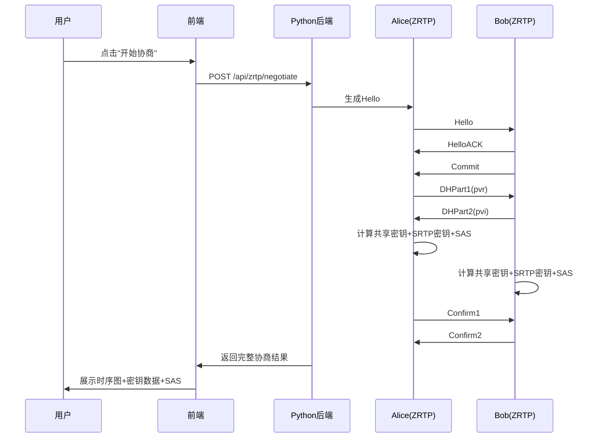

## 1. 产品概述

ZRTP 协商模拟器 — 一个可视化展示 ZRTP 密钥协商全过程的 Web 应用，模拟双方（Alice 和 Bob）执行 ZRTP 握手，生成 SRTP 密钥，并计算四位短认证字符串（SAS）。面向安全协议学习者和开发者，帮助直观理解 ZRTP 协议的工作原理。

- 核心目标：将抽象的 ZRTP 密钥协商过程可视化，展示每一步的密码学操作和中间数据
- 目标用户：安全协议研究者、密码学学习者、VoIP 开发者

## 2. 核心功能

### 2.1 功能模块

1. **协商控制台**：启动/重置 ZRTP 协商，选择 DH 算法（DH-2048 / ECDH-P256），查看协商状态
2. **协商流程可视化**：以时序图方式展示 Hello → Commit → DHPart1/DHPart2 → Confirm1/Confirm2 的完整消息流
3. **密钥数据面板**：实时展示双方生成的 DH 公钥、共享密钥、SRTP 主密钥/盐值、SAS 计算结果
4. **SAS 验证界面**：突出显示四位 SAS 字符串，双方 SAS 对比验证

### 2.2 页面详情

| 页面名称 | 模块名称 | 功能描述 |
|---------|---------|---------|
| 主页面 | 协商控制面板 | 算法选择、启动/重置按钮、协商状态指示器 |
| 主页面 | 消息时序图 | 动态展示 ZRTP 握手消息流，每步附带简要说明 |
| 主页面 | Alice 数据面板 | 展示 Alice 的 ZID、DH 公钥、共享密钥、SRTP 密钥、SAS |
| 主页面 | Bob 数据面板 | 展示 Bob 的 ZID、DH 公钥、共享密钥、SRTP 密钥、SAS |
| 主页面 | SAS 验证区域 | 大字展示双方 SAS，高亮匹配/不匹配状态 |

## 3. 核心流程

用户点击"开始协商"后，后端模拟 Alice 和 Bob 执行完整 ZRTP 握手：

1. Alice 发送 Hello → Bob 回复 HelloACK
2. Bob 发送 Commit（包含选定的 DH 算法）→ Alice 确认
3. Alice 发送 DHPart1（DH 公钥 pvr）→ Bob 发送 DHPart2（DH 公钥 pvi）
4. 双方计算 DH 共享密钥 → 派生 s0 → 计算 SAS 和 SRTP 密钥
5. 双方交换 Confirm1/Confirm2 确认消息
6. 前端展示四位 SAS 字符串供用户比对

## 4. 用户界面设计

### 4.1 设计风格

- 主色调：深色科技感（深蓝黑 #0a0e1a）+ 荧光绿/青色（#00ffc8）强调色
- 辅助色：Alice 用 #4fc3f7 蓝色，Bob 用 #ffb74d 橙色
- 字体：等宽字体展示密钥数据（JetBrains Mono），标题用 Space Grotesk
- 布局：左右双栏展示 Alice/Bob 数据，中间时序图
- 风格：终端/矩阵风格，数据流动画，脉冲效果

### 4.2 页面设计概述

| 页面名称 | 模块名称 | UI 元素 |
|---------|---------|---------|
| 主页面 | 协商控制面板 | 算法下拉选择、启动按钮（发光效果）、状态指示灯 |
| 主页面 | 消息时序图 | 动态箭头+消息标签、逐步动画展现 |
| 主页面 | Alice 数据面板 | 蓝色边框卡片、密钥以十六进制折叠展示、复制按钮 |
| 主页面 | Bob 数据面板 | 橙色边框卡片、密钥以十六进制折叠展示、复制按钮 |
| 主页面 | SAS 验证区域 | 超大四位数字显示、匹配时绿色脉冲、不匹配时红色警告 |

### 4.3 响应式

- 桌面优先设计，大屏三栏布局（Alice | 时序图 | Bob）
- 平板双栏布局（Alice+Bob | 时序图）
- 手机单栏垂直布局
