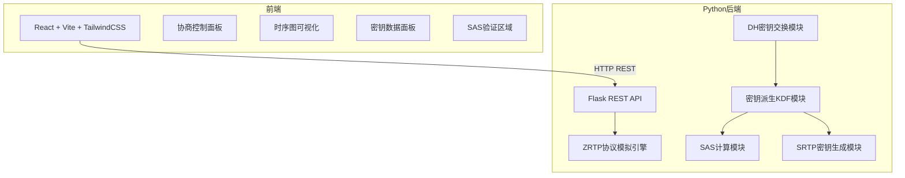
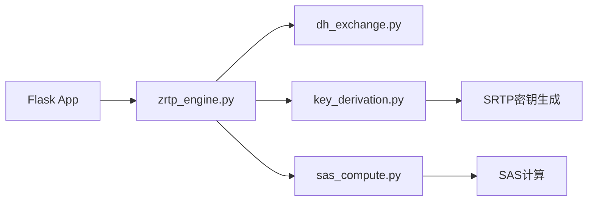

## 1. 架构设计



## 2. 技术说明

- 前端：React@18 + TypeScript + Vite + TailwindCSS + Zustand
- 初始化工具：vite-init (react-ts 模板)
- 后端：Python 3 + Flask + cryptography 库
- 数据库：无（模拟协商，无需持久化）

## 3. 路由定义

| 路由 | 用途 |
|------|------|
| / | 主页面，包含所有协商可视化和SAS展示 |

## 4. API 定义

### 4.1 发起 ZRTP 协商

**POST /api/zrtp/negotiate**

请求：
```typescript
interface NegotiateRequest {
  algorithm: "DH2048" | "ECDH_P256";
}
```

响应：
```typescript
interface NegotiateResponse {
  alice: PartyResult;
  bob: PartyResult;
  sas: string;
  sas_match: boolean;
  messages: ZRTPMessage[];
}

interface PartyResult {
  zid: string;
  dh_public_key: string;
  dh_shared_secret: string;
  s0: string;
  srtp_master_key: string;
  srtp_master_salt: string;
  sas: string;
}

interface ZRTPMessage {
  step: number;
  from: "alice" | "bob";
  to: "alice" | "bob";
  type: "Hello" | "HelloACK" | "Commit" | "DHPart1" | "DHPart2" | "Confirm1" | "Confirm2";
  description: string;
  timestamp: number;
}
```

### 4.2 获取协商历史

**GET /api/zrtp/history**

响应：
```typescript
interface HistoryResponse {
  sessions: NegotiateResponse[];
}
```

## 5. 服务器架构图



## 6. ZRTP 协议模拟关键算法

### 6.1 DH 密钥交换

- DH-2048：使用 2048 位素数群参数（RFC 3526）
- ECDH-P256：使用 NIST P-256 椭圆曲线

### 6.2 密钥派生 (KDF)

遵循 RFC 6189 Section 4.5.2：
- s0 = KDF(DH_result, "ZRTP-HMAC-KDF", ZID_i || ZID_r, hash_len)
- SRTP master key = KDF(s0, "SRTP Master Key", context, 256)
- SRTP master salt = KDF(s0, "SRTP Master Salt", context, 128)

### 6.3 SAS 计算

遵循 RFC 6189 Section 4.5.2：
- SAS = KDF(s0, "SAS", context, 32) → 取低32位
- 四位十进制字符串：SAS_value = sas_bits mod 10000，格式化为4位数字（前补零）
