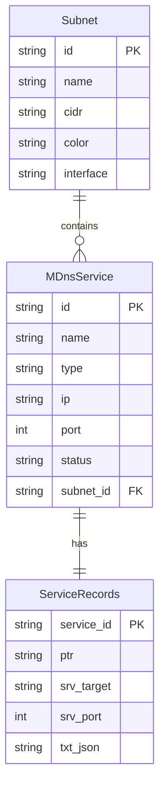

## 1. 架构设计

```mermaid
graph TB
    subgraph "前端层"
        "React + Vite + Tailwind"
    end
    subgraph "后端层 (Go)"
        "mDNS Reflector 核心"
        "HTTP API + WebSocket Server"
    end
    subgraph "网络层 (模拟)"
        "子网 A 模拟器"
        "子网 B 模拟器"
        "子网 C 模拟器"
    end

    "子网 A 模拟器" --> "mDNS Reflector 核心"
    "子网 B 模拟器" --> "mDNS Reflector 核心"
    "子网 C 模拟器" --> "mDNS Reflector 核心"
    "mDNS Reflector 核心" --> "HTTP API + WebSocket Server"
    "HTTP API + WebSocket Server" --> "React + Vite + Tailwind"
```

## 2. 技术说明

- **前端**：React@18 + TypeScript + Tailwind CSS@3 + Vite
- **后端**：Go 1.22+（标准库 net/http + gorilla/websocket）
- **数据**：内存存储（无数据库，模拟数据 + 实时发现）
- **通信**：REST API + WebSocket 实时推送

## 3. 路由定义

| 路由 | 用途 |
|------|------|
| `/` | 仪表板主页 — 子网拓扑、服务统计、实时流 |
| `/subnet/:id` | 子网详情 — 该子网服务列表与记录详情 |

## 4. API 定义

### 4.1 REST API

```
GET /api/subnets
→ [{ id, name, cidr, color, interface, serviceCount, lastSeen }]

GET /api/subnets/:id/services?type=&status=
→ [{ id, name, type, subtype, ip, port, txtRecords, status, discoveredAt, subnetId }]

GET /api/subnets/:id/services/:serviceId/records
→ { ptr: string, srv: { target, port, priority, weight }, txt: { [key]: string } }

GET /api/reflector/status
→ { status, uptime, packetsForwarded, activeInterfaces, startedAt }
```

### 4.2 WebSocket

```
WS /api/ws
→ 事件类型:
  - "service_discovered": { service, subnetId }
  - "service_lost": { serviceId, subnetId }
  - "reflector_stats": { packetsForwarded, uptime }
```

### 4.3 TypeScript 类型定义

```typescript
interface Subnet {
  id: string;
  name: string;
  cidr: string;
  color: string;
  interface: string;
  serviceCount: number;
  lastSeen: string;
}

type ServiceType = "printer" | "airplay" | "homekit" | "http" | "chromecast" | "nfs" | "smb" | "other";
type ServiceStatus = "online" | "offline";

interface MDnsService {
  id: string;
  name: string;
  type: ServiceType;
  subtype: string;
  ip: string;
  port: number;
  txtRecords: Record<string, string>;
  status: ServiceStatus;
  discoveredAt: string;
  subnetId: string;
}

interface ServiceRecords {
  ptr: string;
  srv: { target: string; port: number; priority: number; weight: number };
  txt: Record<string, string>;
}

interface ReflectorStatus {
  status: "running" | "stopped";
  uptime: number;
  packetsForwarded: number;
  activeInterfaces: string[];
  startedAt: string;
}

type WSEvent =
  | { type: "service_discovered"; service: MDnsService; subnetId: string }
  | { type: "service_lost"; serviceId: string; subnetId: string }
  | { type: "reflector_stats"; packetsForwarded: number; uptime: number };
```

## 5. 服务端架构图

```mermaid
graph LR
    "SubnetSimulator" --> "ReflectorEngine"
    "ReflectorEngine" --> "ServiceRegistry"
    "ReflectorEngine" --> "EventBus"
    "ServiceRegistry" --> "APIHandler"
    "EventBus" --> "WSHub"
    "APIHandler" --> "HTTP Server"
    "WSHub" --> "HTTP Server"
```

- **SubnetSimulator**：模拟各子网上的 mDNS 广播，定时生成服务发现/丢失事件
- **ReflectorEngine**：核心反射逻辑，接收子网事件并转发到其他子网，同时记录到注册表
- **ServiceRegistry**：内存存储所有已发现服务的注册表
- **EventBus**：事件总线，将反射器事件广播给 WebSocket 和其他订阅者
- **APIHandler**：REST API 处理器
- **WSHub**：WebSocket 连接管理与广播
- **HTTP Server**：统一 HTTP 服务器，同时处理 REST 和 WebSocket

## 6. 数据模型

### 6.1 数据模型定义



### 6.2 项目目录结构

```
p322/
├── backend/                    # Go 后端
│   ├── main.go                 # 入口
│   ├── go.mod
│   ├── go.sum
│   ├── reflector/
│   │   ├── engine.go           # 反射器核心引擎
│   │   ├── subnet.go           # 子网模拟器
│   │   ├── registry.go         # 服务注册表
│   │   └── eventbus.go         # 事件总线
│   ├── api/
│   │   ├── handler.go          # REST API handler
│   │   └── ws.go               # WebSocket hub & handler
│   └── model/
│       └── types.go            # 数据模型定义
├── src/                        # React 前端
│   ├── components/
│   ├── pages/
│   ├── hooks/
│   ├── utils/
│   └── stores/
├── package.json
├── vite.config.ts
└── tailwind.config.js
```
