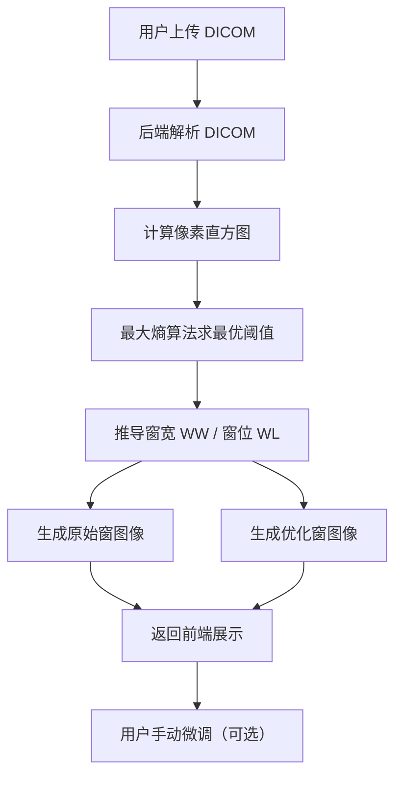

## 1. 产品概述

医学影像智能调窗工具——基于最大熵算法自动计算 CT/MR 图像的最佳窗宽窗位，提供调窗前后对比可视化，帮助放射科医生和医学影像研究者快速获取最佳图像显示效果。

- 目标用户：放射科医生、医学影像研究者、医学AI开发者
- 核心价值：自动化窗宽窗位优化，替代手动调窗，提升阅片效率

## 2. 核心功能

### 2.1 功能模块

1. **主页面**：DICOM 文件上传、调窗前后对比展示、直方图可视化、窗宽窗位参数显示与手动微调

### 2.2 页面详情

| 页面名称 | 模块名称 | 功能描述 |
|---------|---------|---------|
| 主页面 | 文件上传区 | 拖拽或点击上传 DICOM 文件，支持 CT/MR 模态 |
| 主页面 | 原始图像展示 | 显示默认窗宽窗位下的原始图像 |
| 主页面 | 优化图像展示 | 显示基于最大熵算法优化后的图像 |
| 主页面 | 直方图对比 | 展示像素值直方图及窗宽窗位范围标注 |
| 主页面 | 参数面板 | 显示自动计算的窗宽/窗位值，支持手动微调滑块 |
| 主页面 | DICOM 元信息 | 展示患者、检查、序列等关键 DICOM Tag |

## 3. 核心流程

1. 用户上传 DICOM 文件
2. 后端解析 DICOM，提取像素数据与元信息
3. 后端基于最大熵算法计算最优窗宽窗位
4. 后端生成原始窗图像与优化窗图像的 Base64 编码
5. 前端展示调窗前后对比、直方图、参数信息

## 4. 用户界面设计

### 4.1 设计风格

- 主色调：深色医疗主题（#0D1117 背景 + #00D4AA 青绿强调色）
- 次要色：冷灰层次（#161B22, #21262D, #30363D）
- 按钮风格：圆角 + 半透明玻璃拟态
- 字体：DM Sans（UI）+ JetBrains Mono（数据/数值）
- 布局风格：左右对比布局 + 顶部导航
- 图标风格：线性 Lucide 图标

### 4.2 页面设计概览

| 页面名称 | 模块名称 | UI 元素 |
|---------|---------|---------|
| 主页面 | 文件上传区 | 虚线边框拖拽区、上传图标、CT/MR 图标装饰 |
| 主页面 | 图像对比区 | 左右并排 Canvas、标签"原始/优化"、覆盖层信息 |
| 主页面 | 直方图区 | SVG 直方图柱状图、窗范围高亮区域、阈值线标注 |
| 主页面 | 参数面板 | 数值卡片（WW/WL）、Range 滑块、重置按钮 |
| 主页面 | DICOM 元信息 | 折叠面板、键值对列表 |

### 4.3 响应式

- 桌面优先设计
- 大屏：左右对比布局
- 中屏：上下堆叠布局
- 移动端：单列滑动布局
