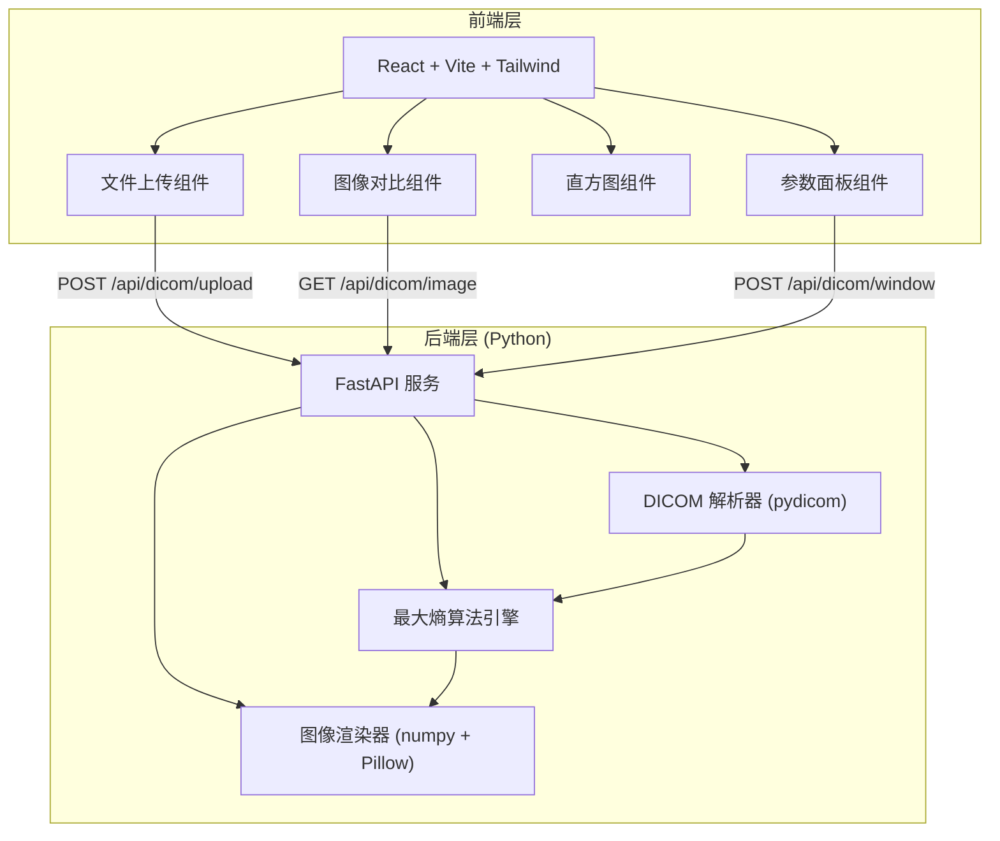
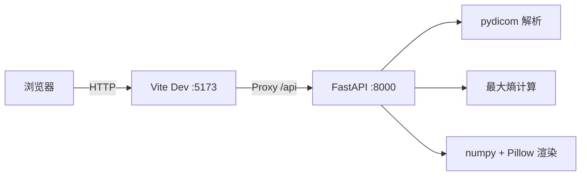

## 1. 架构设计



## 2. 技术说明

- 前端：React@18 + TypeScript + Vite + TailwindCSS + Zustand
- 初始化工具：vite-init
- 后端：Python 3.10+ / FastAPI + pydicom + numpy + Pillow + uvicorn
- 无数据库：文件临时存储在内存中

## 3. 路由定义

| 路由 | 用途 |
|------|------|
| / | 主页面：上传、对比、参数调整 |

## 4. API 定义

### 4.1 上传 DICOM 文件

```
POST /api/dicom/upload
Content-Type: multipart/form-data

Request:
  file: binary (DICOM 文件)

Response:
{
  "id": "string",           // 文件唯一标识
  "metadata": {             // DICOM 元信息
    "patient_name": "string",
    "patient_id": "string",
    "modality": "string",   // CT / MR
    "study_date": "string",
    "series_description": "string",
    "rows": number,
    "columns": number,
    "bits_allocated": number,
    "pixel_spacing": [number, number]
  },
  "default_window": {       // DICOM 默认窗
    "center": number,
    "width": number
  },
  "optimized_window": {     // 最大熵优化窗
    "center": number,
    "width": number
  },
  "histogram": {            // 直方图数据
    "bins": number[],
    "counts": number[],
    "total_pixels": number
  },
  "original_image": "base64string",
  "optimized_image": "base64string"
}
```

### 4.2 调整窗宽窗位

```
POST /api/dicom/window
Content-Type: application/json

Request:
{
  "id": "string",
  "center": number,
  "width": number
}

Response:
{
  "image": "base64string",
  "center": number,
  "width": number
}
```

### 4.3 获取 DICOM 图像

```
GET /api/dicom/image?id={id}&center={center}&width={width}

Response:
{
  "image": "base64string"
}
```

## 5. 最大熵算法说明

基于直方图的最大熵阈值法：

1. 计算像素值归一化直方图 h(i)，i ∈ [0, L-1]
2. 对每个阈值 t，将直方图分为背景 C0 = [0, t] 和前景 C1 = [t+1, L-1]
3. 计算背景熵：H_b(t) = -Σ(h(i)/P0) · log(h(i)/P0)，其中 P0 = Σh(i)，i ∈ [0, t]
4. 计算前景熵：H_f(t) = -Σ(h(i)/P1) · log(h(i)/P1)，其中 P1 = Σh(i)，i ∈ [t+1, L-1]
5. 最优阈值 t* = argmax(H_b(t) + H_f(t))
6. 窗位 WL = t*，窗宽 WW 由前景像素分布的 ±2σ 范围确定

## 6. 服务器架构



前端开发服务器通过 Vite proxy 转发 `/api` 请求到 FastAPI 后端，避免跨域问题。
