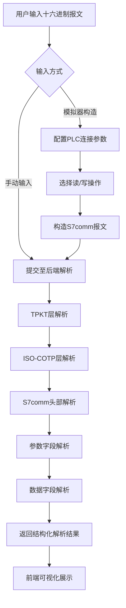

## 1. 产品概述

S7comm协议解析器是一款面向工业自动化工程师和网络协议研究人员的专业工具，用于解析西门子S7comm（基于ISO-TSAP）通信协议数据包，可视化展示PLC读写数据的完整过程。
- 解决工程师调试S7通信时无法直观理解协议报文结构的痛点
- 提供从原始字节到语义化字段的完整解码能力，降低S7协议分析门槛

## 2. 核心功能

### 2.1 用户角色

| 角色 | 注册方式 | 核心权限 |
|------|----------|----------|
| 工程师 | 无需注册 | 上传/输入报文、查看解析结果、模拟读写操作 |

### 2.2 功能模块

1. **协议解析页**：十六进制输入区、实时解析面板、报文结构树形图
2. **PLC通信模拟页**：连接配置、读写操作面板、通信过程时间线
3. **报文历史页**：解析历史列表、报文对比、导出功能

### 2.3 页面详情

| 页面名称 | 模块名称 | 功能描述 |
|----------|----------|----------|
| 协议解析页 | 十六进制输入区 | 输入或粘贴S7comm原始报文（支持带/不带TPKT/ISO-COTP头），自动检测格式 |
| 协议解析页 | 解析结果面板 | 分层展示TPKT→ISO-COTP→S7comm头部→参数→数据各字段，每字段标注偏移量和值 |
| 协议解析页 | 功能码解读 | 显示ROSCTR类型（请求/响应/通知）、功能码名称、子功能码含义 |
| 协议解析页 | 数据块解析 | 解析DB号、区域类型、偏移地址、数据类型、读写字节数等关键参数 |
| PLC通信模拟页 | 连接配置 | 配置PLC IP、Rack/Slot、连接类型 |
| PLC通信模拟页 | 读写操作 | 构造Read/Write报文，发送请求并接收响应 |
| PLC通信模拟页 | 通信时间线 | 按时间顺序展示请求-响应的全过程，标注每层协议解析结果 |
| 报文历史页 | 历史列表 | 展示历史解析记录，支持搜索和筛选 |
| 报文历史页 | 报文对比 | 并排对比两条报文的差异 |
| 报文历史页 | 导出功能 | 导出解析结果为JSON/PDF |

## 3. 核心流程

用户输入S7comm原始十六进制报文或通过模拟器构造读写请求，后端逐层解析协议栈（TPKT → ISO-COTP → S7comm），提取功能码、参数、数据块等关键字段，前端以可视化方式展示解析结果和通信过程。

## 4. 用户界面设计

### 4.1 设计风格

- 主色调：深蓝灰色（#1a1f2e）背景 + 青绿色（#00d4aa）高亮强调色，营造工业科技感
- 辅助色：琥珀色（#f59e0b）用于警告/错误状态，蓝紫色（#8b5cf6）用于数据区域标识
- 按钮风格：圆角矩形，hover时带有微妙的发光效果
- 字体：等宽字体用于十六进制和协议字段（JetBrains Mono），UI文字使用思源黑体/Noto Sans SC
- 布局：左侧输入区 + 右侧解析面板的分栏布局，暗色主题
- 图标：线性风格图标，统一使用lucide-react

### 4.2 页面设计概览

| 页面名称 | 模块名称 | UI元素 |
|----------|----------|--------|
| 协议解析页 | 十六进制输入区 | 深色代码编辑器风格输入框，行号+偏移量标注，语法高亮 |
| 协议解析页 | 解析结果面板 | 树形结构展示协议层，每层可折叠/展开，字段高亮标注 |
| 协议解析页 | 功能码解读 | 卡片式展示，图标+功能名称+描述 |
| 协议解析页 | 数据块解析 | 表格展示DB/区域/偏移/类型/长度，颜色编码不同区域 |
| PLC通信模拟页 | 连接配置 | 表单布局，输入框带图标前缀 |
| PLC通信模拟页 | 读写操作 | 操作面板，Tab切换Read/Write模式 |
| PLC通信模拟页 | 通信时间线 | 垂直时间线，节点标注协议层信息，连线动画 |
| 报文历史页 | 历史列表 | 虚拟滚动列表，卡片式条目 |
| 报文历史页 | 报文对比 | 双栏并排对比，差异高亮 |
| 报文历史页 | 导出功能 | 下拉菜单，支持多种格式 |

### 4.3 响应式设计

- 桌面优先设计，分栏布局在大屏展示
- 平板端自动切换为标签页布局
- 移动端简化为单列布局

### 4.4 3D场景指导

不适用
