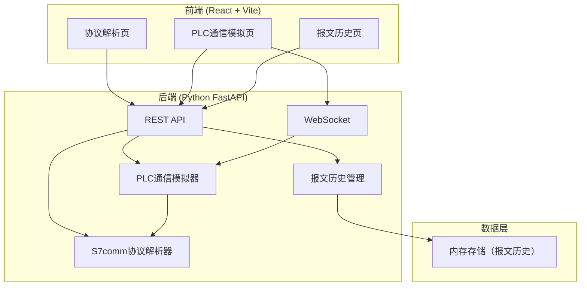
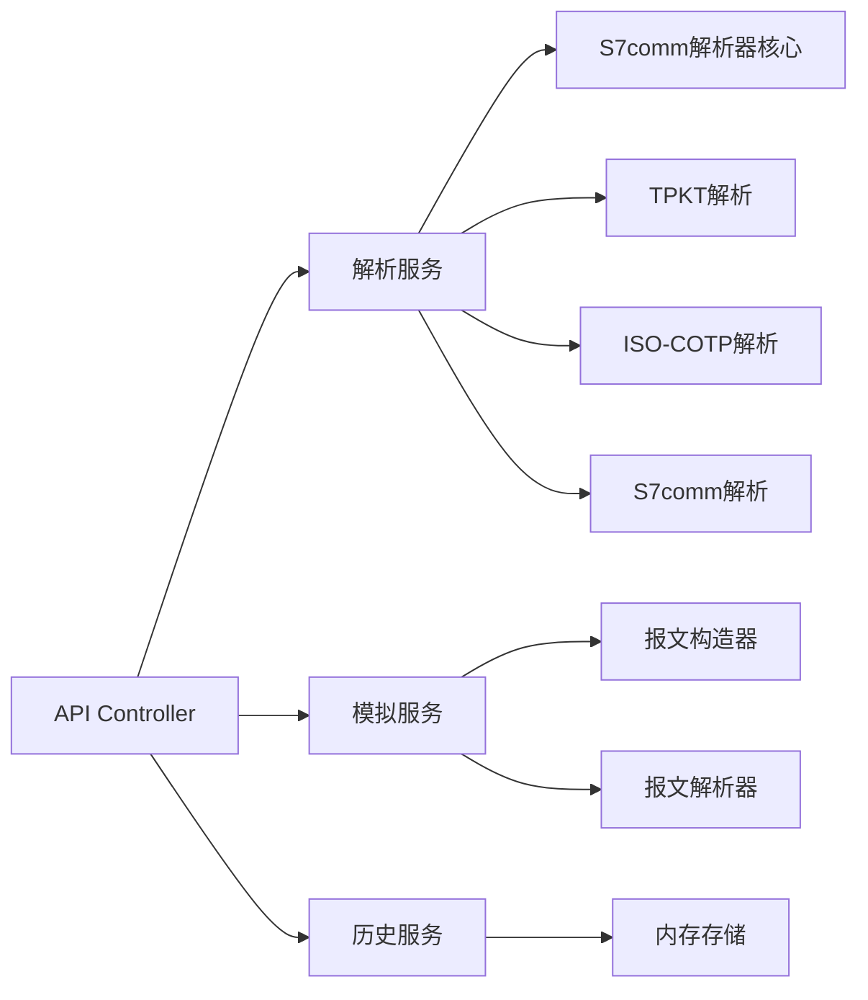
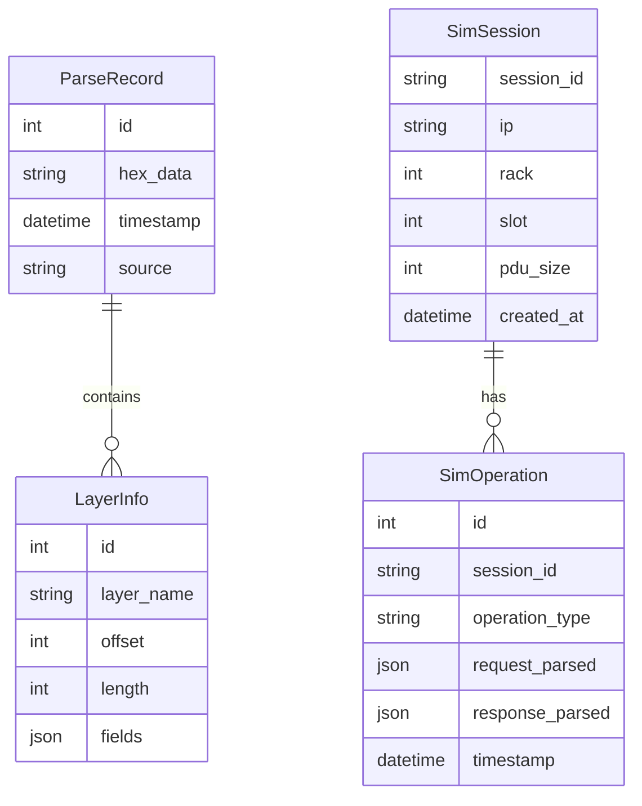

## 1. 架构设计



## 2. 技术说明

- 前端：React@18 + TypeScript + TailwindCSS@3 + Vite
- 初始化工具：vite-init
- 后端：Python FastAPI + uvicorn
- 数据库：无，使用内存存储（支持后续扩展SQLite）
- 通信：REST API + WebSocket（实时通信过程推送）

## 3. 路由定义

| 路由 | 用途 |
|------|------|
| / | 协议解析主页，输入报文并查看解析结果 |
| /simulator | PLC通信模拟器，构造和发送读写请求 |
| /history | 报文解析历史记录 |

## 4. API定义

### 4.1 解析报文

```
POST /api/parse
Request: { "hex_data": "0300001611e00000001400c1020100c0010a010002020001020001020001", "include_tpkt": true }
Response: {
  "tpkt": { "version": 3, "reserved": 0, "length": 22 },
  "cotp": { "length": 17, "pdu_type": "Connection Request", "dst_ref": 0, "src_ref": 1, "class_option": 0 },
  "s7comm": {
    "protocol_id": 50,
    "msg_type": "Request",
    "reserved": 0,
    "pdu_ref": 1,
    "param_length": 2,
    "data_length": 0,
    "function_code": "Setup Communication",
    "parameters": { ... },
    "data": null
  }
}
```

### 4.2 模拟PLC连接

```
POST /api/simulate/connect
Request: { "ip": "192.168.0.1", "rack": 0, "slot": 1 }
Response: { "success": true, "session_id": "abc123", "pdu_size": 240 }
```

### 4.3 模拟PLC读写

```
POST /api/simulate/read
Request: { "session_id": "abc123", "area": "DB", "db_number": 1, "offset": 0, "type": "BYTE", "count": 10 }
Response: { "success": true, "data": [0,1,2,3,4,5,6,7,8,9], "raw_response": "...", "parsed": { ... } }

POST /api/simulate/write
Request: { "session_id": "abc123", "area": "DB", "db_number": 1, "offset": 0, "type": "BYTE", "data": [0,1,2,3] }
Response: { "success": true, "raw_response": "...", "parsed": { ... } }
```

### 4.4 WebSocket通信过程

```
WS /ws/simulate/{session_id}
Client -> Server: { "action": "read", "area": "DB", "db_number": 1, "offset": 0, "type": "BYTE", "count": 10 }
Server -> Client: { "event": "request_built", "raw": "03...", "parsed": { ... } }
Server -> Client: { "event": "response_received", "raw": "03...", "parsed": { ... } }
Server -> Client: { "event": "complete", "data": [0,1,2,...] }
```

### 4.5 历史记录

```
GET /api/history
Response: [{ "id": 1, "timestamp": "...", "hex_data": "...", "parse_result": { ... } }]

DELETE /api/history/{id}
Response: { "success": true }
```

## 5. 服务器架构图



## 6. 数据模型

### 6.1 数据模型定义



### 6.2 数据定义语言

本项目使用内存数据结构，Python数据类定义如下：

```python
@dataclass
class TPKTHeader:
    version: int
    reserved: int
    length: int

@dataclass
class COTPHeader:
    length: int
    pdu_type: int
    dst_ref: int
    src_ref: int
    class_option: int

@dataclass
class S7CommHeader:
    protocol_id: int
    msg_type: int
    reserved: int
    pdu_ref: int
    param_length: int
    data_length: int
    function_code: int

@dataclass
class ParseResult:
    tpkt: TPKTHeader
    cotp: COTPHeader
    s7comm: S7CommHeader
    parameters: dict
    data: dict
```
