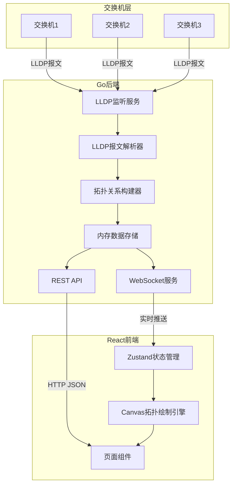
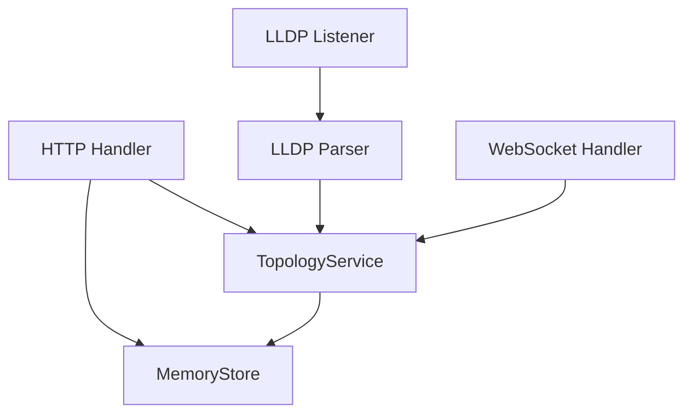

## 1. 架构设计



## 2. 技术说明

- **前端**：React@18 + TypeScript + Vite + TailwindCSS + Zustand
- **前端初始化工具**：vite-init
- **后端**：Go 1.21+ + github.com/j-lg/lldp（LLDP报文解析库）+ gorilla/websocket
- **数据库**：内存存储（Map），定时持久化到JSON文件
- **通信协议**：REST API（查询） + WebSocket（实时推送）

## 3. 路由定义

| 路由 | 用途 |
|------|------|
| `/` | 拓扑总览页 |
| `/device/:id` | 设备详情页 |

## 4. API定义

### 4.1 REST API

```
GET /api/topology
Response: {
  devices: Device[]
  links: Link[]
}

GET /api/devices
Response: Device[]

GET /api/devices/:id
Response: Device

GET /api/devices/:id/neighbors
Response: Device[]
```

### 4.2 WebSocket

```
连接: ws://host:port/ws/topology

推送事件:
- "device_update": 新设备或设备信息更新
- "link_update": 新连接或连接更新
- "topology_full": 完整拓扑数据（初始连接时推送）
```

### 4.3 数据类型定义

```typescript
interface Device {
  id: string
  chassisId: string
  chassisIdSubtype: string
  portId: string
  portIdSubtype: string
  systemName: string
  systemDescription: string
  managementAddress: string
  ttl: number
  tlvs: TLV[]
  lastSeen: string
  status: "online" | "offline"
}

interface TLV {
  type: number
  typeName: string
  value: string
}

interface Link {
  id: string
  sourceDeviceId: string
  sourcePortId: string
  targetDeviceId: string
  targetPortId: string
}

interface TopologyData {
  devices: Device[]
  links: Link[]
}
```

## 5. 后端架构图



## 6. Go后端模块说明

### 6.1 LLDP监听模块 (`internal/lldp`)
- 监听指定网络接口上的LLDP报文（EtherType 0x88cc）
- 使用 `github.com/j-lg/lldp` 库解析报文
- 提取Chassis ID TLV、Port ID TLV、TTL TLV、System Name TLV等

### 6.2 拓扑构建模块 (`internal/topology`)
- 维护设备列表（以Chassis ID为唯一标识）
- 维护设备间连接关系
- 设备超时标记为offline
- 提供查询接口

### 6.3 API模块 (`internal/api`)
- Gin框架提供REST API
- WebSocket实时推送拓扑变更
- 静态文件服务（前端构建产物）

### 6.4 项目结构

```
p330/
├── main.go                  # 入口
├── go.mod
├── go.sum
├── internal/
│   ├── lldp/
│   │   └── listener.go      # LLDP报文监听与解析
│   ├── topology/
│   │   └── builder.go       # 拓扑关系构建
│   └── api/
│       └── handler.go       # HTTP/WebSocket处理器
├── web/                     # React前端
│   ├── src/
│   │   ├── components/
│   │   ├── pages/
│   │   ├── hooks/
│   │   ├── stores/
│   │   └── utils/
│   ├── package.json
│   └── vite.config.ts
└── .trae/
    └── documents/
```
