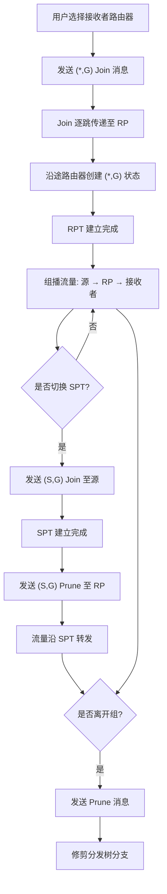

## 1. 产品概述

PIM-SM（Protocol Independent Multicast - Sparse Mode）模拟器是一个交互式网络协议可视化工具，用于模拟和展示PIM-SM组播协议的核心机制，包括汇聚点（RP）选举、Join/Prune消息处理、共享树（RPT）和最短路径树（SPT）的构建与切换过程。

- 目标用户：网络工程师、网络协议学习者、计算机网络课程师生
- 核心价值：将抽象的组播协议过程转化为直观的动态可视化，帮助用户理解PIM-SM协议的工作原理

## 2. 核心功能

### 2.1 用户角色

| 角色 | 说明 |
|------|------|
| 操作者 | 通过交互操作控制模拟器的网络拓扑和协议行为 |

### 2.2 功能模块

1. **网络拓扑画布**：可视化展示路由器、链路、组播源和接收者
2. **协议控制面板**：发送Join/Prune消息、配置RP、切换RPT/SPT
3. **组播流量可视化**：动态展示数据包沿组播分发树转发的路径
4. **协议状态监控**：实时显示路由器的组播路由表和协议状态

### 2.3 页面详情

| 页面名称 | 模块名称 | 功能描述 |
|----------|----------|----------|
| 模拟器主页面 | 网络拓扑画布 | Canvas画布渲染网络拓扑，展示路由器节点、链路连接、RP标识，支持拖拽节点调整布局 |
| 模拟器主页面 | 协议控制面板 | 左侧面板：发送(*,G) Join、(S,G) Join、Prune消息；配置RP节点；选择组播源和组播组 |
| 模拟器主页面 | 组播流量动画 | 数据包沿分发树路径的流动动画，RPT和SPT用不同颜色区分，Join/Prune消息用虚线动画展示 |
| 模拟器主页面 | 路由表监控面板 | 右侧面板：显示选中路由器的组播路由表（(*,G)和(S,G)条目）、上游接口、下游接口列表 |
| 模拟器主页面 | 事件日志 | 底部面板：按时间顺序记录协议事件（Join发送、Prune发送、树切换、注册等），支持筛选 |
| 模拟器主页面 | 预设场景 | 顶部工具栏：提供预设拓扑场景（基本RP树、SPT切换、多源多组、Prune离开等），一键加载 |

## 3. 核心流程

### 3.1 接收者加入组播组（RPT构建）

1. 用户选择一个路由器作为接收者，点击"Join Group"
2. 接收者路由器向RP方向发送(*,G) Join消息
3. Join消息逐跳传递至RP，沿途路由器创建(*,G)状态
4. RPT（共享树）建立完成，用绿色路径高亮显示
5. 组播流量从源→RP→沿RPT转发至接收者

### 3.2 SPT切换流程

1. 当接收者的最后一跳路由器收到来自源的流量后
2. 用户点击"Switch to SPT"触发切换
3. 最后一跳路由器向源方向发送(S,G) Join消息
4. SPT建立后，流量直接从源沿SPT到达接收者
5. 最后一跳路由器向RP发送(S,G) Prune，修剪RPT上的冗余路径
6. SPT路径用橙色高亮显示

### 3.3 核心流程图

## 4. 用户界面设计

### 4.1 设计风格

- **主色调**：深色科技风背景（#0a0e1a），搭配网络蓝（#00d4ff）和协议绿（#00ff88）作为强调色
- **辅助色**：SPT橙色（#ff8c00）、Prune红色（#ff4444）、警告黄（#ffd700）
- **按钮风格**：圆角矩形，微发光边框效果，hover时增强发光
- **字体**：显示字体使用 JetBrains Mono（等宽科技感），UI字体使用 Noto Sans SC
- **布局风格**：三栏布局——左侧控制面板、中央拓扑画布、右侧状态面板
- **图标风格**：线条图标，使用 lucide-react

### 4.2 页面设计概览

| 页面名称 | 模块名称 | UI元素 |
|----------|----------|--------|
| 模拟器主页面 | 网络拓扑画布 | 深色画布背景，路由器为六边形节点，链路为发光线条，RP节点带光环效果，源节点绿色，接收者节点蓝色 |
| 模拟器主页面 | 协议控制面板 | 半透明暗色面板，消息类型按钮组，下拉选择器（组播组、源地址），操作状态指示灯 |
| 模拟器主页面 | 流量动画 | 数据包为发光小球沿路径流动，RPT路径绿色，SPT路径橙色，Join消息虚线+向上箭头动画 |
| 模拟器主页面 | 路由表面板 | 表格形式展示，(*,G)条目青色，(S,G)条目橙色，上游/下游接口标签式展示 |
| 模拟器主页面 | 事件日志 | 终端风格文本区域，带时间戳，不同事件类型不同颜色高亮 |
| 模拟器主页面 | 预设场景 | 顶部工具栏按钮组，带场景缩略图标 |

### 4.3 响应式设计

- 桌面优先设计，最小支持1280px宽度
- 侧边面板可折叠以适应较小屏幕
- 画布区域自适应填充剩余空间

### 4.4 3D场景指引（不适用）
