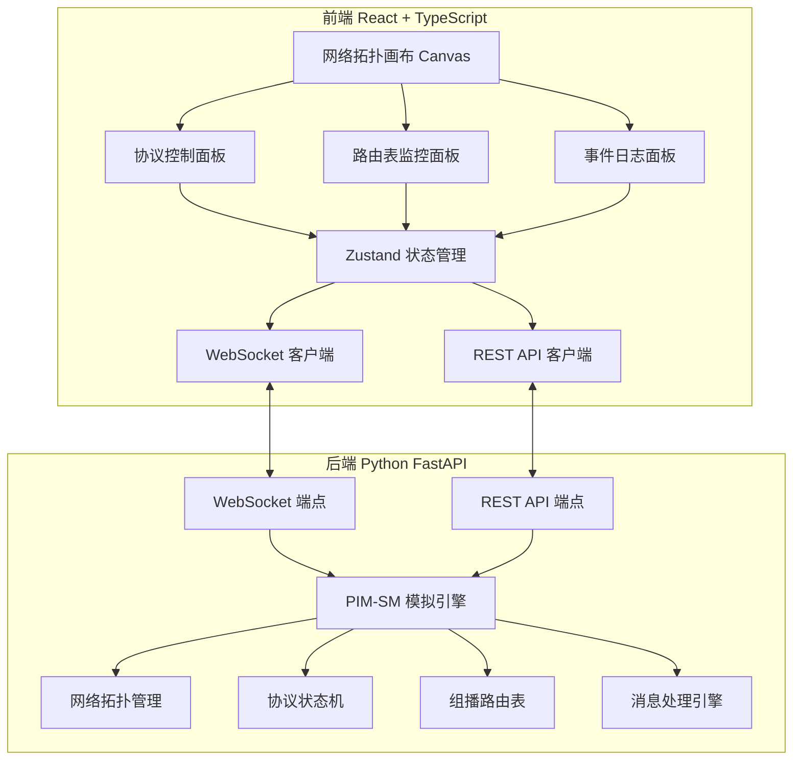
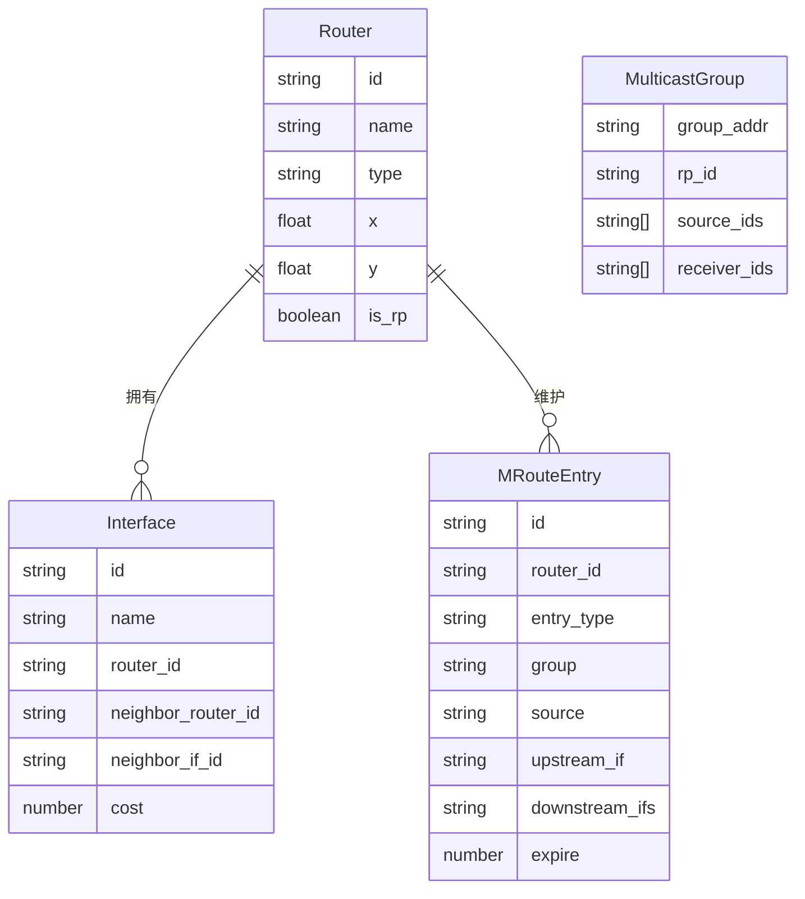

## 1. 架构设计



## 2. 技术说明

- **前端**：React@18 + TypeScript + Tailwind CSS@3 + Vite
- **初始化工具**：vite-init
- **后端**：Python FastAPI + WebSocket
- **数据库**：无，模拟状态全部在内存中维护
- **通信协议**：REST API + WebSocket（实时事件推送）

### 核心依赖

**前端**：
- react、react-dom、react-router-dom
- zustand（状态管理）
- tailwindcss
- lucide-react（图标）

**后端**：
- fastapi
- uvicorn
- websockets
- pydantic

## 3. 路由定义

| 路由 | 用途 |
|------|------|
| `/` | 模拟器主页面，包含所有功能模块 |

## 4. API 定义

### 4.1 REST API

```
# 拓扑管理
GET    /api/topology              获取当前网络拓扑
POST   /api/topology/preset       加载预设拓扑场景
PUT    /api/topology/nodes/{id}   更新节点位置

# 协议操作
POST   /api/pim/join              发送Join消息（(*,G)或(S,G)）
POST   /api/pim/prune             发送Prune消息
POST   /api/pim/switch-spt        触发SPT切换
POST   /api/pim/register          源向RP注册

# 查询
GET    /api/routers/{id}/mroute   获取路由器组播路由表
GET    /api/routers/{id}/state    获取路由器协议状态
GET    /api/groups                获取所有组播组信息
```

### 4.2 WebSocket 事件

```typescript
interface SimEvent {
  type: "join_forward" | "prune_forward" | "traffic_forward" | 
        "state_change" | "tree_change" | "register" | "spt_switch";
  timestamp: number;
  data: {
    source: string;
    target: string;
    group?: string;
    source_addr?: string;
    tree_type?: "rpt" | "spt";
    mroute_entry?: MRouteEntry;
  };
}

interface MRouteEntry {
  type: "starg" | "sg";
  group: string;
  source?: string;
  upstream_if: string;
  downstream_ifs: string[];
  expire: number;
}
```

## 5. 服务器架构图（不适用）

后端为Python FastAPI，无分层架构。

## 6. 数据模型

### 6.1 数据模型定义



### 6.2 Python 数据类定义

```python
from pydantic import BaseModel
from typing import Optional
from enum import Enum

class RouterType(str, Enum):
    ROUTER = "router"
    SOURCE = "source"
    RECEIVER = "receiver"

class MRouteType(str, Enum):
    STARG = "starg"
    SG = "sg"

class Router(BaseModel):
    id: str
    name: str
    type: RouterType
    x: float
    y: float
    is_rp: bool = False

class Interface(BaseModel):
    id: str
    name: str
    router_id: str
    neighbor_router_id: str
    neighbor_if_id: str
    cost: int = 1

class MRouteEntry(BaseModel):
    id: str
    router_id: str
    entry_type: MRouteType
    group: str
    source: Optional[str] = None
    upstream_if: str
    downstream_ifs: list[str]
    expire: int = 180

class MulticastGroup(BaseModel):
    group_addr: str
    rp_id: str
    source_ids: list[str] = []
    receiver_ids: list[str] = []
```
