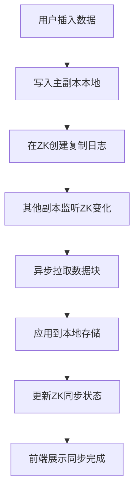

## 1. 产品概述

ClickHouse多副本数据复制模拟器，用于模拟和可视化展示ClickHouse集群中多副本之间基于ZooKeeper协调的数据异步同步过程，帮助开发者和运维人员理解分布式数据库的数据复制机制。

- 核心目的：模拟ClickHouse多副本架构的数据同步流程，直观展示各副本的同步状态
- 解决问题：降低分布式数据库复制机制的理解门槛，提供可交互的学习和演示工具
- 目标用户：数据库开发者、运维工程师、技术学习者

## 2. 核心功能

### 2.1 用户角色

| 角色 | 注册方式 | 核心权限 |
|------|----------|----------|
| 普通用户 | 无需注册 | 查看副本状态、执行插入操作、观察同步过程 |

### 2.2 功能模块

1. **主面板**：副本状态概览、集群健康度展示、实时同步监控
2. **操作区**：数据插入表单、模拟控制按钮（暂停/恢复/重置）
3. **同步详情**：各副本数据列表、同步进度条、复制队列状态
4. **ZooKeeper视图**：ZK节点结构、Leader选举状态、元数据信息

### 2.3 页面详情

| 页面名称 | 模块名称 | 功能描述 |
|----------|----------|----------|
| 主面板 | 状态概览 | 展示所有副本的在线状态、数据量、同步延迟 |
| 主面板 | 插入操作 | 模拟向指定副本插入数据，触发异步同步 |
| 主面板 | 同步进度 | 以进度条和时间线形式展示各副本的同步进度 |
| 主面板 | ZooKeeper协调器 | 展示ZK中的节点信息、Leader状态、复制日志 |
| 主面板 | 控制面板 | 提供暂停同步、恢复同步、重置集群等操作 |

## 3. 核心流程

用户通过前端界面选择一个副本执行数据插入操作，该副本将数据写入本地并在ZooKeeper中创建复制日志节点。其他副本通过监听ZK节点变化发现新数据，异步拉取并应用到本地。前端实时轮询各副本状态，展示同步进度和延迟。

## 4. 用户界面设计

### 4.1 设计风格

- 主色调：深蓝色系（#1e3a5f）配合科技感青色（#00d4ff），体现分布式系统的专业感
- 辅助色：绿色（#10b981）表示在线/同步完成，黄色（#f59e0b）表示同步中，红色（#ef4444）表示异常
- 按钮风格：圆角矩形，带轻微阴影，hover时有发光效果
- 字体：使用 JetBrains Mono 作为等宽字体展示数据，配合 Poppins 作为标题字体
- 布局风格：卡片式布局，顶部导航，左侧ZK视图，中间主面板，右侧操作区
- 图标风格：使用简约线性图标，配合动画效果展示状态变化

### 4.2 页面设计概述

| 页面名称 | 模块名称 | UI元素 |
|----------|----------|----------|
| 主面板 | 状态概览 | 卡片网格布局，每个副本一个卡片，包含状态指示灯、数据量、同步延迟 |
| 主面板 | 同步进度 | 线性进度条，带百分比数字，同步中的进度条有脉冲动画 |
| 主面板 | ZooKeeper视图 | 树形结构展示ZK节点，可展开/折叠，节点状态用颜色区分 |
| 主面板 | 操作区 | 表单输入数据内容，下拉选择目标副本，按钮组控制模拟状态 |
| 主面板 | 数据列表 | 表格展示各副本已同步的数据，带时间戳和来源副本标记 |

### 4.3 响应式

- 采用桌面优先设计，主内容区最小宽度1200px
- 中等屏幕（1024px）：ZK视图可收起，操作区移至底部
- 移动设备：采用垂直堆叠布局，关键信息优先展示

### 4.4 动画效果

- 页面加载时各卡片按顺序淡入，带有轻微的上移动画
- 数据插入时，目标副本卡片有脉冲高亮效果
- 同步进度条有平滑过渡动画，同步完成时有绿色光晕扩散效果
- ZK节点变化时有闪烁提示，新节点有从无到有的缩放动画
