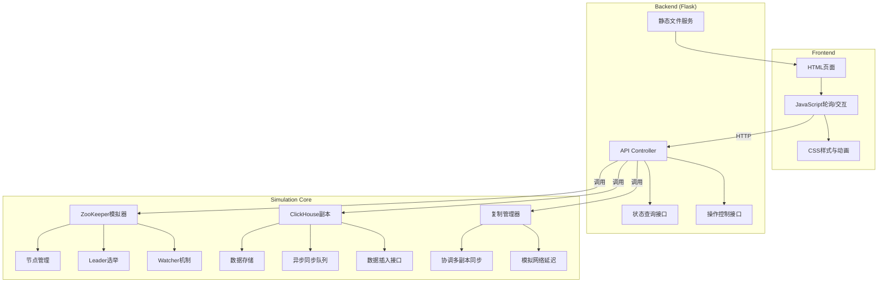
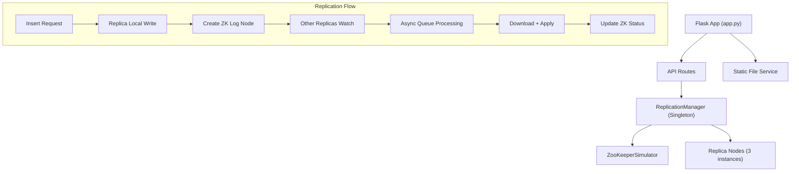

## 1. 架构设计



## 2. 技术描述

- **前端**：原生 HTML5 + CSS3 + JavaScript（ES6+），无需构建工具，直接运行
- **后端**：Python 3.9+ + Flask 2.3+，提供 RESTful API 和静态文件服务
- **核心模拟层**：纯 Python 实现，包含 ZK 模拟、副本节点、复制管理器
- **数据存储**：内存存储（Python 字典/列表），无需外部数据库
- **异步机制**：Python `threading` + `queue` 实现异步复制队列
- **依赖包**：flask, flask-cors

## 3. 目录结构

```
p338/
├── app.py                      # Flask主入口
├── simulator/
│   ├── __init__.py
│   ├── zookeeper.py            # ZooKeeper模拟器
│   ├── replica.py              # ClickHouse副本节点
│   └── replication_manager.py  # 复制管理器
├── static/
│   ├── css/
│   │   └── style.css           # 样式文件
│   └── js/
│       └── app.js              # 前端交互逻辑
├── templates/
│   └── index.html              # 主页面
└── requirements.txt            # 依赖清单
```

## 4. 路由定义

| Route | Method | Purpose |
|-------|--------|---------|
| / | GET | 主页面，展示模拟器UI |
| /api/status | GET | 获取所有副本状态和同步进度 |
| /api/zk/status | GET | 获取ZooKeeper节点状态 |
| /api/insert | POST | 向指定副本插入数据 |
| /api/control/pause | POST | 暂停同步过程 |
| /api/control/resume | POST | 恢复同步过程 |
| /api/control/reset | POST | 重置整个集群 |

## 5. API 定义

### 5.1 数据类型定义

```typescript
interface Replica {
  id: string;
  name: string;
  host: string;
  port: number;
  status: 'online' | 'offline' | 'syncing';
  isLeader: boolean;
  dataCount: number;
  lastSyncTime: number | null;
  syncLag: number;
  data: DataBlock[];
  syncQueue: SyncQueueItem[];
}

interface DataBlock {
  id: string;
  content: string;
  sourceReplica: string;
  timestamp: number;
  blockNumber: number;
}

interface SyncQueueItem {
  blockId: string;
  progress: number;
  status: 'pending' | 'downloading' | 'applying' | 'completed';
  startTime: number;
}

interface ZKNode {
  path: string;
  value: any;
  children: ZKNode[];
  ephemeral: boolean;
  createdAt: number;
}

interface ZKStatus {
  leader: string;
  nodes: ZKNode[];
  replicationLog: ReplicationLogEntry[];
}

interface ReplicationLogEntry {
  id: string;
  blockId: string;
  sourceReplica: string;
  timestamp: number;
  replicasToSync: string[];
  completedReplicas: string[];
}
```

### 5.2 请求/响应示例

#### POST /api/insert
```json
{
  "replicaId": "replica-1",
  "content": "INSERT INTO test VALUES (1, 'hello')"
}
```

响应：
```json
{
  "success": true,
  "blockId": "blk-abc123",
  "message": "Data inserted successfully, replication started"
}
```

#### GET /api/status
响应：
```json
{
  "replicas": [
    {
      "id": "replica-1",
      "name": "副本1",
      "status": "online",
      "isLeader": true,
      "dataCount": 5,
      "syncLag": 0,
      "syncQueue": []
    }
  ],
  "isPaused": false,
  "totalDataBlocks": 5
}
```

## 6. 服务器架构



## 7. 核心类设计

### 7.1 ZooKeeperSimulator
- `create_node(path, value, ephemeral=False)` - 创建节点
- `get_node(path)` - 获取节点数据
- `set_data(path, value)` - 设置节点数据
- `get_children(path)` - 获取子节点列表
- `watch(path, callback)` - 注册监听器
- `elect_leader(replica_ids)` - Leader选举

### 7.2 ClickHouseReplica
- `insert_data(content)` - 插入数据到本地
- `apply_block(block)` - 应用数据块
- `start_sync(block_id, source)` - 开始同步某个数据块
- `get_sync_progress(block_id)` - 获取同步进度
- `get_status()` - 获取副本状态

### 7.3 ReplicationManager
- `insert_to_replica(replica_id, content)` - 向指定副本插入数据
- `replicate_block(block_id, source_id)` - 触发数据块复制
- `get_all_status()` - 获取所有副本状态
- `pause_replication()` - 暂停复制
- `resume_replication()` - 恢复复制
- `reset()` - 重置集群
