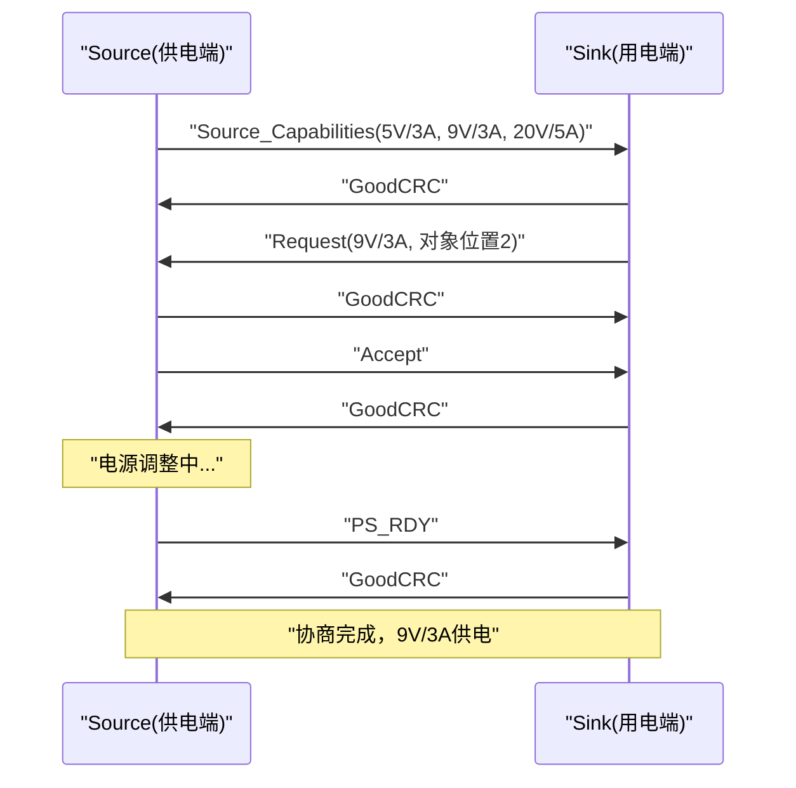

## 1. 产品概述

USB-C PD（Power Delivery）协议分析仪桌面应用，用于实时捕获、解析和可视化USB PD协商过程。通过USB-C分析仪硬件或内置模拟器捕获PD消息，解析Source_Capabilities、Request、PS_RDY等关键消息类型，以时间线和供电曲线形式展示电压电流协商全过程。

- **目标用户**：嵌入式工程师、USB-C配件开发者、电源管理调试人员
- **核心价值**：将晦涩的PD二进制消息转化为直观的可视化界面，加速PD协议调试与验证

## 2. 核心功能

### 2.1 功能模块

1. **主面板页**：实时消息流、协商时间线、供电曲线、设备状态
2. **消息详情页**：PD消息二进制解码、字段级别解析

### 2.2 页面详情

| 页面名称 | 模块名称 | 功能描述 |
|----------|----------|----------|
| 主面板 | 连接状态栏 | 显示分析仪连接状态、USB设备信息、当前协商电压/电流 |
| 主面板 | 实时消息流 | 按时间顺序显示捕获的PD消息列表，支持按消息类型筛选 |
| 主面板 | 协商时间线 | 可视化展示PD协商阶段：Source_Capabilities → Request → Accept → PS_RDY → 新电压生效 |
| 主面板 | 供电曲线图 | 实时绘制电压/电流变化曲线，支持缩放和时间范围选择 |
| 主面板 | 模拟控制面板 | 启动/停止模拟器，选择模拟场景（标准5V→20V协商、PPS协商等） |
| 消息详情 | 消息解码视图 | 显示原始十六进制数据与逐字段解码结果 |
| 消息详情 | PDO解析表 | Source_Capabilities中每个PDO的电压/电流/类型详细解析 |

## 3. 核心流程

用户启动应用后，可选择连接真实USB-C分析仪或使用内置模拟器。数据流经主进程解析后推送至渲染进程，实时更新界面各模块。

```mermaid
flowchart TD
    "启动应用" --> "选择数据源"
    "选择数据源" --> "USB-C分析仪"
    "选择数据源" --> "内置模拟器"
    "USB-C分析仪" --> "读取原始PD帧"
    "内置模拟器" --> "生成模拟PD帧"
    "读取原始PD帧" --> "PD协议解析引擎"
    "生成模拟PD帧" --> "PD协议解析引擎"
    "PD协议解析引擎" --> "消息类型识别"
    "消息类型识别" --> "Source_Capabilities解析"
    "消息类型识别" --> "Request解析"
    "消息类型识别" --> "PS_RDY/Accept/Reject解析"
    "Source_Capabilities解析" --> "更新消息流"
    "Request解析" --> "更新消息流"
    "PS_RDY/Accept/Reject解析" --> "更新消息流"
    "更新消息流" --> "更新协商时间线"
    "更新消息流" --> "更新供电曲线"
    "更新消息流" --> "更新PDO解析表"
```

PD协商核心流程：



## 4. 用户界面设计

### 4.1 设计风格

- **主色调**：深色科技风（深蓝灰 #0F1923 为底，电光蓝 #00D4FF 为主色调，琥珀色 #FFB800 为警示/高亮色）
- **次色调**：翠绿 #00FF88 表示成功/就绪状态，红色 #FF4757 表示错误/拒绝
- **按钮风格**：圆角矩形，微发光边框效果，hover时发光增强
- **字体**：JetBrains Mono（数据/代码区域）、Outfit（UI文本）
- **布局风格**：三栏布局 - 左侧消息列表、中间时间线与详情、右侧供电曲线
- **图标风格**：线性图标（lucide-react），2px描边，与科技风一致

### 4.2 页面设计概述

| 页面名称 | 模块名称 | UI元素 |
|----------|----------|--------|
| 主面板 | 连接状态栏 | 顶部横条，设备图标+连接状态指示灯+当前VD/ID数值 |
| 主面板 | 实时消息流 | 左侧可滚动列表，每条消息带类型色标、时间戳、摘要 |
| 主面板 | 协商时间线 | 中间区域，水平时间轴，节点显示协商阶段，动画过渡 |
| 主面板 | 供电曲线图 | 右侧Canvas图表，双Y轴（电压+电流），实时滚动 |
| 主面板 | 模拟控制面板 | 底部工具栏，场景选择下拉框+开始/停止按钮+速度控制 |
| 消息详情 | 消息解码视图 | 弹出侧面板，上方十六进制dump，下方字段解码表格 |
| 消息详情 | PDO解析表 | 表格形式，每行一个PDO，列：位置/类型/电压/电流/功率 |

### 4.3 响应式设计

- 桌面优先设计，最低支持1280x720
- 三栏布局在窄屏时可折叠为标签页切换模式
- 供电曲线图支持全屏展开
