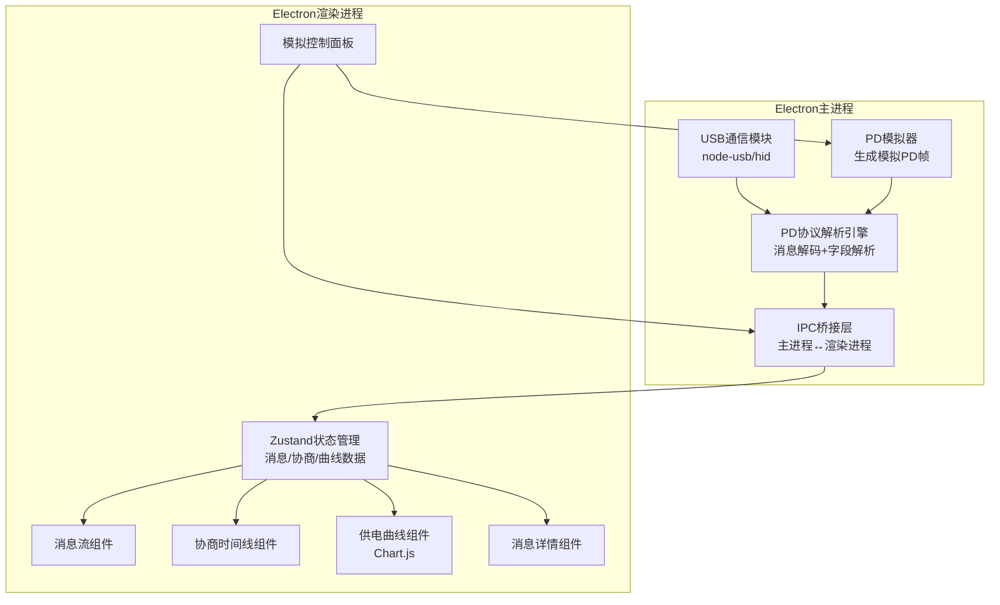

## 1. 架构设计



## 2. 技术说明

- **前端框架**：React 18 + TypeScript + TailwindCSS 3 + Vite
- **桌面框架**：Electron 28+（electron-builder打包）
- **图表库**：Chart.js + react-chartjs-2（供电曲线）
- **状态管理**：Zustand
- **USB通信**：node-usb（主进程，可选硬件连接）
- **初始化工具**：vite-init（react-ts模板）
- **后端**：无独立后端，Electron主进程直接处理
- **数据库**：无，内存中管理消息数据，支持导出JSON

## 3. 路由定义

| 路由 | 用途 |
|------|------|
| / | 主面板：消息流+时间线+供电曲线 |
| /detail/:id | 消息详情：二进制解码+PDO解析 |

## 4. IPC通道定义

| 通道名 | 方向 | 数据格式 | 说明 |
|--------|------|----------|------|
| pd:start-simulation | 渲染→主 | { scenario: string, speed: number } | 启动模拟器 |
| pd:stop-simulation | 渲染→主 | null | 停止模拟器 |
| pd:connect-device | 渲染→主 | { deviceId: string } | 连接USB设备 |
| pd:disconnect-device | 渲染→主 | null | 断开USB设备 |
| pd:message | 主→渲染 | PDParsedMessage | 解析后的PD消息 |
| pd:negotiation-update | 主→渲染 | NegotiationState | 协商状态更新 |
| pd:power-curve-point | 主→渲染 | { timestamp: number, voltage: number, current: number } | 供电曲线数据点 |
| pd:device-status | 主→渲染 | DeviceStatus | 设备连接状态 |

### 核心TypeScript类型定义

```typescript
type PDMessageType =
  | 'SOURCE_CAPABILITIES'
  | 'REQUEST'
  | 'BIST'
  | 'SINK_CAPABILITIES'
  | 'BATTERY_STATUS'
  | 'ALERT'
  | 'GET_SOURCE_CAP'
  | 'GET_SINK_CAP'
  | 'DR_SWAP'
  | 'PR_SWAP'
  | 'VCONN_SWAP'
  | 'WAIT'
  | 'NOT_SUPPORTED'
  | 'GOODCRC'
  | 'GOTOMIN'
  | 'ACCEPT'
  | 'REJECT'
  | 'PS_RDY'
  | 'SOFT_RESET'
  | 'VENDOR_DEFINED'

interface PDMessage {
  id: string
  timestamp: number
  rawHex: string
  header: PDMessageHeader
  dataObjects?: PDDataObject[]
  direction: 'SOP' | 'SOP\''
}

interface PDMessageHeader {
  messageType: PDMessageType
  messageId: number
  portDataRole: 'Source' | 'Sink'
  portPowerRole: 'Source' | 'Sink'
  specificationRevision: number
  numDataObjects: number
}

interface PDDataObject {
  position: number
  type: 'fixed' | 'battery' | 'variable' | 'apsdo'
  voltageMV: number
  currentMA: number
  maxPowerMW: number
  rawValue: number
}

interface NegotiationState {
  phase: 'idle' | 'capabilities_sent' | 'request_sent' | 'accepted' | 'power_transition' | 'ready' | 'rejected'
  sourceCapabilities: PDDataObject[]
  selectedCapability: number
  requestedVoltage: number
  requestedCurrent: number
  activeVoltage: number
  activeCurrent: number
  history: NegotiationEvent[]
}

interface NegotiationEvent {
  timestamp: number
  phase: NegotiationState['phase']
  message: string
  voltage: number
  current: number
}

interface DeviceStatus {
  connected: boolean
  deviceName: string
  firmwareVersion: string
  captureCount: number
}

interface PowerCurvePoint {
  timestamp: number
  voltage: number
  current: number
  power: number
}
```

## 5. PD协议解析引擎设计

### 5.1 消息头解析（16-bit Header）

```
Bit 15:    Extended (0=非扩展消息)
Bit 14-12: 数据对象数量 (0-7)
Bit 11-9:  消息ID (0-7)
Bit 8:     端口电源角色 (0=Sink, 1=Source)
Bit 7:     规范版本 (00=1.0, 01=2.0, 10=3.0)
Bit 6:     端口数据角色 (0=UFP, 1=DFP)
Bit 5-0:   消息类型
```

### 5.2 PDO解析规则

| PDO类型 | Bit 31-30 | 说明 |
|---------|-----------|------|
| Fixed Supply | 00 | 固定电压，Bit29=双电源角色，Bit28=USB通信，Bit27=不受限，Bit26-21=峰值电流，Bit19-10=电压(50mV)，Bit9-0=最大电流(10mA) |
| Battery | 01 | 电池供电，Bit19-10=最小电压，Bit9-0=最大功率(250mW) |
| Variable | 10 | 可变电源，Bit19-10=最大电压，Bit9-0=最小电压... |
| APDO | 11 | 可编程电源PPS，Bit29=PPS，Bit24-17=最大电压，Bit15-8=最小电压，Bit6-0=最大电流(50mA) |

## 6. 模拟场景设计

| 场景名称 | 描述 | PD消息序列 |
|----------|------|-----------|
| standard-5v | 标准5V协商 | Source_Cap(5V/3A) → Request(5V/3A) → Accept → PS_RDY |
| standard-9v | 5V→9V协商 | Source_Cap(5V/3A,9V/3A,20V/5A) → Request(9V/3A) → Accept → PS_RDY |
| standard-20v | 5V→20V协商 | Source_Cap(5V/3A,9V/3A,15V/3A,20V/5A) → Request(20V/5A) → Accept → PS_RDY |
| pps-negotiation | PPS可编程协商 | Source_Cap(5V/3A,9V/3A,PPS 3.3-11V/3A) → Request(PPS 8.4V/2.5A) → Accept → PS_RDY |
| rejected-request | 请求被拒绝 | Source_Cap(5V/3A) → Request(9V/3A) → Reject |
| renegotiation | 重新协商 | 初始5V → Source_Cap更新 → Request(新电压) → Accept → PS_RDY |
