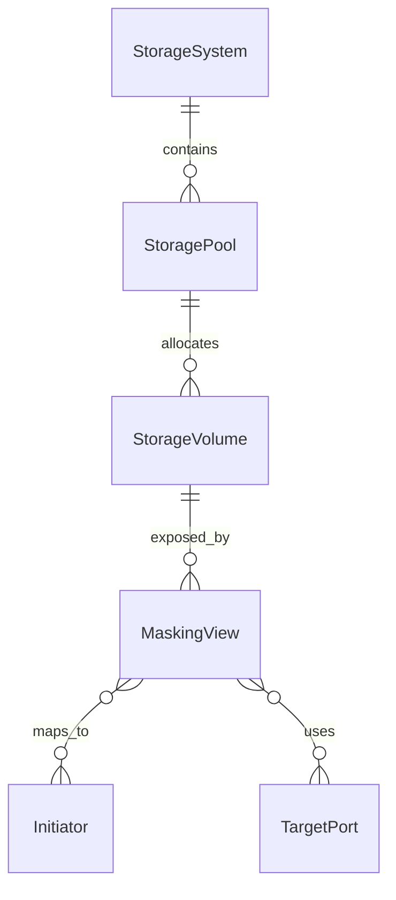

## 1. 架构设计

```mermaid
graph TB
    subgraph "前端层"
        "React App" --> "Topology Visualization"
        "React App" --> "Connection Manager"
        "React App" --> "Device Detail"
    end
    subgraph "后端层 (Python)"
        "FastAPI Server" --> "SMI-S Service"
        "SMI-S Service" --> "pywbem Client"
    end
    subgraph "外部服务"
        "pywbem Client" --> "SMI-S Provider"
    end
    "React App" -->|"HTTP REST API"| "FastAPI Server"
```

## 2. 技术说明

- 前端：React@18 + TypeScript + Vite + TailwindCSS + @antv/g6（拓扑图）
- 初始化工具：vite-init
- 后端：Python 3.11+ / FastAPI + pywbem + uvicorn
- 数据库：无需数据库，实时查询 SMI-S Provider（后端内存缓存）
- 拓扑可视化：@antv/g6 力导向图

## 3. 路由定义

| 路由 | 用途 |
|------|------|
| / | 连接管理页 - 配置 SMI-S Provider 连接 |
| /topology | 拓扑总览页 - 展示存储拓扑图 |
| /devices | 设备详情页 - 存储设备列表与详情 |

## 4. API 定义

### 4.1 连接管理

**POST /api/connect**
```typescript
interface ConnectRequest {
  host: string;
  port: number;
  username: string;
  password: string;
  namespace?: string;
  ssl_verify?: boolean;
}

interface ConnectResponse {
  success: boolean;
  message: string;
  provider_info?: {
    product: string;
    version: string;
    vendor: string;
  };
}
```

**GET /api/status**
```typescript
interface StatusResponse {
  connected: boolean;
  provider_info?: {
    product: string;
    version: string;
    vendor: string;
  };
  last_sync?: string;
}
```

### 4.2 存储设备枚举

**GET /api/storage-pools**
```typescript
interface StoragePool {
  id: string;
  name: string;
  path: string;
  total_size_gb: number;
  used_size_gb: number;
  free_size_gb: number;
  pool_type: string;
  health_state: string;
  system_name: string;
}

interface StoragePoolsResponse {
  pools: StoragePool[];
  total: number;
}
```

**GET /api/storage-volumes**
```typescript
interface StorageVolume {
  id: string;
  name: string;
  path: string;
  size_gb: number;
  volume_type: string;
  health_state: string;
  pool_id: string;
  system_name: string;
}

interface StorageVolumesResponse {
  volumes: StorageVolume[];
  total: number;
}
```

**GET /api/masking-views**
```typescript
interface MaskingView {
  id: string;
  name: string;
  path: string;
  volume_id: string;
  volume_name: string;
  initiator_ids: string[];
  port_ids: string[];
  system_name: string;
}

interface MaskingViewsResponse {
  views: MaskingView[];
  total: number;
}
```

### 4.3 拓扑数据

**GET /api/topology**
```typescript
interface TopologyNode {
  id: string;
  label: string;
  type: "system" | "pool" | "volume" | "masking_view" | "initiator" | "port";
  status: string;
  properties: Record<string, string | number>;
}

interface TopologyEdge {
  source: string;
  target: string;
  relation: "contains" | "exposes" | "maps_to" | "uses";
}

interface TopologyResponse {
  nodes: TopologyNode[];
  edges: TopologyEdge[];
}
```

## 5. 服务端架构图

```mermaid
graph LR
    "FastAPI Router" --> "ConnectionController"
    "FastAPI Router" --> "TopologyController"
    "ConnectionController" --> "SMISService"
    "TopologyController" --> "SMISService"
    "SMISService" --> "pywbem WBEMConnection"
    "pywbem WBEMConnection" --> "SMI-S Provider"
```

## 6. 数据模型

### 6.1 数据模型定义

无需持久化数据库，所有数据通过 SMI-S 实时查询。后端缓存层使用 Python 字典在内存中暂存拓扑数据。



### 6.2 SMI-S CIM 类映射

| SMI-S CIM 类 | 前端节点类型 | 说明 |
|---------------|-------------|------|
| CIM_StorageSystem | system | 存储系统 |
| CIM_StoragePool | pool | 存储池 |
| CIM_StorageVolume | volume | 存储卷 |
| CIM_MaskingView | masking_view | 掩码视图 |
| CIM_StorageHardwareID | initiator | Initiator |
| CIM_TargetPort | port | 目标端口 |
