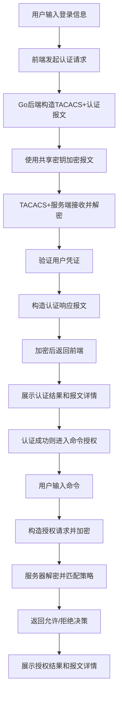

## 1. 产品概述

TACACS+ 模拟器是一个网络安全协议模拟系统，用于模拟 Cisco TACACS+ 协议的认证、授权和计费（AAA）流程。系统包含 Go 语言实现的 TACACS+ 服务端和可视化前端，帮助开发者和网络工程师理解、测试 TACACS+ 协议的工作原理。

- 核心价值：提供可交互的 TACACS+ 协议学习和测试环境，无需真实网络设备即可体验完整 AAA 流程
- 目标用户：网络工程师、安全开发人员、网络安全学习者

## 2. 核心功能

### 2.1 用户角色

| 角色 | 注册方式 | 核心权限 |
|------|----------|----------|
| 管理员 | 预设账号登录 | 配置共享密钥、管理用户、查看协议报文 |
| 普通用户 | 管理员创建 | 体验登录认证、命令授权流程 |

### 2.2 功能模块

1. **登录认证页**：用户登录界面，展示 TACACS+ 认证请求和响应流程
2. **命令授权页**：模拟网络设备命令执行，展示 TACACS+ 授权决策过程
3. **报文详情页**：展示 TACACS+ 报文结构、加密解密过程、十六进制原始数据
4. **配置管理页**：设置共享密钥、管理用户账号和权限策略

### 2.3 页面详情

| 页面名称 | 模块名称 | 功能描述 |
|---------|----------|----------|
| 登录认证页 | 登录表单 | 用户名密码输入、认证状态实时反馈 |
| 登录认证页 | 报文可视化 | 展示认证请求/响应报文结构、加密字段解密过程 |
| 命令授权页 | 命令输入 | 模拟设备命令输入（如 show running-config） |
| 命令授权页 | 授权决策 | 展示 TACACS+ 服务器允许/拒绝命令的判断逻辑 |
| 报文详情页 | 报文解析 | 十六进制原始数据、字段解析、加密/解密对比 |
| 配置管理页 | 密钥配置 | 设置 TACACS+ 共享密钥 |
| 配置管理页 | 用户管理 | 添加/编辑用户账号和权限级别 |
| 配置管理页 | 策略配置 | 配置命令授权规则（允许/拒绝的命令列表） |

## 3. 核心流程

### 3.1 认证流程
用户在前端输入用户名密码 → 前端调用后端认证接口 → 后端构造 TACACS+ 认证请求报文 → 使用共享密钥加密 → 模拟 TACACS+ 服务器接收并解密 → 验证用户凭证 → 构造认证响应报文 → 加密后返回 → 前端展示认证结果和报文详情

### 3.2 授权流程
已认证用户输入命令 → 前端调用授权接口 → 后端构造 TACACS+ 授权请求 → 加密发送 → 服务器解密后匹配授权策略 → 返回允许/拒绝决策 → 前端展示授权结果

### 3.3 流程图

## 4. 用户界面设计

### 4.1 设计风格
- **主题色调**：深色科技风格，主色采用深蓝色（#1a237e），辅以青色（#00bcd4）作为强调色
- **按钮风格**：立体渐变按钮，圆角 6px，hover 时有轻微上浮和发光效果
- **字体**：标题使用 JetBrains Mono 等宽字体，正文使用 Inter
- **布局风格**：左右分栏布局，左侧操作区，右侧报文详情区
- **视觉元素**：网络拓扑装饰线条、十六进制数据流动画、报文结构树状图

### 4.2 页面设计概览

| 页面名称 | 模块名称 | UI 元素 |
|---------|----------|---------|
| 登录认证页 | 登录表单 | 深色卡片布局、输入框带发光边框、错误抖动动画 |
| 登录认证页 | 报文可视化 | 左右对比布局（加密/解密）、颜色编码的字段高亮、展开/折叠动画 |
| 命令授权页 | 命令终端 | 模拟终端界面、命令输入自动补全、打字机效果 |
| 命令授权页 | 授权决策 | 绿色对勾/红色叉号动画、策略匹配过程展示 |
| 报文详情页 | 报文解析 | 十六进制数据与结构化字段联动高亮、字节级别的 hover 提示 |
| 配置管理页 | 配置表单 | 标签页切换、密钥隐藏/显示切换、策略规则表格 |

### 4.3 响应式设计
- 桌面端（1280px+）：左右双栏布局，左侧 40% 操作区，右侧 60% 详情区
- 平板端（768px-1279px）：上下堆叠布局，操作区在上，详情区在下
- 移动端（<768px）：单列布局，重点突出核心操作，报文详情可折叠

### 4.4 交互动效
- 页面加载：元素从下往上淡入，错开延迟 100ms
- 报文传输：从左到右的流动线条动画，代表数据传输
- 加解密过程：字段从乱码到明文的过渡动画
- 按钮点击：缩放反馈 + 涟漪效果
