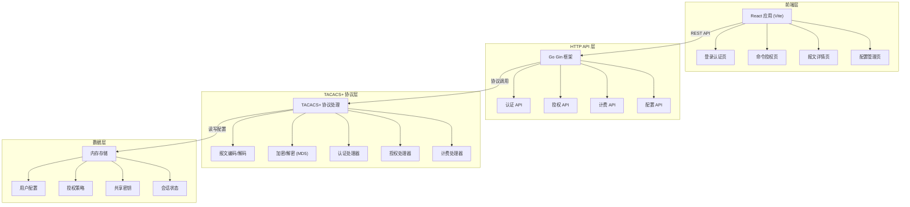
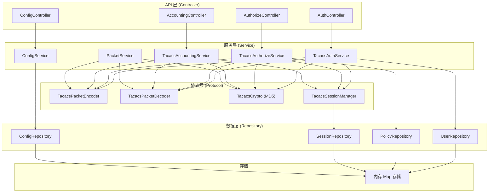
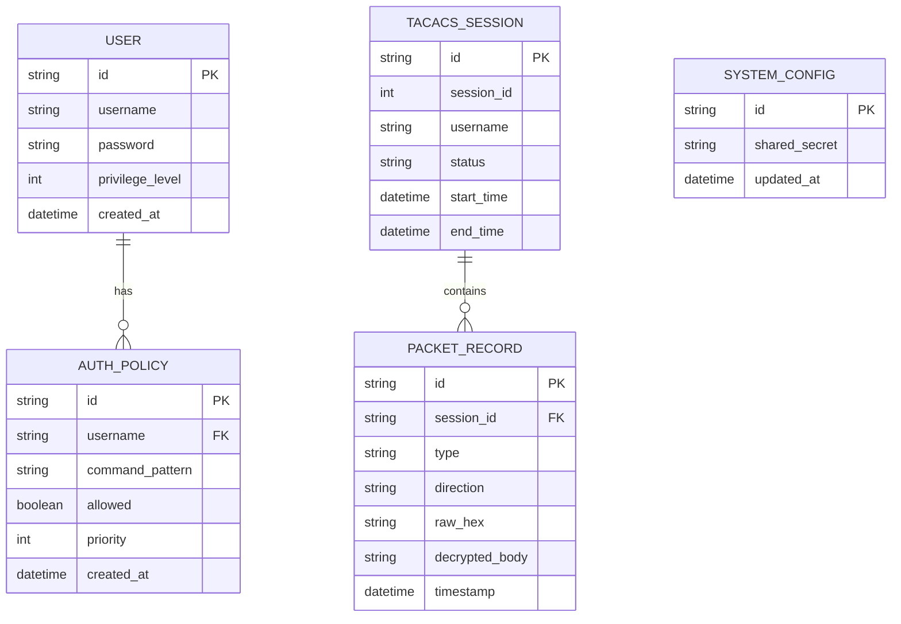

## 1. 架构设计



## 2. 技术说明

### 2.1 前端技术栈
- **框架**: React@18 + TypeScript
- **构建工具**: Vite@5
- **样式**: TailwindCSS@3
- **路由**: React Router@6
- **状态管理**: React Context + useState
- **HTTP 客户端**: Fetch API
- **代码高亮**: Prism.js (用于十六进制和报文展示)

### 2.2 后端技术栈
- **语言**: Go 1.21+
- **Web 框架**: Gin@1.9
- **TACACS+ 协议**: 自研实现
- **加密算法**: MD5 (TACACS+ 标准)
- **数据存储**: 内存存储（map 结构）

### 2.3 TACACS+ 协议实现要点
- 支持 TACACS+ 版本 0x0c (12)
- 支持三种报文类型: 认证 (0x01)、授权 (0x02)、计费 (0x03)
- 加密方式: 基于共享密钥和会话 ID 的 MD5 流加密
- 报文结构: 12 字节头部 + 可变长 Body

## 3. 路由定义

| 路由 | 页面/接口 | 用途 |
|------|----------|------|
| `/` | 登录认证页 | 用户登录，展示 TACACS+ 认证流程 |
| `/authorize` | 命令授权页 | 命令授权，展示 TACACS+ 授权流程 |
| `/packets` | 报文详情页 | 报文解析和加解密过程展示 |
| `/config` | 配置管理页 | 共享密钥、用户、策略配置 |
| `/api/auth` | API | 发起 TACACS+ 认证请求 |
| `/api/authorize` | API | 发起 TACACS+ 授权请求 |
| `/api/accounting` | API | 发起 TACACS+ 计费请求 |
| `/api/config` | API | 获取/更新系统配置 |
| `/api/sessions` | API | 获取会话历史和报文记录 |

## 4. API 定义

### 4.1 类型定义

```typescript
// TACACS+ 报文头部
interface TacacsHeader {
  version: number;       // 版本号 (高4位主版本, 低4位次版本)
  type: number;          // 报文类型: 1=认证, 2=授权, 3=计费
  seqNo: number;         // 序列号
  flags: number;         // 标志位
  sessionId: number;     // 会话ID
  length: number;        // Body长度
}

// 认证请求
interface AuthRequest {
  username: string;
  password: string;
  sharedSecret: string;
}

// 认证响应
interface AuthResponse {
  success: boolean;
  message: string;
  packet: {
    header: TacacsHeader;
    rawHex: string;
    decryptedBody: string;
    fields: Record<string, any>;
  };
}

// 授权请求
interface AuthorizeRequest {
  username: string;
  command: string;
  sessionId: number;
}

// 授权响应
interface AuthorizeResponse {
  allowed: boolean;
  reason: string;
  matchedPolicy?: string;
  packet: {
    header: TacacsHeader;
    rawHex: string;
    decryptedBody: string;
    fields: Record<string, any>;
  };
}

// 配置信息
interface SystemConfig {
  sharedSecret: string;
  users: User[];
  policies: AuthPolicy[];
}

interface User {
  id: string;
  username: string;
  password: string;
  privilegeLevel: number;
}

interface AuthPolicy {
  id: string;
  username: string;
  commandPattern: string;
  allowed: boolean;
  priority: number;
}
```

## 5. 服务器架构图



## 6. 数据模型

### 6.1 数据模型定义



### 6.2 Go 数据结构定义

```go
// TACACS+ 报文头部 (12字节)
type TacacsHeader struct {
    Version   uint8  // 版本: 高4位=1, 低4位=2 → 0xc
    Type      uint8  // 类型: 1=认证, 2=授权, 3=计费
    SeqNo     uint8  // 序列号
    Flags     uint8  // 标志位: 0x1=加密, 0x2=单连接
    SessionID uint32 // 会话ID
    Length    uint32 // Body长度 (大端)
}

// 认证请求 Body
type AuthStart struct {
    Action      uint8  // 1=登录, 2=发送密码, ...
    PrivLvl     uint8  // 权限级别
    AuthenType  uint8  // 1=ASCII, 2=PAP, 3=CHAP, ...
    AuthenSvc   uint8  // 1=登录, 2=启用, ...
    UserLen     uint8
    PortLen     uint8
    RemAddrLen  uint8
    DataLen     uint16
    User        string
    Port        string
    RemAddr     string
    Data        string
}

// 认证响应 Body
type AuthReply struct {
    Status     uint8  // 1=通过, 2=失败, 3=获取数据, ...
    Flags      uint8
    ServerMsgLen  uint16
    DataLen    uint16
    ServerMsg  string
    Data       string
}

// 用户配置
type User struct {
    ID             string `json:"id"`
    Username       string `json:"username"`
    Password       string `json:"password"`
    PrivilegeLevel int    `json:"privilegeLevel"`
}

// 授权策略
type AuthPolicy struct {
    ID             string `json:"id"`
    Username       string `json:"username"`
    CommandPattern string `json:"commandPattern"`
    Allowed        bool   `json:"allowed"`
    Priority       int    `json:"priority"`
}
```
