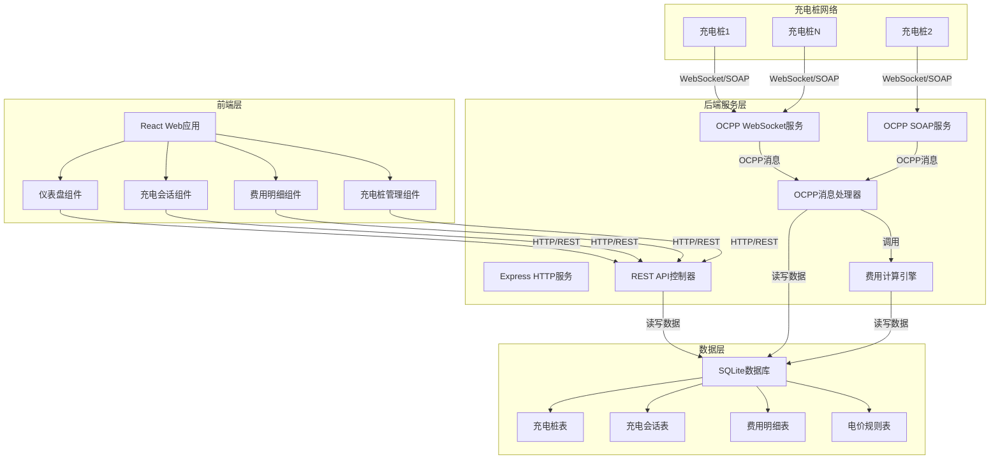
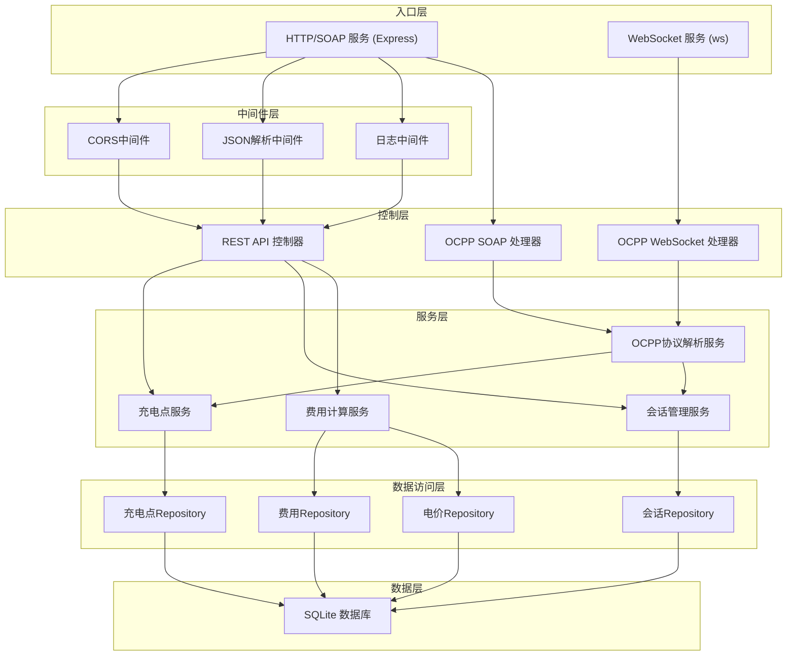
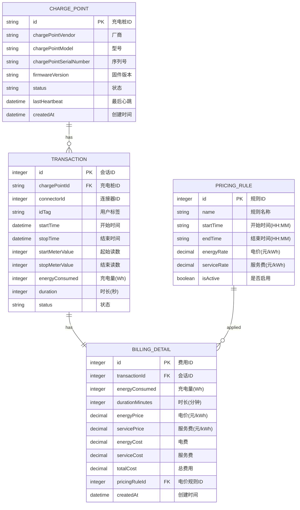

## 1. 架构设计



## 2. 技术描述

### 2.1 前端技术栈
- **框架**：React@18 + TypeScript
- **构建工具**：Vite@5
- **样式方案**：TailwindCSS@3
- **状态管理**：React Query (TanStack Query)
- **UI组件库**：Headless UI + Lucide React图标
- **路由**：React Router@6
- **图表**：Recharts

### 2.2 后端技术栈
- **运行时**：Node.js@18+
- **Web框架**：Express@4
- **WebSocket**：ws库
- **SOAP服务**：soap库
- **数据库**：SQLite3 + better-sqlite3
- **ORM/查询构建**：Knex.js
- **验证**：Joi
- **CORS**：cors中间件

### 2.3 项目结构
```
p348/
├── backend/
│   ├── src/
│   │   ├── server.js          # 主服务入口
│   │   ├── config/            # 配置文件
│   │   ├── controllers/       # REST API控制器
│   │   ├── services/          # 业务逻辑
│   │   │   ├── ocpp/          # OCPP处理器
│   │   │   ├── billing/       # 费用计算
│   │   │   └── database/      # 数据访问
│   │   ├── models/            # 数据模型
│   │   ├── routes/            # API路由
│   │   └── websocket/         # WebSocket服务
│   └── package.json
├── frontend/
│   ├── src/
│   │   ├── components/        # 可复用组件
│   │   ├── pages/             # 页面组件
│   │   ├── hooks/             # 自定义Hooks
│   │   ├── services/          # API服务
│   │   ├── types/             # TypeScript类型定义
│   │   └── App.tsx
│   └── package.json
└── .trae/documents/
```

## 3. 路由定义

### 前端路由
| 路由 | 页面 | 说明 |
|------|------|------|
| / | 仪表盘 | 系统概览和实时状态 |
| /transactions | 充电会话列表 | 所有充电会话的列表展示 |
| /transactions/:id | 充电会话详情 | 单条会话的详细信息 |
| /billing | 费用明细 | 费用列表和统计 |
| /chargepoints | 充电桩管理 | 已注册的充电桩列表 |

### 后端REST API路由
| 方法 | 路由 | 说明 |
|------|------|------|
| GET | /api/chargepoints | 获取充电桩列表 |
| GET | /api/chargepoints/:id | 获取单个充电桩详情 |
| GET | /api/transactions | 获取充电会话列表 |
| GET | /api/transactions/:id | 获取单条会话详情 |
| GET | /api/billing | 获取费用明细列表 |
| GET | /api/billing/:transactionId | 获取单条会话的费用明细 |
| GET | /api/stats/dashboard | 获取仪表盘统计数据 |
| GET | /api/pricing | 获取电价规则 |

## 4. API定义

### 4.1 数据类型定义

```typescript
interface ChargePoint {
  id: string;
  chargePointVendor: string;
  chargePointModel: string;
  chargePointSerialNumber?: string;
  firmwareVersion?: string;
  status: 'available' | 'charging' | 'offline' | 'faulted';
  lastHeartbeat: Date;
  createdAt: Date;
}

interface Transaction {
  id: number;
  chargePointId: string;
  connectorId: number;
  idTag: string;
  startTime: Date;
  stopTime?: Date;
  startMeterValue: number;
  stopMeterValue?: number;
  energyConsumed?: number;
  duration?: number;
  status: 'active' | 'completed' | 'stopped';
}

interface BillingDetail {
  id: number;
  transactionId: number;
  energyConsumed: number;
  durationMinutes: number;
  energyPrice: number;
  servicePrice: number;
  energyCost: number;
  serviceCost: number;
  totalCost: number;
  pricingRuleId: number;
  createdAt: Date;
}

interface PricingRule {
  id: number;
  name: string;
  startTime: string;
  endTime: string;
  energyRate: number;
  serviceRate: number;
  isActive: boolean;
}

interface DashboardStats {
  onlineChargePoints: number;
  totalChargePoints: number;
  activeTransactions: number;
  todayEnergy: number;
  todayRevenue: number;
}
```

### 4.2 OCPP消息格式

#### BootNotification 请求
```json
{
  "chargePointVendor": "Vendor Name",
  "chargePointModel": "Model X",
  "chargePointSerialNumber": "CP001",
  "firmwareVersion": "v1.2.3"
}
```

#### BootNotification 响应
```json
{
  "status": "Accepted",
  "currentTime": "2024-01-01T00:00:00Z",
  "interval": 300
}
```

#### StartTransaction 请求
```json
{
  "connectorId": 1,
  "idTag": "RFID12345",
  "timestamp": "2024-01-01T00:00:00Z",
  "meterStart": 12345
}
```

#### StartTransaction 响应
```json
{
  "idTagInfo": { "status": "Accepted" },
  "transactionId": 1001
}
```

#### StopTransaction 请求
```json
{
  "transactionId": 1001,
  "idTag": "RFID12345",
  "timestamp": "2024-01-01T01:30:00Z",
  "meterStop": 12495,
  "reason": "EVDisconnected"
}
```

#### StopTransaction 响应
```json
{
  "idTagInfo": { "status": "Accepted" }
}
```

## 5. 服务器架构图



## 6. 数据模型

### 6.1 ER图



### 6.2 DDL语句

```sql
CREATE TABLE charge_points (
  id TEXT PRIMARY KEY,
  charge_point_vendor TEXT NOT NULL,
  charge_point_model TEXT NOT NULL,
  charge_point_serial_number TEXT,
  firmware_version TEXT,
  status TEXT NOT NULL DEFAULT 'offline',
  last_heartbeat DATETIME,
  created_at DATETIME NOT NULL DEFAULT CURRENT_TIMESTAMP
);

CREATE TABLE transactions (
  id INTEGER PRIMARY KEY AUTOINCREMENT,
  charge_point_id TEXT NOT NULL,
  connector_id INTEGER NOT NULL,
  id_tag TEXT NOT NULL,
  start_time DATETIME NOT NULL,
  stop_time DATETIME,
  start_meter_value INTEGER NOT NULL,
  stop_meter_value INTEGER,
  energy_consumed INTEGER,
  duration INTEGER,
  status TEXT NOT NULL DEFAULT 'active',
  FOREIGN KEY (charge_point_id) REFERENCES charge_points(id)
);

CREATE TABLE billing_details (
  id INTEGER PRIMARY KEY AUTOINCREMENT,
  transaction_id INTEGER NOT NULL UNIQUE,
  energy_consumed INTEGER NOT NULL,
  duration_minutes INTEGER NOT NULL,
  energy_price REAL NOT NULL,
  service_price REAL NOT NULL,
  energy_cost REAL NOT NULL,
  service_cost REAL NOT NULL,
  total_cost REAL NOT NULL,
  pricing_rule_id INTEGER,
  created_at DATETIME NOT NULL DEFAULT CURRENT_TIMESTAMP,
  FOREIGN KEY (transaction_id) REFERENCES transactions(id),
  FOREIGN KEY (pricing_rule_id) REFERENCES pricing_rules(id)
);

CREATE TABLE pricing_rules (
  id INTEGER PRIMARY KEY AUTOINCREMENT,
  name TEXT NOT NULL,
  start_time TEXT NOT NULL,
  end_time TEXT NOT NULL,
  energy_rate REAL NOT NULL,
  service_rate REAL NOT NULL,
  is_active INTEGER NOT NULL DEFAULT 1
);

CREATE INDEX idx_transactions_charge_point ON transactions(charge_point_id);
CREATE INDEX idx_transactions_status ON transactions(status);
CREATE INDEX idx_billing_transaction ON billing_details(transaction_id);

INSERT INTO pricing_rules (name, start_time, end_time, energy_rate, service_rate, is_active) VALUES
('峰时电价', '07:00', '23:00', 1.2, 0.6, 1),
('谷时电价', '23:00', '07:00', 0.6, 0.3, 1);
```
