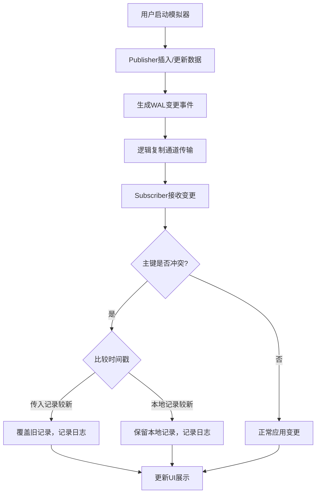

## 1. 产品概述

PostgreSQL逻辑复制模拟器，模拟数据库发布-订阅复制流程，实现主键冲突时按时间戳保留最新记录的冲突解决策略，并通过前端界面实时展示冲突计数和解决日志。

- **核心目标**：模拟PostgreSQL逻辑复制机制，验证冲突解决算法的正确性
- **目标用户**：数据库工程师、开发人员、教学演示场景
- **产品价值**：可视化展示复制冲突解决过程，帮助理解分布式数据一致性问题

## 2. 核心功能

### 2.1 用户角色
| 角色 | 注册方式 | 核心权限 |
|------|----------|----------|
| 普通用户 | 无需注册 | 查看模拟状态、触发数据操作、查看冲突日志 |

### 2.2 功能模块
1. **模拟控制面板**：启动/停止复制、手动插入/更新数据、自动模拟数据生成
2. **数据库状态展示**：实时显示发布端和订阅端的数据表内容
3. **冲突监控面板**：冲突计数统计、冲突类型分布、实时冲突解决日志
4. **WAL日志模拟**：展示逻辑复制的WAL变更流

### 2.3 页面详情
| 页面名称 | 模块名称 | 功能描述 |
|----------|----------|----------|
| 主控制台 | 控制面板 | 控制模拟流程，手动执行INSERT/UPDATE操作，设置自动模拟速度 |
| 主控制台 | 数据展示区 | 分栏展示Publisher和Subscriber的表数据，高亮冲突记录 |
| 主控制台 | 冲突监控面板 | 显示总冲突数、已解决数、冲突解决日志列表 |
| 主控制台 | WAL日志区 | 滚动展示逻辑复制的变更事件流 |

## 3. 核心流程

用户启动模拟器后，可以手动插入数据或开启自动模拟模式。发布端产生数据变更，通过逻辑复制通道发送到订阅端。当订阅端检测到主键冲突时，比较两条记录的时间戳，保留较新的记录并记录冲突日志。前端实时轮询或通过WebSocket推送更新展示最新状态。

## 4. 用户界面设计

### 4.1 设计风格
- **主色调**：深蓝科技感主题（#0f172a 背景），配合 PostgreSQL 品牌色（#336791）作为主强调色
- **辅助色**：绿色（#10b981）表示成功，橙色（#f59e0b）表示冲突，红色（#ef4444）表示错误
- **字体**：等宽字体（JetBrains Mono）展示数据内容，现代无衬线字体（Inter）展示界面文字
- **布局风格**：四象限卡片式布局，代码编辑器风格的数据展示区
- **视觉效果**：暗色主题，霓虹边框高亮，微交互动画，滚动日志效果

### 4.2 页面设计概述
| 页面名称 | 模块名称 | UI元素 |
|----------|----------|--------|
| 主控制台 | 控制面板 | 操作按钮组、速度滑块、数据输入表单、状态指示灯 |
| 主控制台 | 数据展示区 | 双栏表格布局、行级时间戳显示、冲突行高亮闪烁 |
| 主控制台 | 冲突监控面板 | 统计卡片（大号数字+趋势指示）、带时间戳的日志列表、冲突类型图例 |
| 主控制台 | WAL日志区 | 终端风格滚动窗口、彩色编码的事件类型、自动滚动/暂停切换 |

### 4.3 响应性
- 桌面端优先：四象限布局充分利用大屏空间
- 平板适配：调整为上下两栏布局
- 移动端：垂直堆叠布局，可折叠各模块

### 4.4 交互动效
- 数据变更时的行高亮闪烁动画
- 冲突发生时的警告动效和声音提示（可选）
- 数字计数器滚动动画
- 日志条目滑入效果
- 按钮悬停时的霓虹发光效果
