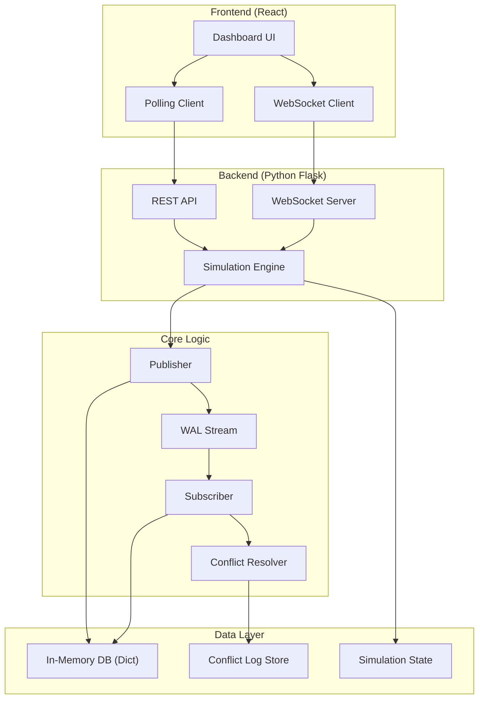
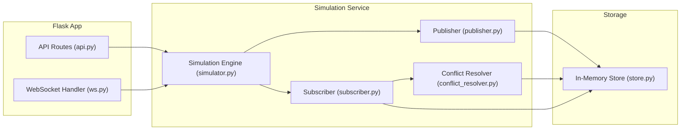
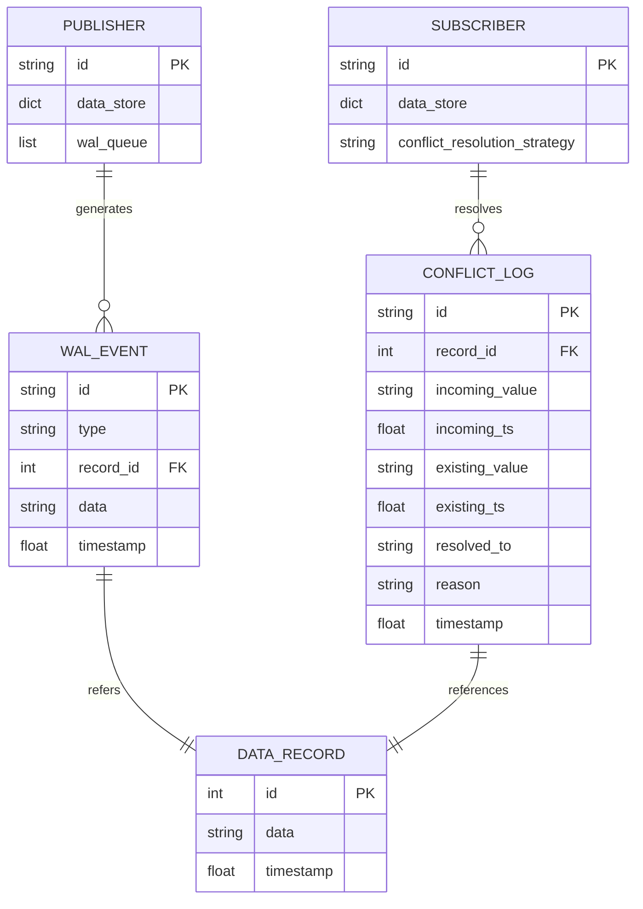

## 1. 架构设计



## 2. 技术描述
- **前端**：React@18 + tailwindcss@3 + vite + lucide-react + recharts
- **后端**：Python Flask + flask-socketio
- **核心模拟**：纯Python实现，无需真实PostgreSQL
- **通信方式**：WebSocket实时推送 + HTTP轮询兜底

## 3. 路由定义
| 路由 | 方法 | 用途 |
|------|------|------|
| `/` | GET | 前端主页 |
| `/api/state` | GET | 获取当前模拟状态（Publisher/Subscriber数据） |
| `/api/conflicts` | GET | 获取冲突统计和日志 |
| `/api/insert` | POST | 向Publisher插入数据 |
| `/api/update` | POST | 更新Publisher数据 |
| `/api/simulate` | POST | 开始/停止自动模拟 |
| `/api/reset` | POST | 重置模拟状态 |
| `/ws` | WS | WebSocket实时事件推送 |

## 4. API 定义

### 数据模型
```typescript
interface DataRecord {
  id: number;
  data: string;
  timestamp: number;
  source: 'publisher' | 'subscriber';
}

interface ConflictLog {
  id: string;
  timestamp: number;
  record_id: number;
  incoming_value: string;
  incoming_ts: number;
  existing_value: string;
  existing_ts: number;
  resolved_to: 'incoming' | 'existing';
  reason: string;
}

interface SimulationState {
  is_running: boolean;
  publisher_data: DataRecord[];
  subscriber_data: DataRecord[];
  conflict_count: number;
  conflict_logs: ConflictLog[];
  wal_events: WALEvent[];
}

interface WALEvent {
  id: string;
  timestamp: number;
  type: 'INSERT' | 'UPDATE' | 'DELETE';
  record_id: number;
  data: string;
  source: string;
}
```

### 请求/响应示例
**POST /api/insert**
```json
{
  "id": 1,
  "data": "value_1"
}
```
响应:
```json
{
  "success": true,
  "wal_event": {...}
}
```

**GET /api/conflicts**
```json
{
  "total_conflicts": 5,
  "resolved_incoming": 3,
  "resolved_existing": 2,
  "logs": [...]
}
```

## 5. 服务端架构



## 6. 数据模型

### 6.1 实体关系图


### 6.2 Python类定义
```python
class DataRecord:
    def __init__(self, id: int, data: str, timestamp: float):
        self.id = id
        self.data = data
        self.timestamp = timestamp

class Publisher:
    def __init__(self):
        self.data: Dict[int, DataRecord] = {}
        self.wal_queue: Deque[WALEvent] = deque()
    
    def insert(self, id: int, data: str) -> WALEvent: ...
    def update(self, id: int, data: str) -> WALEvent: ...

class Subscriber:
    def __init__(self, conflict_resolver: ConflictResolver):
        self.data: Dict[int, DataRecord] = {}
        self.conflict_resolver = conflict_resolver
    
    def apply_wal(self, event: WALEvent) -> Optional[ConflictLog]: ...

class ConflictResolver:
    def resolve(self, incoming: DataRecord, existing: DataRecord) -> Tuple[DataRecord, str]:
        # 按时间戳保留最新记录
        if incoming.timestamp > existing.timestamp:
            return incoming, "incoming record has newer timestamp"
        return existing, "existing record has newer or equal timestamp"
```
