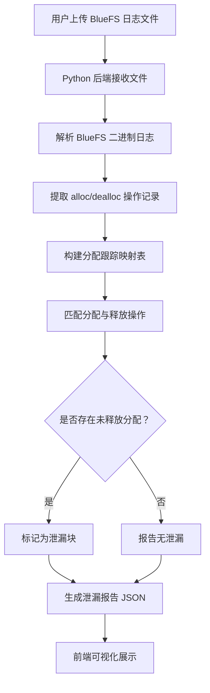

## 1. 产品概述

Ceph BlueStore 元数据分析器是一款针对 Ceph 分布式存储系统的诊断工具，专注于解析 BlueFS 日志文件，跟踪元数据的分配与释放操作，自动检测空间泄漏（已分配但未释放的元数据块），并通过可视化前端直观展示泄漏详情，帮助存储运维人员快速定位和修复空间泄漏问题。

- 目标用户：Ceph 存储集群运维工程师、存储系统开发者
- 核心价值：降低因元数据泄漏导致的存储空间浪费，提升集群健康度巡检效率

## 2. 核心功能

### 2.1 功能模块

1. **分析仪表盘**：整体泄漏概览、关键指标卡片、泄漏趋势
2. **日志解析详情**：BlueFS 操作日志列表、分配/释放事件流
3. **泄漏检测结果**：泄漏块列表、位置信息、大小统计、空间分布图

### 2.2 页面详情

| 页面名称 | 模块名称 | 功能描述 |
|----------|----------|----------|
| 分析仪表盘 | 概览指标卡片 | 显示总分配量、总释放量、泄漏总量、泄漏块数 |
| 分析仪表盘 | 泄漏趋势图 | 按时间线展示元数据分配与释放的差值趋势 |
| 分析仪表盘 | 空间分布图 | 可视化展示磁盘空间的分配、释放、泄漏区域 |
| 日志解析详情 | 操作日志表 | 展示 BlueFS 日志中所有分配/释放操作记录，支持筛选与搜索 |
| 日志解析详情 | 事件时间线 | 以时间线形式展示元数据操作事件流 |
| 泄漏检测结果 | 泄漏块列表 | 展示所有检测到的泄漏块，包含偏移地址、大小、所属文件、首次分配时间 |
| 泄漏检测结果 | 泄漏统计图 | 按文件/设备维度汇总泄漏大小的柱状图和饼图 |

## 3. 核心流程

用户上传或指定 BlueFS 日志文件路径 → Python 后端解析二进制日志 → 提取分配和释放操作记录 → 构建分配跟踪映射表 → 检测未匹配的分配（泄漏） → 计算泄漏统计信息 → 前端展示分析结果

## 4. 用户界面设计

### 4.1 设计风格

- 主色调：深色工业风（#0F172A 深蓝黑底色 + #06B6D4 青色高亮 + #F59E0B 琥珀色警告）
- 辅助色：#EF4444 红色用于泄漏警告，#10B981 绿色用于健康状态
- 按钮风格：圆角微凸，带有微妙阴影和 hover 发光效果
- 字体：JetBrains Mono（数据/代码） + Noto Sans SC（中文正文）
- 布局风格：左侧导航 + 右侧内容区，卡片式布局
- 图标风格：Lucide 线性图标

### 4.2 页面设计概览

| 页面名称 | 模块名称 | UI 元素 |
|----------|----------|---------|
| 分析仪表盘 | 概览指标卡片 | 深色卡片、数字高亮、状态指示灯、微妙渐变边框 |
| 分析仪表盘 | 泄漏趋势图 | 面积图、深色背景、青色/琥珀色双线 |
| 分析仪表盘 | 空间分布图 | 热力图风格、矩形树图、红黄渐变表示泄漏严重度 |
| 日志解析详情 | 操作日志表 | 深色表格、行悬停高亮、类型标签色块 |
| 日志解析详情 | 事件时间线 | 垂直时间线、节点图标、连接线动画 |
| 泄漏检测结果 | 泄漏块列表 | 深色表格、红色泄漏标记、可展开详情行 |
| 泄漏检测结果 | 泄漏统计图 | 柱状图+饼图组合、渐变填充 |

### 4.3 响应式设计

- 桌面优先设计，确保在大屏上数据密度和可读性
- 平板端卡片自动重排
- 移动端简化图表，保留核心数据展示

### 4.4 上传入口

- 页面顶部提供文件上传区域（拖拽上传 + 点击选择）
- 支持 .bin / .log 格式的 BlueFS 日志文件
- 上传后自动触发解析并跳转至仪表盘
