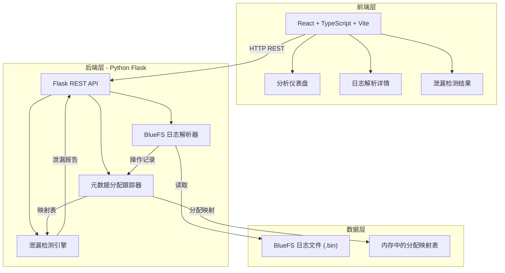
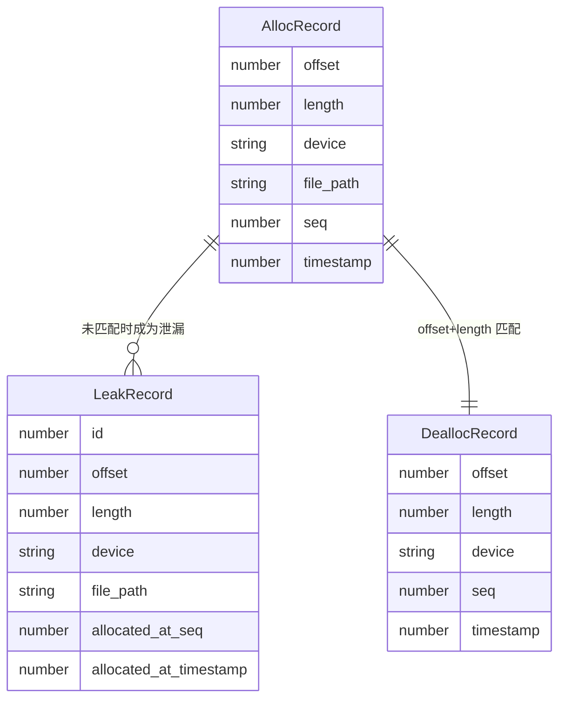

## 1. 架构设计



## 2. 技术说明

- 前端：React@18 + TypeScript + Vite + TailwindCSS + Zustand
- 初始化工具：vite-init (react-ts 模板)
- 后端：Python 3.10+ / Flask + flask-cors
- 数据库：无（基于内存的实时分析，解析结果缓存在内存中）
- 图表库：Recharts

## 3. 路由定义

| 路由 | 用途 |
|------|------|
| / | 分析仪表盘 - 整体概览与关键指标 |
| /logs | 日志解析详情 - 操作日志列表与时间线 |
| /leaks | 泄漏检测结果 - 泄漏块列表与统计图 |

## 4. API 定义

### 4.1 上传日志文件

```
POST /api/upload
Content-Type: multipart/form-data
Request: file (binary)
Response: {
  task_id: string,
  filename: string,
  status: "parsing"
}
```

### 4.2 获取解析状态

```
GET /api/status/:task_id
Response: {
  task_id: string,
  status: "parsing" | "completed" | "error",
  progress: number (0-100),
  error?: string
}
```

### 4.3 获取概览指标

```
GET /api/analysis/:task_id/overview
Response: {
  total_allocated: number,
  total_freed: number,
  leaked_size: number,
  leaked_blocks: number,
  total_operations: number,
  allocation_count: number,
  deallocation_count: number
}
```

### 4.4 获取操作日志

```
GET /api/analysis/:task_id/logs?page=1&per_page=50&type=alloc|dealloc|all
Response: {
  logs: [{
    seq: number,
    op_type: "alloc" | "dealloc",
    offset: number,
    length: number,
    device: string,
    file_path: string,
    timestamp: number
  }],
  total: number,
  page: number,
  per_page: number
}
```

### 4.5 获取泄漏检测结果

```
GET /api/analysis/:task_id/leaks?page=1&per_page=50&sort_by=size&order=desc
Response: {
  leaks: [{
    id: number,
    offset: number,
    length: number,
    device: string,
    file_path: string,
    allocated_at_seq: number,
    allocated_at_timestamp: number
  }],
  total: number,
  page: number,
  per_page: number,
  summary: {
    by_device: { [device: string]: { count: number, total_size: number } },
    by_file: { [file: string]: { count: number, total_size: number } }
  }
}
```

### 4.6 获取泄漏趋势数据

```
GET /api/analysis/:task_id/trend
Response: {
  timeline: [{
    seq: number,
    allocated: number,
    freed: number,
    leaked: number
  }]
}
```

## 5. BlueFS 日志格式说明

BlueFS 是 Ceph BlueStore 使用的简单文件系统，其日志记录了所有元数据操作。关键操作码：

| 操作码 | 名称 | 说明 |
|--------|------|------|
| 1 | OP_NONE | 空操作 |
| 2 | OP_ALLOC | 分配空间 |
| 3 | OP_DEALLOC | 释放空间 |
| 4 | OP_DIR_CREATE | 创建目录 |
| 5 | OP_DIR_LINK | 目录链接 |
| 6 | OP_DIR_UNLINK | 目录取消链接 |
| 7 | OP_FILE_CREATE | 创建文件 |
| 8 | OP_FILE_LINK | 文件链接 |
| 9 | OP_FILE_UNLINK | 文件取消链接 |
| 10 | OP_FILE_UPDATE | 更新文件元数据 |

日志文件为二进制格式，头部包含魔术数和版本号，后续为连续的操作记录。Python 解析器需要按照 Ceph 源码中的 BlueFS 日志格式定义来解析二进制数据。

## 6. 数据模型

### 6.1 内存数据模型



### 6.2 核心解析逻辑

1. 读取日志文件头部，验证魔术数
2. 逐条解析操作记录，提取操作类型、偏移、长度、设备、文件信息
3. 维护一个 `alloc_map: Dict[(device, offset), AllocRecord]` 映射表
4. 遇到 OP_ALLOC 时，将记录插入映射表
5. 遇到 OP_DEALLOC 时，从映射表中查找匹配的分配记录并移除
6. 解析完成后，映射表中剩余的记录即为泄漏块
